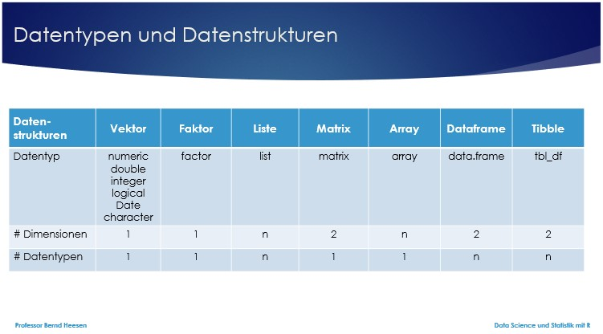
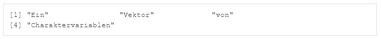
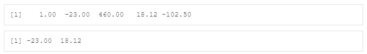
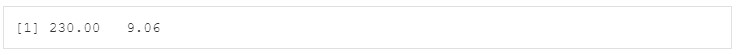
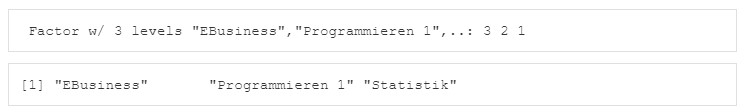
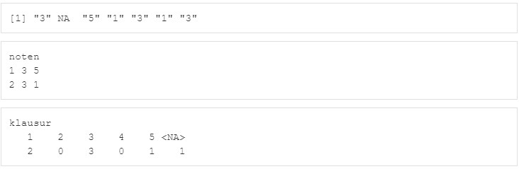
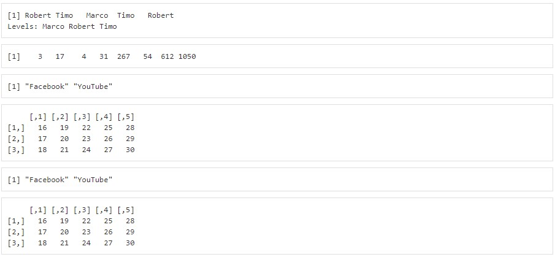
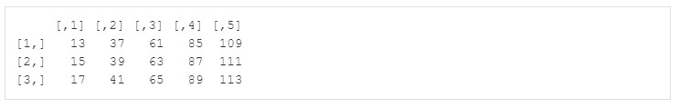
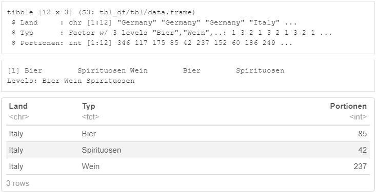
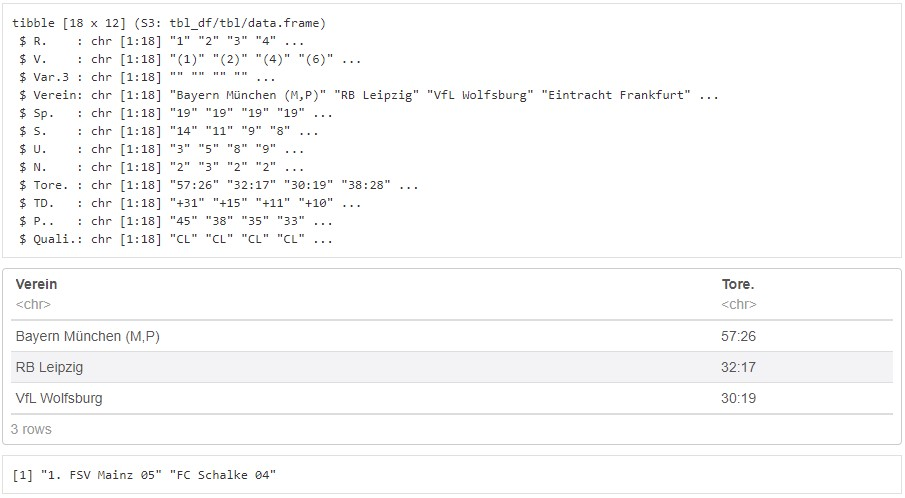

```{r setup, include=FALSE}
library(machinelearning)
library(tidyverse)
library(learnr)
```


## Willkommen

Dieses Tutorial ergänzt die Inhalte des Buches [Künstliche Intelligenz und Machine Learning mit R](https://www.amazon.de/Data-Science-Statistik-mit-Anwendungsl%C3%B6sungen/dp/3658348240/ref=sr_1_1?__mk_de_DE=%C3%85M%C3%85%C5%BD%C3%95%C3%91&dchild=1&keywords=Data+Science+und+Statistik+mit+R&qid=1627898747&sr=8-1).

Das Kapitel 5.2 im Buch beschreibt die Datenstrukturen von R. 


### Grundsätzliches

Wird nur ein einzelner Wert in einer Variablen gespeichert, so bezeichnet man diese als „einfache Variable“. Werden mehrere Werte in einer Variablen gespeichert, so bezeichnet man diese als „Vektor“. Es gibt zwei Typen von Vektoren, sogenannte „atomare Vektoren“ (ein Datentyp) und Listen (mehrere Datentypen).

```{r 0_1, exercise=FALSE}
a <- c(12,55,107,3,24)                              # Numerischer Vektor 
b <- c("Ein", "Vektor", "vo", "Charaktervariablen") # Character Vektor
```


```{r 0_2-setup, exercise=FALSE, echo=FALSE, include=FALSE}
a <- c(12,55,107,3,24)                              # Numerischer Vektor 
b <- c("Ein", "Vektor", "vo", "Charaktervariablen") # Character Vektor
```

Vorhandene Variablen und Datenstrukturen können mit der Funktion View() angezeigt und mit der Funktion edit() bearbeitet werden.
Angenommen Sie würden den Vektor b editieren und die dritte Variable innerhalb des Character-Vektors von "vo" auf "von" ändern und speichern, dann sollte die Variable hinterher wie folgt aussehen: 

## 1. Vektor

Ein neuer Vektor ohne Inhalt lässt sich mit der Funktion new() erzeugen, z.B. text<-new("character") oder a<-new("numeric"), um einen leeren Vektor vom Typ character oder numeric anzulegen. In einem Vektor können mehrere Werte eines Datentyps gespeichert werden, indem diese mit der Funktion c() zu einem Vektor zusammengefügt werden (c steht für das englische Wort "combine"). Folgende Funktion kann beispielsweise verwendet werden, um einen Vektor anzulegen: a  <- c(1.2, -13, 46, 1880.12, -2.5). Achtung: In R werden die Nachkommastellen wie im Englischen üblich mit einem Punkt getrennt und nicht wie im Deutschen mit einem Komma. In R werden aber Kommas verwendet, um die Argumente einer Funktion voneinander zu unterscheiden.

```{r 1_1, exercise=FALSE}
a <- new("numeric")                           # Vektor ohne Inhalt
str(a)                                        # Ausgabe mit Typ und Länge
a <- c(1.2, -13, 46, 1880.12, -2.5)           # Vektor Typ numerisch
a                                             # Ausgabe 
```

### 1.1 Zugriff auf Vektor mit Index

Auf einzelne Elemente eines Vektors kann durch Indizierung in eckigen Klammern zugegriffen werden, wobei die Indizierung bei 1 startet, z.B. a[2] gibt den zweiten Wert der Vektorvariablen mit dem Namen a aus, hier also -13. Wird in den Klammern kein Index angegeben, so werden alle Elemente ausgegeben. Es können auch mehrere Werte eines Vektors ausgegeben werden, z.B. die Elemente 2 bis 4 mit der Anweisung a[2:4]. Um alle außer gewissen Elementen anzuzeigen, kann ein dem Index vorangestelltes Minuszeichen verwendet werden, z.B. a[-2] zeigt alle Elemente außer dem 2. Element an. Eine Liste von Indizes kann mit der Funktion c() angegeben werden, z.B. a[c(1,3:4)] gibt das Element 1 und 3 bis 4 aus.

```{r 1_2-setup, exercise=FALSE, echo=FALSE, include=FALSE}
a <- c(1.2, -13, 46, 1880.12, -2.5)           # Vektor Typ numerisch
```

```{r 1_2, exercise=FALSE, exercise.setup="1_2-setup"}
a[]                                           # Ausgabe 
str(a)                                        # Ausgabe mit Typ und Länge
a[2]                                          # Ausgabe 2. Element
a[2:4]                                        # Ausgabe 2.-4. Element
a[-2]                                         # Ausgabe ohne 2. Element
a[-2:-4]                                      # Ausgabe ohne 2.-4. Element 
a[c(1,3:4)]                                   # Ausgabe 1. & 3.-4. Element
```

Die Ausgabe einer Reihenfolge von Elementen kann auch beliebig inklusive Wiederholungen einzelner Elemente kombiniert werden, z.B. um die Elemente 1, 3, 3, 1, 1, 5 auszugeben a[c(1,3,3,1,1,5)]. Die Angabe eines ungültigen Indizes bewirkt die Ausgabe NA, z.B. a[3:7] bewirkt für den Index 6 und 7 ein NA.

```{r 1_3-setup, exercise=FALSE, echo=FALSE, include=FALSE}
a <- c(1.2, -13, 46, 1880.12, -2.5)           # Vektor Typ numerisch
```

```{r 1_3, exercise=TRUE, exercise.setup="1_3-setup"}
a[c(1,3,3,1,1,5)]                             # Ausgabe beliebiger Elemente
a[3:7]                                        # Ausgabe ungültiger Indizes 
```

Auch eine Berechnung der Indizes ist möglich. Die Funktion length() gibt die Anzahl der Elemente eines Vektors zurück. Möchte man z.B. auf das vorletzte Element zugreifen, so kann man mit der Anweisung a[length(a)-1] arbeiten.

```{r 1_4-setup, exercise=FALSE, echo=FALSE, include=FALSE}
a <- c(1.2, -13, 46, 1880.12, -2.5)           # Vektor Typ numerisch
```

```{r 1_4, exercise=TRUE, exercise.setup="1_4-setup"}
length(a)                                     # Anzahl Elemente von Vektor
a[length(a)-1]                                # Ausgabe vorletztes Element
```

### 1.2 Zugriff auf Vektor mit Namen

Vektoren können auch für jedes Element einen Namen enthalten, z.B. b <- c(anna = 1.3, rolf = 2.7, heike = 4.0). Den Inhalt des Vektors kann man wieder durch Eingabe des Namens oder mit der Funktion str() anzeigen lassen. Ein Zugriff auf das Element 2 kann erfolgen durch b[2] oder b[“rolf“].

```{r 1_5, exercise=FALSE}
b <- c(anna = 2.7, rolf = 1.3, heike = 4.0)   # Vektor mit Namen
b                                             # Ausgabe 
str(b)                                        # Ausgabe mit Typ und Länge
b[2]                                          # Ausgabe 2. Element
b["rolf"]                                     # Ausgabe 2. Element```
```

### 1.3 Zugriff auf Vektor mit Logik

Auch ein logisches Indexing ist möglich, indem Bedingungen bestimmen, welche Elemente ausgewählt werden sollen, z.B. b[>2], b[b==1.3 | b>3] oder b[b<3.3 & b>2]. Eine weitere Option ist die Angabe von TRUE (soll ausgegeben werden) oder FALSE (soll nicht ausgegeben werden) für jedes Element, z.B. b[c(FALSE, TRUE, FALSE)], um nur das Element 2 auszugeben.

```{r 1_6-setup, exercise=FALSE, echo=FALSE, include=FALSE}
b <- c(anna = 2.7, rolf = 1.3, heike = 4.0)   # Vektor mit Namen
```

```{r 1_6, exercise=TRUE, exercise.setup="1_6-setup"}
b[b>2]                                        # Ausgabe wenn >2
b[b==1.3 | b>3]                               # Ausgabe wenn 1.3 oder >3
b[b<3.3 & b>2]                                # Ausgabe wenn <3.3 und >2
b[c(FALSE, TRUE, FALSE)]                      # Ausgabe 2. Element
```

### 1.4 Operationen mit Vektor

Wenn Sie einen Befehl auf einen Vektor anwenden, dann führt R diesen Befehl für jedes einzelne Element des Vektors aus, z.B. bei der Umwandlung einer Temperatur von Celsius in Fahrenheit. Dies erfordert keine Schleifenprogrammierung wie in vielen anderen Programmiersprachen, was die Anzahl der erforderlichen R-Anweisungen gering hält. Ein Vektor d<-c(20,40,60,80,100) kann für jedes Element des Vektors mit der Anweisung d<-(d-32)*5/9 eine Umrechnung von Grad Fahrenheit in Grad Celsius realisieren.

```{r 1_7, exercise=FALSE}
d<-c(20,40,60,80,100)                         # Vektor Temperaturen Fahrenheit
d                                             # Ausgabe
d<-(d-32)*5/9                                 # Temperaturen Celsius
d                                             # Ausgabe
```

### 1.5 Übung

```{r 1_9-setup, exercise=FALSE, echo=FALSE, include=FALSE}
x <- c(1, -23, 460, 18.12, -102.5)            # Vektor Typ numerisch
```

Lassen Sie sich zunächst das Objekt x anzeigen. Lassen Sie sich dann nur das zweite und vierte Element des Vektors x anzeigen.

Die Anzeige sollte hinterher wie folgt aussehen: 

```{r 1_9, exercise=TRUE, exercise.setup="1_9-setup"}

```

```{r 1_9-hint-1}
x
```
```{r 1_9-hint-2}
x[c(2,4)]
```

Teilen Sie für alle Elemente von Objekt x, welche größer als 10 sind, den Wert der Objekte durch 2. Speichern Sie das Ergebnis in dem Objekt y. Lassen Sie sich anschließend das Objekt y anzeigen.

Die Anzeige sollte hinterher wie folgt aussehen: 

```{r 1_10-setup, exercise=FALSE, echo=FALSE, include=FALSE}
x <- c(1, -23, 460, 18.12, -102.5)            # Vektor Typ numerisch
```

```{r 1_10, exercise=TRUE, , exercise.setup="1_10-setup"}

```

```{r 1_10-hint-1}
y<-x[x>10]/2
```
```{r 1_10-hint-2}
y
```

## 2. Faktorvariable

Eine Faktorvariable ist ein atomarer Vektor vom Datentyp factor, in dem mehrere Werte eines Datentyps gespeichert werden können. Es handelt sich dabei um kategoriale Variablen mit einer vordefinierten Menge an Ausprägungen. Bei kategorialen Variablen wird unterscheiden zwischen nominalen Variablen wie Farbe oder Land (ohne Reihenfolge) und ordinalen Variablen wie Schulnoten (mit Reihenfolge von sehr gut bis ungenügend).

Für jede vorkommende Ausprägung wird ein sogenanntes Label als Kombination des Wertes der Ausprägung und einem Zähler vergeben, so dass jede Ausprägung nur einmalig gespeichert werden muss. Die Labels werden standardmäßig entweder von der kleinsten Zahl zur größten Zahl (numerisch) oder alphabetisch (character) mit einer Integerzahl von 1 bis n durchnummeriert. Dies ist bei einer nominalen Faktorvariable auch in Ordnung. Bei einer ordinalen Faktorvariable dagegen ist es wichtig, dass die einer Ausprägung zugeordnete Integerzahl entsprechend der Reihenfolge entweder aufsteigend oder absteigend vergeben wird, damit die Integerwerte später z.B. für Korrelationsanalysen und Machine Learning verwendet werden können. 
Eine derartige Vergabe der Integerzahlen wird durch die Verwendung der Parameter order und levels erreicht, z.B. noten.ordinal <- factor(noten, order=TRUE, levels=c("sehr gut","gut","befriedigend","ausreichend","ungenügend")). Mit dem Parameter exclude=NULL werden auch Ausprägungen mit fehlenden Werten (NA) berücksichtigt.

Kommt ein Wert in der Faktorvariablen vor, so wird nicht der Wert selbst, sondern die zugeordnete Integerzahl für das Element hinterlegt. Die Integerzahlen repräsentieren die Reihenfolge der Werte, wie sie mit dem levels-Parameter angegeben werden bzw. mit der Funktion levels() angezeigt werden. Da Integerzahlen minimalen Speicherplatz benötigen, reduziert sich so der Speicherbedarf für einen Vektor vom Typ factor, wenn Werte wiederholt vorkommen. 

### 2.1 Faktorvariable erzeugen

Eine Faktorvariable lässt sich mit der Funktion factor() erstellen, z.B. für die Nominale Variable torschuetze <- factor(c("Robert", "Timo", "Marco", "Timo", "Robert", "Robert")). 
Alternativ kann auch die Funktion as.factor() aus einem bereits existierenden Vektor eine Faktorvariable erstellen, z.B. aa <- as.factor(a). 
In beiden Fällen hat R den Datentyp nicht automatisch erkennen müssen, sondern die Funktion factor() bzw. as.factor() hat bestimmt, dass eine Faktorvariable erzeugt werden soll. 

Der Parameter order=TRUE bestimmt, ob die Funktion class() den Datentyp "factor" oder "ordered factor" zurückgibt. Für ordinale Variablen sollte der Parameter order=TRUE verwendet werden.

Die gesamte Faktorvariable kann durch Eingabe des Namens oder mit der Funktion str() ausgegeben werden und die Funktion levels() zeigt die Ausprägungen einer Faktorvariablen an.

Wenn eine Faktorvariable als Basis einer arithmetischen Operation verwendet werden soll, so gilt es die kategorialen Werte mit der Funktion as.numeric(Faktorvariable) vorher in einen numerischen Wert zu überführen.

```{r 2, exercise=FALSE}
torschuetze <- factor(c("Robert", "Timo", "Marco", "Timo", "Robert", "Robert"))
torschuetze                                      # Ausgabe Faktorvariable 
str(torschuetze)                                 # Ausgabe mit Typ und Länge
levels(torschuetze)                              # Levels anzeigen
torschuetze.numeric <- as.numeric(torschuetze)   # Konvertierung in numerisch
str(torschuetze.numeric)                         # Werte numerisch
unternehmen <- c("Siemens","Adidas","Prescient")
unternehmen                                      # Ausgabe Charactervariable
str(unternehmen)                                 # Ausgabe mit Typ und Länge
unternehmen <- as.factor(unternehmen)
unternehmen                                      # Ausgabe Faktorvariable
str(unternehmen)                                 # Ausgabe mit Typ und Länge
levels(unternehmen)                              # Levels anzeigen
```

Erzeugen Sie eine neue Faktorvariable mit dem Namen module.ws.ansbach und den Inhalten "Statistik", "Programmieren 1", und "EBusiness". Lassen Sie sich dann mit einem Funktionsaufruf den Inhalt, den Datentyp und die Länge der Variablen module.ws.ansbach anzeigen und anschließend auch noch die Ausprägungen der Levels.

Die Anzeige sollte hinterher wie folgt aussehen: 

```{r 2_1, exercise=TRUE}

```

```{r 2_1-hint-1}
module.wif.ansbach <- factor(c("Statistik", "Programmieren 1", "EBusiness"))
```
```{r 2_1-hint-2}
str(module.wif.ansbach)                          # Ausgabe mit Typ und Länge
```
```{r 2_1-hint-3}
levels(module.wif.ansbach)                       # Levels anzeigen
```

### 2.2 Häufigkeiten

Wenn Sie eine Faktorvariable anlegen, in der Sie die Wochentage festhalten, an denen Sie diesen Monat Sport getrieben haben, so können Sie dies mit der Anweisung tag <- factor(c("Mittwoch", "Montag", "Mittwoch", "Dienstag", "Mittwoch")) erledigen. Alternativ können Sie auch zunächst eine Charactervariable anlegen und diese dann in eine Faktorvariable konvertieren.

Mit der Funktion table() kann man sich die Häufigkeiten der vorkommenden Werte in einem Vektor anzeigen zu lassen, in diesem Falle mit table(tag). Die Reihenfolge bei der Auflistung der Häufigkeiten erfolgt in der Reihenfolge, in welcher die Levels in der Faktorvariablen vorkommen (bei numerischen Inhalten aufsteigend, bei Zeichenketten alphabetisch sortiert).

```{r 2_2, exercise=FALSE}
tag <- c("Mittwoch", "Montag", "Mittwoch", "Dienstag", "Mittwoch") # Vektor
table(tag)                                    # Häufigkeit
tag1 <- factor(tag)                           # Faktorisierter Vektor
levels(tag1)                                  # Levels
table(tag1)                                   # Häufigkeit
```

### 2.3 Nominale und Ordinale Faktorvariablen

Der Parameter order=TRUE bestimmt, ob die Funktion class() den Datentyp "factor" oder "ordered factor" zurückgibt. Für ordinale Variablen sollte der Parameter order=TRUE verwendet werden.

```{r 2_3, exercise=FALSE}
noten<-c("sehr gut",NA,"ungenügend","ausreichend","gut","gut",NA) #Vektor
noten                                         # Ausgabe Charactervektor
#-Konvertierung in Nominale Faktorvariable---------------------------------
noten.nominal1 <- factor(noten)               # Nominale Variable
str(noten.nominal1)                           # Ausgabe mit Typ und Länge      
table(noten.nominal1) 
#-Konvertierung in Ordinale Faktorvariable nicht ordered-------------------
noten.nominal2 <- factor(noten,order=FALSE,   # Ordinale Variable
  levels=c("sehr gut","gut","befriedigend","ausreichend","ungenügend"))
str(noten.nominal2)                           # Ausgabe mit Typ und Länge   
table(noten.nominal2)
#-Konvertierung in Ordinale Faktorvariable ordered NAs ignoriert-----------
noten.ordinal <- factor(noten,order=TRUE,     # Ordinale Variable "ordered"
                                              # NAs ignoriert
  levels=c("sehr gut","gut","befriedigend","ausreichend","ungenügend"))
class(noten.ordinal)                          # Datentyp
str(noten.ordinal)                            # Ausgabe mit Typ und Länge      
table(noten.ordinal)
#-Konvertierung in Ordinale Faktorvariable ordered NAs auch codiert--------
noten.ordinal.mitNA<-factor(noten,order=TRUE, # Ordinale Variable "ordered"
  exclude = NULL,                             # NAs auch codiert
  levels=c("sehr gut","gut","befriedigend","ausreichend","ungenügend",NA))
class(noten.ordinal.mitNA)                    # Datentyp
str(noten.ordinal.mitNA)                      # Ausgabe mit Typ und Länge  
table(noten.ordinal.mitNA)
```

### 2.4 Reihenfolge der Levels

Wenn Sie jetzt aber gerne eine spezifische Reihenfolge bevorzugen, z.B. die Abfolge der Wochentage innerhalb einer Woche, dann können Sie die Reihenfolge auch ändern bzw. spezifisch vorgeben. Für diesen Zweck gibt es die Funktionen fct_inorder() (sortiert nach Reihenfolge des Vorkommens), fct_infreq() (sortiert nach Häufigkeit) und fct_inseq() (sortiert numerisch). Die Funktion fct_inseq() setzt voraus, dass die Inhalte numerisch sind, sonst wird eine Fehlermeldung veranlasst. Diese Funktionen sind in dem Paket forcats enthalten.

Die Reihenfolge der Levels kann auch ganz individuell vorgegeben werden, wenn der Parameter levels in der Funktion factor() verwendet wird, z.B. wochentage <- factor(tag, levels = c("Montag","Dienstag","Mittwoch")). Jetzt entspricht die Reihenfolge der Levels der Abfolge innerhalb einer Woche von Montag, Dienstag zu Mittwoch. Eine Ausgabe der Häufigkeiten erfolgt dann entsprechend der Wochentage. Sollen Levels nicht in den Daten vorkommen, so können Sie mit der Funktion droplevels() entfernt werden, z.B. autos <- droplevels(autos).

```{r 2_4, exercise=FALSE}
f <- factor(c("b", "b", "a", "c", "c", "c"))
f
fct_inorder(f)
fct_infreq(f)
f <- factor(1:3, levels = c("3", "2", "1"))
f
fct_inseq(f)
```

### 2.5 Übung

```{r 2_5-setup, exercise=FALSE, echo=FALSE, include=FALSE}
noten<-c("3",NA,"5","1","3","1","3")
```

Lassen Sie sich zunächst den Inhalt der gemeldeten Noten anzeigen, die im Vektor noten hinterlegt sind. Lassen Sie sich anschließend eine Häufigkeitsverteilung mit Hilfe der Funktion table() anzeigen.
Um die Anzeige übersichtlicher zu gestalten, legen Sie eine neue Faktorvariable mit dem Namen "klausur" an, welche die Klausurnoten von 1 bis 5 und auch NA (NA für nicht teilgenommen bzw. Prüfung nicht abgelegt) erfassen soll und die Werte des Vektors noten enthält. Die Variable sollte ordered sein und die Angabe NA sollte als die letzte Ausprägung nach der 5 folgen. Lassen Sie sich die Häufigkeitsverteilung der Variablen klausur mit Hilfe der Funktion table() anzeigen.

Folgendes sollte Ihnen angezeigt werden: 

```{r 2_5, exercise=TRUE, exercise.setup="2_5-setup"}

```

```{r 2_5-hint-1}
noten
table(noten)
```
```{r 2_5-hint-2}
klausur <- factor(noten,order=TRUE,       # Ordinale Variable "ordered"
  exclude = NULL,                         # NAs auch codiert
  levels=c("1","2","3","4","5",NA))
table(klausur)
```

## 3. Liste

Eine Verknüpfung von mehreren Vektoren ist in einer Liste möglich, die mit der Funktion list() erzeugt werden kann. Dabei muss es sich keinesfalls um eine Repräsentation einer Tabelle mit Zeilen und Spalten handeln, denn die verknüpften Vektoren können im Gegensatz zu Matrizen, Arrays, Dataframes und Tibbles eine unterschiedliche Länge besitzen.

Im folgenden Beispiel werden drei Vektoren unterschiedlichen Datentyps zu einer Liste zusammengefügt und auf die Elemente der Liste über Index (Syntax: Objekt[Index]) und Name (Syntax: Objekt$Elementname oder Objekt[[“Elementname“]]) zugegriffen. Die Ausgabe bei Zugriff über Index ist eine Liste während die Ausgabe bei Zugriff über Name ein Vektor sein wird.


```{r 3, exercise=FALSE}
x1 <- c("Hans", "Silke")                      # Vektor x1 (Freunde)
x2 <- c(42, 5, 7, 356)                        # Vektor X2 (Spende in Euro)
x3 <- c(TRUE, FALSE, FALSE, FALSE, TRUE)      # Vektor X3 (Ergebnis Münzwurf)
liste <- list(Freund=x1, Spende=x2, Kopf=x3)  # Liste
liste                                         # Ausgabe 
str(liste)                                    # Ausgabe mit Typ und Länge
a <- liste[2]                                 # Ausgabe über Index erzeugt Liste
str(a)
b <- liste$Spende                             # Ausgabe über Name erzeugt Vektor
str(b)
c <- liste[["Spende"]]                        # Ausgabe über Name erzeugt Vektor
str(c)
```

### 3.1 Übung

```{r 3_1-setup, exercise=FALSE, echo=FALSE, include=FALSE}
mitarbeiterdesmonats <- factor(c("Robert", "Timo", "Marco", "Timo", "Robert"))
neukunden<-c(3,17,4,31,267,54,612,1050)
marketing<-c("Facebook","YouTube")
zielwerte <- matrix(16:30, 3, 5)             
```

Lassen Sie sich zunächst den Inhalt der folgenden Variablen anzeigen, die für die Landesniederlassung in Burkina Faso erfasst wurden: mitarbeiterdesmonats, neukunden, marketing, zielwerte. Fügen Sie diese vier Variablen in einer Liste mit dem Namen burkinafaso zusammen und benennen die Variablen innerhalb der Liste so wie auch die Ursprungsvariablen benannt sind.

Lassen Sie sich anschließend den Inhalt für marketing und zielwerte aus der Liste burkinafaso anzeigen.

Folgendes sollte Ihnen angezeigt werden: 

```{r 3_1, exercise=TRUE, exercise.setup="3_1-setup"}

```

```{r 3_1-hint-1}
mitarbeiterdesmonats
neukunden
marketing
zielwerte
```
```{r 3_1-hint-2}
burkinafaso <- list(mitarbeiterdesmonats=mitarbeiterdesmonats, neukunden=neukunden, marketing=marketing, zielwerte=zielwerte)  
burkinafaso$marketing
burkinafaso$zielwerte
```

## 4. Matrix und Array

Matrizen, Arrays, Dataframes und Tibbles sind mehrdimensionale Vektoren. Matrizen, Dataframes und Tibbles sind wie Tabellen und haben zwei Dimensionen, Zeilen und Spalten, während Arrays beliebig viele Dimensi-onen haben können. Matrizen und Arrays sind atomare Vektoren und können nur Elemente eines Datentyps enthalten. Dataframes und Tibbles dagegen können beliebig viele Datentypen enthalten.

### 4.1 Matrix

Eine Matrix kann erzeugt werden, indem einem eindimensionalen Vektor mit der Funktion dim() die Dimensionsattribute (Spalten, Zeilen) zugeordnet werden. Eine andere Option ist es mehrere eindimensionale Vektoren mit den Funktionen cbind() (column bind verbindet die Vektoren als Spalten nebeneinander) oder rbind() (row bind verbindet die Vektoren als Zeilen untereinander) zu einer Matrix zusammenzuführen. Es gibt aber auch die Funktion matrix(), um eine Matrix anzulegen.
Mit der Funktion dim() können für alle mehrdimensionalen Vektoren auch die Dimensionen (Zeilen, Spalten) angezeigt werden. Wird die Funktion dim() auf eindimensionale Vektoren angewendet, so wird als Ergebnis NULL zurückgegeben.


```{r 4_1, exercise=FALSE}
zahlen <- 1:15                            # Vektor
zahlen                                    # Ausgabe
dim(zahlen)                               # Dimensionen
class(zahlen)                             # Datentyp
dim(zahlen) <- c(3,5)                     # Matrix
zahlen                                    # Ausgabe
dim(zahlen)                               # Dimensionen
class(zahlen)                             # Datentyp
str(zahlen)                               # Ausgabe mit Typ, Dimension und Länge
matrix1 <- matrix(1:15, 3, 5)             # Matrix
matrix1                                   # Ausgabe
dim(matrix1)                              # Dimensionen
str(matrix1)                              # Ausgabe mit Typ, Dimension und Länge
zahlen1 <- 1:3                            # Vektor
zahlen2 <- 4:6                            # Vektor
zahlen3 <- 7:9                            # Vektor
zahlen4 <- 10:12                          # Vektor
zahlen5 <- 13:15                          # Vektor
matrix2 <- cbind(zahlen1, zahlen2, zahlen3, zahlen4, zahlen5) # Matrix
matrix2                                   # Ausgabe
str(matrix2)                              # Ausgabe mit Typ, Dimension und Länge
zahlen6 <- 1:5                            # Vektor
zahlen7 <- 6:10                           # Vektor             
zahlen8 <- 11:15                          # Vektor
matrix3 <- rbind(zahlen6, zahlen7, zahlen8) # Matrix
matrix3                                   # Ausgabe
str(matrix3)                              # Ausgabe mit Typ, Dimension und Länge
```

### 4.2 Array

Ein Array kann mit der Funktion array() angelegt werden und unter-scheidet sich nur von einer Matrix durch die beliebige Anzahl an Dimensionen. Arrays eignen sich zum Anlegen von sogenannten DataCubes, mit deren Hilfe Auswertungen sehr performant erfolgen können. In folgendem Beispiel soll ein Array mit den drei Dimensionen Quartal 1-4, Produktgruppe 1-9 und Vertriebsregion für Land 1-5 genutzt werden, um die Umsatzzahlen je Produktgruppe und Land für jedes der Quartale zu hinterlegen. Der Einfachheit halber wurden die Umsatzzahlen mit 1 bis 180 bestimmt.

```{r 4_2, exercise=FALSE}
array1 <- array(1:180, dim=c(4,9,5))      # Array: Quartal, Produktgruppe, Land
array1                                    # Ausgabe 
str(array1)                               # Ausgabe mit Typ, Dimension und Länge
dim(array1)                               # Dimensionen
array1[1,,]                               # Dim 1=1
array1[1,2,]                              # Dim 1=1, Dim 2=2
array1[1,2,4]                             # Dim 1=1, Dim 2=2, Dim 3=4
array1[,1,]                               # Dim 2=1
array1[,,1]                               # Dim 3=1
```

### 4.2 Übung

Legen Sie das Array mit dem Namen demo mit vier Dimensionen an, wobei die erste Dimension 2, die zweite Dimension 3, die dritte Dimension 4 und die vierte Dimension 5 Werte beinhalten soll. Füllen Sie das Array mit den Zahlen 1 bis 120.
Lassen Sie sich anschließend alle Werte für die zweite Dimension und vierte Dimension anzeigen, bei denen Dimension 1=1 und Dimension 3=3.

Die Anzeige sollte hinterher wie folgt aussehen: 

```{r 4_3, exercise=TRUE}

```
```{r 4_3-hint-1}
demo <- array(1:120, dim=c(2,3,4,5)) 
```
```{r 4_3-hint-2}
demo[1,,3,]
```

## 5. Dataframe und Tibble

Die vielleicht beliebtesten Datenstrukturen sind der Dataframe und das Tibble. Oft sollen in Tabellen mehrere Dimensionen und verschiedene Datentypen der Elemente abgelegt werden. Für diesen Zweck ist ein Dataframe oder ein Tibble geeignet. 

### 5.1 Dataframe

Ein Dataframe kann mit der Funktion data.frame() erstellt werden. Einzelne Spalten eines Dataframes können über Index oder mit Hilfe des Operators $ (Dollar) mit der Syntax Dataframename Dollar Spaltenname oder Dataframename[[“Spaltenname“]] angesprochen werden. In Verbindung mit dem Pipe-Operator (%>%) ist dem $ bzw. [[ noch ein Punkt voranzustellen. Soll ein Element eines Dataframes über Indizes adressiert werden, ist eine Notation der Form dataframe[zeile,spalte] möglich. Indizes können auch weggelassen werden und so zum Beispiel mit df[,3] die dritte Spalte des Dataframes, also die Variable Alter, ausgeben. Davon abhängig ob auf einen Dataframe über Index (Syntax: Objekt[Index]) oder Name (Syntax: Objekt$Elementname oder Objekt[[“Elementname“]]) zugegriffen wird, entscheidet sich der Objekttyp, der zurückgegeben wird. Die Ausgabe bei Zugriff über Index ist ein Dataframe während die Ausgabe bei Zugriff über Name ein Vektor sein wird.

```{r 5, exercise=FALSE}
x1 <- c("Tobi","Silke","Klaus","Tobi")   # Vektor x1 (Freunde)
x2 <- c(42, 356, 123, 200)               # Vektor X2 (Facebook Freunde)
x3 <- c(53, 22, 31, 26)                  # Vektor X3 (Alter)
df <- data.frame(Freund=x1, Facebook=x2, Alter=x3)  # Dataframe
df2 <- df                                # Kopie des Dataframes
df                                       # Ausgabe
class(df)                                # Datentyp
str(df)                                  # Ausgabe mit Typ, Dimension und Länge
```

Folgende Funktionen sind sowohl für Dataframes als auch für Tibbles anwendbar. Die Dimensionen (Zeilen, Spalten) können mit der Funktion dim() ausgegeben werden. Um nur die Anzahl der Zeilen zu ermitteln, kann die Funktion nrow() verwendet werden. Gleichermaßen funktioniert die Funktion ncol(), um die Anzahl der Spalten zu ermitteln. Die Namen der Spalten (Variablen) eines Dataframes können mit der Funktion names() angezeigt werden. Mit den Funktionen colnames() und rownames() kann man den Spalten und Zeilen Namen zuweisen (die Zuweisung von Zeilennamen funktioniert für Tibbles nicht).

```{r 5_1-setup, exercise=FALSE, echo=FALSE, include=FALSE}
x1 <- c("Tobi","Silke","Klaus","Tobi")   # Vektor x1 (Freunde)
x2 <- c(42, 356, 123, 200)               # Vektor X2 (Facebook Freunde)
x3 <- c(53, 22, 31, 26)                  # Vektor X3 (Alter)
df <- data.frame(Freund=x1, Facebook=x2, Alter=x3)  # Dataframe
```

```{r 5_1, exercise=FALSE, exercise.setup="5_1-setup"}
dim(df)                            # Dimension (Zeilen,Spalten)
nrow(df)                           # Zeilenanzahl
ncol(df)                           # Spaltenanzahl
object.size(df)                    # Größe des Dataframe in Bytes
names(df)                          # Namen der Spalten
colnames(df)[2] <- "fb"            # Spalte 2 umbenennen
colnames(df)[names(df)=="Freund"] <- "Name"   # Spalte "Freund" umbenennen
rownames(df) <- c("F-1", "F-2", "F-3", "F-4") # Zeilen benennen
df
```

### 5.2 Zugriff auf Dataframe

```{r 5_2-setup, exercise=FALSE, echo=FALSE, include=FALSE}
x1 <- c("Tobi","Silke","Klaus","Tobi")   # Vektor x1 (Freunde)
x2 <- c(42, 356, 123, 200)               # Vektor X2 (Facebook Freunde)
x3 <- c(53, 22, 31, 26)                  # Vektor X3 (Alter)
df <- data.frame(Freund=x1, Facebook=x2, Alter=x3)  # Dataframe
```

```{r 5_2, exercise=FALSE, exercise.setup="5_2-setup"}
a <- df[2]                         # Ausgabe Spalte 2 über Index erzeugt Dataframe
str(a)
b <- df$Facebook                   # Ausgabe Spalte 2 über Name erzeugt Vektor
str(b)
c <- df[["Facebook"]]              # Ausgabe Spalte 2 über Name erzeugt Vektor
str(c)
d <- df %>% .$Facebook             # Ausgabe Spalte 2 mit Name und Pipe -> Vektor
str(d)
e <- df %>% .[["Facebook"]]        # Ausgabe Spalte 2 mit Name und Pipe -> Vektor
str(e)
df[3,2]                            # Ausgabe Zeile 3 Spalte 2 mit Index
df[3,]                             # Ausgabe Zeile 3 mit Index
df[df$Freund == "Silke",]          # Ausgabe Zeile 2 mit logischen index
```

Um einen schnellen Überblick über einen Dataframe oder ein Tibble zu erhalten, ist die Funktion head() geschickt, welche die ersten 6 Datensätze anzeigt, oder mit konkreter Angabe einer Zahl auch eine beliebige andere Anzahl, z.B. head(df, 10), um die ersten zehn Datensätze anzuzeigen. Um die letzten n Datensätze anzuzeigen, kann die Funktion tail(df, n) verwendet werden.

Hilfreich ist auch die Funktion summary(), um sich einen Überblick über die Daten zu verschaffen. Sie liefert für jede Variable, abhängig von deren Typ (num, char, factor...) einen anderen Output. Für numerische (num, int) Daten zeigt sie Minimum, unteres Quartil, Median, arithmetisches Mittel, oberes Quartil und Maximum an. Diese Information hilft zu verstehen, wie die Daten verteilt sind. Für Faktorvariablen (kategoriale Variablen) zeigt die Funktion die absolute Häufigkeit jedes Levels, also jeder Ausprägung, an.

```{r 5_21-setup, exercise=FALSE, echo=FALSE, include=FALSE}
x1 <- c("Tobi","Silke","Klaus","Tobi")   # Vektor x1 (Freunde)
x2 <- c(42, 356, 123, 200)               # Vektor X2 (Facebook Freunde)
x3 <- c(53, 22, 31, 26)                  # Vektor X3 (Alter)
df <- data.frame(Freund=x1, Facebook=x2, Alter=x3)  # Dataframe
colnames(df)[names(df)=="Freund"] <- "Name"   # Spalte "Freund" umbenennen
```

```{r 5_21, exercise=FALSE, exercise.setup="5_21-setup"}
df                                 # Ausgabe
head(df)                           # Ausgabe der ersten Datensätze
head(df, 3)                        # Ausgabe der ersten 3 Datensätze
tail(df, 2)                        # Ausgabe der letzten 2 Datensätze
summary(df)                        # Zusammenfassung
table(df$Name)                     # Häufigkeit der Namen von Freunden
df$Name <- as.factor(df$Name)      # Konvertierung Freund von chr->factor
summary(df)                        # Zusammenfassung (factor anders)
```

### 5.3 Übung

Lassen Sie sich zunächst mit der Funktion str() die Struktur inklusive der darin enthaltenen Variablen des Dataframes alkohol anzeigen. Lassen Sie sich dann die ersten fünf Inhalte der Variablen Typ im Dataframe alkohol anzeigen.
Im nächsten Schritt lassen Sie sich bitte alle Informationen aus dem Dataframe anzeigen, die sich auf das Land "Italy" beziehen.

Folgendes sollte Ihnen angezeigt werden: 

```{r 5_3, exercise=TRUE}

```

```{r 5_3-hint-1}
str(alkohol)
```
```{r 5_3-hint-2}
alkohol$Typ[1:5]
```
```{r 5_3-hint-3}
alkohol[alkohol$Land == "Italy",,]
```

### 5.4 Tibble

Neben Dataframes erlauben auch Tibbles, als moderne und aktualisierte Form eines Dataframes, das Ablegen verschiedener Datentypen in einer zweidimensionalen Tabellenform. Ein Tibble ist vom Datentyp tbl_df und die Installation des Pakets tibble oder tidyverse ist erforderlich, um diesen Datentyp zu verwenden. Im Gegensatz zu Dataframes konvertieren Tibbles die Datentypen von Variablen nicht in Vektoren, wenn nur noch eine Spalte verbleibt (das passiert bei Dataframes) und sie lassen sich etwas komfortabler ausgeben. Mit der Funktion as_tibble() können Dataframes, Listen, Matrizen oder Tabellen in ein Tibble konvertiert werden. Um ein Tibble anzulegen, ist auch die Funktion tibble() anwendbar. Wenn jedoch eine Funktion nur mit dem Datentyp Dataframe funktioniert, dann erlaubt die Funktion as.data.frame() einen Tibble auch in einen Dataframe zu konvertieren.

```{r 5_4-setup, exercise=FALSE, echo=FALSE, include=FALSE}
x1 <- c("Tobi","Silke","Klaus","Tobi")   # Vektor x1 (Freunde)
x2 <- c(42, 356, 123, 200)               # Vektor X2 (Facebook Freunde)
x3 <- c(53, 22, 31, 26)                  # Vektor X3 (Alter)
df2<- data.frame(Freund=x1, Facebook=x2, Alter=x3)  # Dataframe
```

```{r 5_4, exercise=FALSE, exercise.setup="5_4-setup"}
tbl <- as_tibble(df2)              # Tibble
tbl                                # Ausgabe
class(tbl)                         # Datentyp
tbl2 <- tibble(Freund=x1, Facebook=x2, Alter=x3)  # Tibble
tbl2                               # Ausgabe
class(tbl2)                        # Datentyp
str(tbl)                           # Ausgabe mit Typ, Dimension und Länge
object.size(tbl)                   # Größe des Tibble in Bytes
names(tbl)                         # Namen der Spalten
colnames(tbl)[2] <- "fb"           # Spalte 2 umbenennen
colnames(tbl)[names(tbl)=="Freund"] <- "Name"   # Spalte "Freund" umbenennen
rownames(tbl) <- c("F-1", "F-2", "F-3", "F-4")  # Zeilen benennen NICHT in Tibble
tbl                                # Ausgabe
```

Um einen schnellen Überblick über einen Dataframe oder ein Tibble zu erhalten, ist die Funktion head() geschickt, welche die ersten 6 Datensätze anzeigt, oder mit konkreter Angabe einer Zahl auch eine beliebige andere Anzahl, z.B. head(df, 10), um die ersten zehn Datensätze anzuzeigen. Um die letzten n Datensätze anzuzeigen, kann die Funktion tail(df, n) verwendet werden.

Hilfreich ist auch die Funktion summary(), um sich einen Überblick über die Daten zu verschaffen. Sie liefert für jede Variable, abhängig von deren Typ (num, char, factor...) einen anderen Output. Für numerische (num, int) Daten zeigt sie Minimum, unteres Quartil, Median, arithmetisches Mittel, oberes Quartil und Maximum an. Diese Information hilft zu verstehen, wie die Daten verteilt sind. Für Faktorvariablen (kategoriale Variablen) zeigt die Funktion die absolute Häufigkeit jedes Levels, also jeder Ausprägung, an.

```{r 5_41-setup, exercise=FALSE, echo=FALSE, include=FALSE}
x1 <- c("Tobi","Silke","Klaus","Tobi")   # Vektor x1 (Freunde)
x2 <- c(42, 356, 123, 200)               # Vektor X2 (Facebook Freunde)
x3 <- c(53, 22, 31, 26)                  # Vektor X3 (Alter)
df2<- data.frame(Freund=x1, Facebook=x2, Alter=x3)  # Dataframe
tbl <- as_tibble(df2)              # Tibble
tbl2 <- tibble(Freund=x1, Facebook=x2, Alter=x3)  # Tibble
colnames(tbl)[names(tbl)=="Freund"] <- "Name"   # Spalte "Freund" umbenennen
```

```{r 5_41, exercise=FALSE, exercise.setup="5_41-setup"}
head(tbl)                          # Ausgabe der ersten Datensätze
head(tbl, 3)                       # Ausgabe der ersten 3 Datensätze
tail(tbl, 2)                       # Ausgabe der letzten 2 Datensätze
summary(tbl)                       # Zusammenfassung
table(tbl$Name)                    # Häufigkeit der Namen von Freunden
tbl$Name <- as.factor(tbl$Name)    # Konvertierung Freund von chr->factor
summary(tbl)                       # Zusammenfassung (factor anders)
#-  Tibble in Dataframe konvertieren----------------------------------------------
df3 <- as.data.frame(tbl)          # Konvertiert Tibble in Dataframe
class(df3)                         # Datentyp
```

### 5.5 Zugriff auf Tibble

```{r 5_5-setup, exercise=FALSE, echo=FALSE, include=FALSE}
x1 <- c("Tobi","Silke","Klaus","Tobi")   # Vektor x1 (Freunde)
x2 <- c(42, 356, 123, 200)               # Vektor X2 (Facebook Freunde)
x3 <- c(53, 22, 31, 26)                  # Vektor X3 (Alter)
df2<- data.frame(Freund=x1, Facebook=x2, Alter=x3)  # Dataframe
tbl <- as_tibble(df2)              # Tibble
tbl2 <- tibble(Freund=x1, Facebook=x2, Alter=x3)  # Tibble
```

```{r 5_5, exercise=FALSE, exercise.setup="5_5-setup"}
str(tbl)                           # Ausgabe mit Typ, Dimension und Länge
a <- tbl[2]                        # Ausgabe Spalte 2 über Index erzeugt Tibble
str(a)
b <- tbl$Facebook                  # Ausgabe Spalte 2 über Name erzeugt Vektor
str(b)
c <- tbl[["Facebook"]]             # Ausgabe Spalte 2 über Name erzeugt Vektor
str(c)
d <- tbl %>% .$Facebook            # Ausgabe Spalte 2 mit Name und Pipe -> Vektor
str(d)
e <- tbl %>% .[["Facebook"]]       # Ausgabe Spalte 2 mit Name und Pipe -> Vektor
str(e)
tbl[2]                             # Ausgabe Spalte 2 mit Index
tbl[3,2]                           # Ausgabe Zeile 3 Spalte 2 mit Index
tbl[3,]                            # Ausgabe Zeile 3 mit Index
tbl[tbl$Freund == "Silke",]        # Ausgabe Zeile 2 mit logischen index
```

### 5.6 Übung

```{r 5_6-setup, exercise=FALSE, echo=FALSE, include=FALSE}
fussball <- as_tibble(bundesliga) 
```

Lassen Sie sich zunächst die Struktur des Tibble fussball anzeigen. Zeigen Sie die besten 3 Mannschaften (Variable Verein) mit ihren Torverhältnissen an. Zeigen Sie anschließend alle Vereine an, die sich auf einem Abstiegsplatz befinden (Variable Quali. mit dem Wert "Ab").

Folgendes sollte Ihnen angezeigt werden: 

```{r 5_6, exercise=TRUE, exercise.setup="5_6-setup"}

```

```{r 5_6-hint-1}
str(fussball)
```
```{r 5_6-hint-2}
head(fussball[c("Verein","Tore.")],3)
```
```{r 5_6-hint-3}
fussball$Verein[fussball$Quali.=="Ab"]
```
## 6. Dynamische Datenstrukturen

Manchmal ist es sinnvoll, wenn die Namen der Datenstrukturen erst während der Laufzeit des Programms bestimmt werden. Um einen Variablennamen neu zu erzeugen, kann die Funktion assign() verwendet werden und um den Inhalt einer Variablen abzufragen, dient die Funktion get().

```{r 6, exercise=FALSE}
for(i in 1:4) { # Variablen dynamisch erzeugen 'v.1', 'v.2', ... 'v.4'
  name <- paste("v", i, sep = ".")
  assign(name, 1:i)
}
for(i in 1:4) { # Variableninhalt dynamisch abrufen 'v.1', 'v.2', ... 'v.4'
  name <- paste("v", i, sep = ".")
  inhalt<-get(name)
  cat("Variableninhalt von",name,":",inhalt,"\n")
}
```

## 7. Quiz

```{r 7_1, echo = FALSE}
quiz(
  question("Welche der folgenden Aussagen sind korrekt?", allow_retry = TRUE, random_answer_order = TRUE,
    answer("a[2:4] gibt das 2.-4. Element des Vektors a aus.", correct = TRUE),
    answer("b[<3.3 & >2] gibt alle Werte von b aus, die <3.3 und >2 sind.", message = "Nein, b[b<3.3 & b>2] gibt alle Werte von b aus, die <3.3 und >2 sind."),
    type = "multiple"
  ),
  question("Welche der folgenden Aussagen sind korrekt?", allow_retry = TRUE, random_answer_order = TRUE,
    answer("fct_infreq(f) ordnet die Levels der Faktorvariablen f in der Reihenfolge ihres Vorkommens.", message = "Nein, fct_infreq(f) ordnet die Levels der Faktorvariablen f entsprechend der Häufigkeit ihres Vorkommens."),
    answer("f <- factor(c(1,1,2,3,3,3)) legt eine Faktorvariable mit dem Namen f an.", correct = TRUE),
    answer("table(f) gibt die Häufigkeit der Levels der Faktorvariablen f aus.", correct = TRUE),
    type = "multiple"
  ),
  question("Welche der folgenden Aussagen sind korrekt?", allow_retry = TRUE, random_answer_order = TRUE,
    answer("dim(df) zeigt die Dimensionen des Dataframes df in Zeilen und Spalten an.", correct = TRUE),
    answer("head(df, 3) gibt die Spaltenbezeichnung der 3. Spalte des Dataframes df aus.", message = "Nein, head(df, 3) gibt die ersten 3 Datensätze des Dataframes df aus."),
    answer("colnames(df)[2] <- 'Jahre' benennt die Spalte 2 des Dataframes df um in Jahre", correct = TRUE)
  )
)
```

## Ende 

Gratulation!

Sie haben dieses Tutorial erfolgreich ausgeführt und einen Einblick in die Datenstrukturen der Programmiersprache R erhalten.