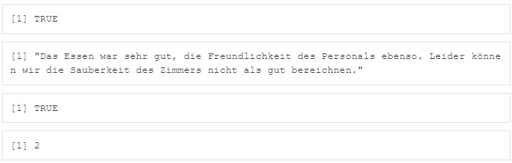

```{r setup, include=FALSE}
library(tidyverse)
library(learnr)
library(lubridate)
```


## Willkommen

Dieses Tutorial ergänzt die Inhalte des Buches [Künstliche Intelligenz und Machine Learning mit R](https://www.amazon.de/Data-Science-Statistik-mit-Anwendungsl%C3%B6sungen/dp/3658348240/ref=sr_1_1?__mk_de_DE=%C3%85M%C3%85%C5%BD%C3%95%C3%91&dchild=1&keywords=Data+Science+und+Statistik+mit+R&qid=1627898747&sr=8-1).

Das Kapitel 5.1 im Buch beschreibt die Datentypen von R. R ist schwach typisiert, da R den Datentyp automatisch bestimmen kann. Dabei wird der Mechanismus der Coercion angewendet, der versucht sicherzustellen, dass Daten dem für die jeweils durchgeführte Operation notwendigen Typ entsprechen. Wenn z.B. Text und Zahlen in einem Vek-tor zusammengeführt werden, dann erhält dieser Vektor automatisch den Typ character, damit beide Typen von Daten gespeichert werden können. R wählt also den kleinsten gemeinsamen Typen-Nenner. Es ist aber auch möglich einer Variablen explizit einen Typ zuzuweisen.

### Grundsätzliches

Nachdem Wertzuweisungen an Variablen erfolgt sind, kann die Funktion class() genutzt werden, um den von R automatisch zugewiesenen Datentyp anzeigen zu lassen. Um mit einer Funktion sowohl den Datentyp als auch den Wert einer Variablen angezeigt zu bekommen, kann die Funktion str() genutzt werden.

```{r 0_1, exercise=FALSE}
a <-  12                 # Numerische Variable 
a                        # Inhalt der Variable
class(a)                 # Datentyp der Variable
str(a)                   # Datentyp und Wert der Variable
heute <- Sys.Date()      # Datumsvariable mit aktuellem Datum
heute                    # Inhalt der Variable
class(heute)             # Datentyp der Variable
str(heute)               # Datentyp und Wert der Variable
```

Die Funktion unclass() kann verwendet werden, um anzuzeigen wie eine Variable intern (uncodiert durch den Datentyp vom Typ raw/roh) betrachtet und gespeichert wird.

```{r 0_2-setup, exercise=FALSE, echo=FALSE, include=FALSE}
a <-  12                 # Numerische Variable 
heute <- Sys.Date()      # Datumsvariable mit aktuellem Datum
```

```{r 0_2, exercise=FALSE, exercise.setup="0_2-setup"}
unclass(a)               # Uncodierte Variable vom Typ raw
unclass(heute)
```

## 1. Datentyp numeric und integer

### 1.1 Numerische Variable ohne Nachkommastellen

Numerische Zahlen werden gewöhnlich mit zwei Werten, der Mantisse m und dem Exponenten e als x = m * 10e, als Gleitkommazahlen gespeichert und angezeigt.

Historisch wurde in R auch mit dem Datentyp double gearbeitet, der identisch ist mit numeric bzw. num. Bei Bedarf kann eine Zahl vom Datentyp double mit der Funktion as.numeric() in numeric konvertiert werden, wenn das Ergebnis der Funktion is.numeric() ein TRUE produzieren soll. Wenn Zahlenwerte mit einem nachfolgenden L angegeben werden, z.B. 33L, dann werden sie als Datentyp integer (Ganzzahlen) gespeichert, was etwas weniger Speicherplatz verbraucht als Gleitkommazahlen. Das Dezimalkomma wird in R durch einen Punkt ein- und ausgegeben. R-Werte vom Typ numeric folgen dem Standard IEC 60559:2011 (auch bekannt als IEEE 754-2008) oder Binär64-Format, das mit einer Präzision von 53 Bits arbeitet.

```{r 1_1, exercise=FALSE}
a <-  12                 # Numerische Variable 
a                        # Inhalt der Variable
class(a)                 # Datentyp der Variable
a <- as.integer(a)       # Konvertierung zu Integer -> weniger Speicherplatz
a
```

### 1.2 Numerische Variable mit Nachkommastellen

Das Dezimalkomma wird in R durch einen Punkt ein- und ausgegeben.

```{r 1_2, exercise=FALSE}
b <- 13.5                # Numerische Variable mit Nachkommastellen 
str(b)
```

### 1.3 Ganzzahlige numerische Variable

Wenn Zahlenwerte mit einem nachfolgenden L angegeben werden, z.B. 33L, dann werden sie als Datentyp integer (Ganzzahlen) gespeichert, was etwas weniger Speicherplatz verbraucht als Gleitkommazahlen.

```{r 1_3, exercise=FALSE}
c <- 48000000            # Numerische Variable große Zahl 
str(c)
d <- 46000000L           # Integer Variable große Zahl 
str(d)
```

### 1.4 Übung

Weisen Sie der Variablen x den Wert 3,47 zu und lassen Sie sich anschließend durch die Ausführung einer Funktion den Datentyp und Wert von x anzeigen. Das Ergebnis sollte sein "num 3.47".

```{r 1_4, exercise=TRUE}

```

```{r 1_4-hint-1}
#Tippen Sie "x <- 3.47", um den Wert zuzuweisen.
```
```{r 1_4-hint-2}
#Tippen Sie "str(x)", um sich sowohl den Datentyp als auch den Wert mit einer Funktion anzeigen zu lassen.
```

## 2. Datentyp logical

Logische Werte vom Typ logical bzw. logi können den Wert TRUE und FALSE bzw. T und F annehmen.

```{r 2, exercise=FALSE}
e <- TRUE                # Boolsche Variable 
e
class(e)
```

Die logischen Funktionen is.numeric(), is.logical(), is.character() und is.Date() können verwendet werden, um zu prüfen, ob eine Variable von einem gewissen Datentyp ist. Das Ergebnis dieser Funktionen ist TRUE, wenn die Variable dem Datentyp entspricht, ansonsten FALSE.

Verwenden Sie die Funktion is.numeric() und is.logical(), um sich anzeigen zu lassen, ob die Variable a eine numerische oder logische Variable ist. Verwenden Sie anschließend die gleichen Funktionen, um die Prüfung für die Variable e durchzuführen.

```{r 2_1, exercise=TRUE}
a <- 12                  # Numerische Variable
e <- TRUE                # Boolsche Variable 

```

```{r 2_1-hint-1}
is.numeric(a)
is.logical(a)
```
```{r 2_1-hint-2}
is.numeric(e)
is.logical(e)
```

## 3. Datentyp Date, POSIXct und POSIXlt

R hat eine spezielle Art Datums- und Zeitvariablen zu verarbeiten. Der Datentyp der Datumsvariablen ist Date und der von Zeitvariablen ist POSIXct und POSIXlt. Alle Zeitinformationen werden als die Zeit in Tagen, Stunden oder Sekunden gespeichert, die seit dem 1.1.1970 vergangen ist. Für Zeiten vor diesem Datum gibt eine negative Zahl die Tage bzw. Sekunden bis zum 1.1.1970 an. 

Die Funktion Sys.Date() kann verwendet werden, um das aktuelle Datum anzuzeigen. Mit der Anweisung unclass(Sys.Date()) wird Ihnen die interne Darstellung des aktuellen Datums angezeigt und dies ist die Zahl der Tage, die seit dem 1.1.1970 vergangen sind. Mit der Funktion Sys.time() lässt sich auch die aktuelle Uhrzeit anzeigen. Die Anweisung unclass(Sys.time()) zeigt dann die Zahl der Sekunden an, die seit dem 1.1.1970 vergangen sind.

```{r 3, exercise=FALSE}
f <- Sys.Date()          # Datumsvariable
str(f)
unclass(f)
t <- Sys.time()          # Uhrzeitvariable
str(t)
unclass(t)
```

### 3.1 Konvertierung in Datumsvariable

Die Hilfe zu einer Funktion in R kann über ein dem Funktionsnamen vorangestelltes Fragezeichen erfolgen, z.B. ?ggplot, um die Hilfe zu der Funktion ggplot angezeigt zu bekommen. In der Hilfe werden u.a. auch die Parameter einer Funktion vorgestellt.

Lassen Sie sich die Hilfe zu der Funktion as.Date anzeigen, um deren Funktion und Parameter besser zu verstehen. Dies kann in R-Studio oder in einem separaten Browser-Fenster angezeigt werden.

```{r 3_1, exercise=TRUE}

```

```{r 3_1-hint-1}
?as.Date                # Hilfe zu der Funktion as.Date()
```

### 3.2 Übung

Gegeben ist die Character-Variable g, die eine Datumsinformation enthält.

```{r 3_2, exercise=FALSE}
g <- "2022-01-01"        # Character Variable
g
class(g)
```

Konvertieren Sie die Variable g mit Hilfe der Funktion as.Date() in die Datumsvariable h. Lassen Sie sich anschließend den Datentyp und Wert anzeigen. Als Ergebnis sollte Date[1:1], format: "2022-01-01" angezeigt werden.

```{r 3_21-setup, exercise=FALSE, echo=FALSE, include=FALSE}
g <- "2022-01-01"        # Character Variable 
```

```{r 3_21, exercise=TRUE, exercise.setup="3_21-setup"}

```

```{r 3_21-hint-1}
h <- as.Date(g)          # Konvertierung in Datumsvariable
```
```{r 3_21-hint-2}
str(h)
```

### 3.3 Datumsformat

Sie können bei der Funktion as.Date() über den Parameter format auch ein ganz spezifisches Format für die Konvertierung festlegen. Die Konvertierung in eine Datumsvariable ist für beliebige Datumsformate mit dem Parameter format möglich, z.B. as.Date("04.01.2021", format= "%d.%m.%Y").

```{r 3_3, exercise=FALSE}
i <- as.Date("16.10.2021", format= "%d.%m.%Y") # Konvertierung jeden Formates
str(i)
```

### 3.4 Zeitvariable

Die Funktion Sys.time() erlaubt die Abfrage der aktuellen Uhrzeit.

```{r 3_4, exercise=FALSE}
j<-Sys.time()            # Zeitvariable
class(j)
str(j)
```

### 3.5 Paket lubridate

Das Paket lubridate bietet viele weitere Funktionen für Datums- und Zeitvariablen wie date(), year(), month(), day(), hour(), minute(), second(), week(), quarter(), am() und pm().

```{r 3_5-setup, exercise=FALSE, echo=FALSE, include=FALSE}
j<-Sys.time()            # Zeitvariable
```

```{r 3_5, exercise=FALSE, exercise.setup="3_5-setup"}
lubridate::date(j)       # Datum
year(j)                  # Jahr
month(j)                 # Monat
day(j)                   # Tag
hour(j)                  # Stunde
minute(j)                # Minute
second(j)                # Sekunde
week(j)                  # Woche
quarter(j)               # Quartal
am(j)                    # AM-Uhrzeit TRUE/FALSE
pm(j)                    # PM-Uhrzeit TRUE/FALSE
```

### 3.6 Übung

Weisen Sie der Variablen heute das heutige Datum zu und weisen Sie der Variablen gerade die aktuelle Zeit zu. Lassen Sie sich im nächsten Schritt den aktuellen Monat und die aktuelle Stunde anzeigen.

```{r 3_6, exercise=TRUE}

```

```{r 3_6-hint-1}
heute <- Sys.Date()
gerade <- Sys.time()
```
```{r 3_6-hint-2}
month(heute)
hour(gerade)
```

## 4. Datentyp character

Zeichenketten bzw. Strings werden in einfache ‘ ‘ oder doppelte “ “ Anführungszeichen gesetzt und sind vom Typ character bzw. chr.

```{r 4_0, exercise=FALSE}
i <- 'Erste Zeichenkette'# Character Variable in einfachen Anführungszeichen
str(i)
j <- "Statistik ist toll"# Character Variable in doppelten Anführungszeichen
str(j)
```

### 4.1 Paket stringr

Werden Variablen vom Typ Character bearbeitet, so bietet das Paket stringr einige Funktionen an, z.B. die Funktion str_detect(), str_locate(), um nach Zeichenketten bzw. Wörtern zu suchen, oder str_count(), um die Häufigkeit einer Zeichenkette zu ermitteln.

```{r 4_1-setup, exercise=FALSE, echo=FALSE, include=FALSE}
i <- 'Erste Zeichenkette'# Character Variable in einfachen Anführungszeichen
j <- "Statistik ist toll"# Character Variable in doppelten Anführungszeichen
```

```{r 4_1, exercise=FALSE, exercise.setup="4_1-setup"}
str_detect(i,"toll")     # Prüfung, ob String enthalten ist
str_detect(j,"toll")     # Prüfung, ob String enthalten ist
str_locate(j,"toll")     # Start und Endeposition von String
str_count(j,"toll")      # Anzahl des Vorkommens von String
```

### 4.2 Typabfrage

Die Funktion is.character() kann verwendet werden, um abzufragen, ob eine Variable den Datentyp Character hat. 

```{r 4_2, exercise=FALSE}
k <- "27.62"             # Character Variable
str(k)                   # str() zeigt Datentyp und Inhalt gleichzeitig
l <- is.character(k)     # Logische Frage ob Datentyp == character
str(l)
```

### 4.3 Übung

```{r 4_3-setup, exercise=FALSE, echo=FALSE, include=FALSE}
feedback <- "Das Essen war sehr gut, die Freundlichkeit des Personals ebenso. Leider können wir die Sauberkeit des Zimmers nicht als gut bezeichnen."
```

Prüfen Sie, ob es sich bei der Variablen mit dem Namen feedback um eine Variable vom Typ character handelt und lassen Sie sich den Inhalt der Variablen anzeigen. Anschließend lassen Sie sich bitte anzeigen, ob die Zeichenkette "gut" in der Variablen enthalten ist und wie häufig "gut" vorkommt.

Folgendes sollte Ihnen angezeigt werden: 

```{r 4_3, exercise=TRUE, exercise.setup="4_3-setup"}

```

```{r 4_3-hint-1}
is.character(feedback)
feedback
```
```{r 4_3-hint-2}
str_detect(feedback,"gut")
str_count(feedback,"gut")
```

## 5. Konvertierung von Datentyp

Wenn der Datentyp konvertiert werden soll, so ist dies mit den Funktionen as.numeric(), as.logical(), as.character() und as.Date() möglich. Die Funktion as.numeric() ermöglicht beispielsweise die Konvertierung in eine Variable vom Typ numeric.

```{r 5, exercise=FALSE}
k <- "27.62"             # Character Variable
str(k)                   # str() zeigt Datentyp und Inhalt gleichzeitig
m <- as.numeric(k)       # Konvertierung zu numerisch 
m                        # Wert anzeigen
str(m)                   # Anzeige Typ, Wert, Attribute
```

## 6. Attribute von Variablen

Variablen können neben dem Wert auch Attribute besitzen. Mit der Funktion attributes() kann man diese anzeigen lassen und mit der Funktion attr() Attribute ändern oder hinzufügen, z.B. wird der Variablen a mit der Anweisung attr(a, "Bedeutung") <- "Stückzahl verkauft" das Attribut Bedeutung hinzugefügt. Die Funktion str() kann verwendet werden, um sowohl den Datentyp, den Wert als auch die Attribute einer Variablen anzuzeigen.

```{r 6, exercise=FALSE}
a <-  12                                       # Numerische Variable
str(a)                                         # Anzeige Typ, Wert, Attribute
attributes(a)                                  # Attribute anzeigen
attr(a, "Bedeutung") <- "Stückzahl verkauft"   # Attribut zuweisen
attributes(a)                                  # Attribute anzeigen
str(a)                                         # Anzeige Typ, Wert, Attribute
```

## 7. Quiz

```{r 7_1, echo = FALSE}
quiz(
  question("Welche der folgenden Aussagen sind korrekt?", allow_retry = TRUE, random_answer_order = TRUE,
    answer("a<-12 erzeugt eine numerische Variable.", correct = TRUE),
    answer("b<-''23,67'' erzeugt eine numerische Variable.", message = "Nein, die Verwendung von Hochkommata erzeugt eine character-Variable."),
    type = "multiple"
  ),
  question("Welche der folgenden Aussagen sind korrekt?", allow_retry = TRUE, random_answer_order = TRUE,
    answer("class(a) gibt den Inhalt der Klasse aus.", message = "Nein, die Funktion class() zeigt den Datentyp an."),
    answer("str(a) zeigt den Wert, die Attribute und den Datentyp von a an.", correct = TRUE),
    answer("System.date() gibt das aktuelle Datum an.", message = "Nein, die Funktion Sys.Date() gibt das aktuelle Datum an."),
    type = "multiple"
  ),
  question("Welche der folgenden Aussagen sind korrekt?", allow_retry = TRUE, random_answer_order = TRUE,
    answer("as.integer() prüft, ob eine Variable vom Typ Integer ist.", message = "Nein, die Funktion konvertiert eine Variable zum Datentyp Integer."),
    answer("Die Anweisung x <- 97,82 erzeugt eine Fehlermeldung", message = "Ja, die Fehlermeldung wird durch das falsche Dezimaltrennzeichen ',' anstatt des korrekten '.' verursacht.", correct = TRUE),
    answer("e<-T erzeugt eine logische Variable mit dem Wert TRUE", correct = TRUE),
    answer("Die Funktionen is.numeric(), is.logical() und is.character() prüfen, ob eine Variable vom Typ numeric, logical oder character ist und geben Yes bzw. No als Wert zurück.", message = "Nein, die Funktionen prüfen den Typ, geben aber TRUE bzw. FALSE zurück.")
  ),
  question("Welche der folgenden Aussagen sind korrekt?", allow_retry = TRUE, random_answer_order = TRUE,
    answer("POSIXct ist der Datentyp für Datums- und Zeitangaben.", correct = TRUE),
    answer("Die Funktion as.Date() konvertiert eine Variable in das Format Date.", correct = TRUE),
    answer("Das Paket lubridate beinhaltet wertvolle Funktionen zur Bearbeitung von Strings/Zeichenketten.", message = "Nein, lubridate enthält Funktionen für Datums- und Zeitvariablen."),
    answer("Charactervariablen können durch die Zuweisung einer Zeichenkette erstellt werden. Dabei darf die Zeichenkette entweder in einfachen oder doppelten Anführungszeichen geschrieben werden.", correct = TRUE)
  ),
  question("Welche der folgenden Aussagen sind korrekt?", allow_retry = TRUE, random_answer_order = TRUE,
    answer("Die Funktion str_locate() prüft, ob eine Zeichenkette in einer Charactervariablen enthalten ist.", message = "Nein, die Funktion str_detect() prüft, ob eine Zeichenkette in einer Charactervariablen enthalten ist. Die Funktion str_locate() gibt die Start- und Endposition zurück."),
    answer("Die Funktion attributes() erlaubt einer Variablen Attribute zuzuordnen", message = "Nein, die Zuordnung von Attributen erfolgt durch die Funktion attr(). Die Funktion attributes() zeigt die Attribute an."),
    answer("Die Funktion str() zeigt neben dem Datentyp und dem Wert einer Variablen auch die Attribute an.", correct = TRUE)
  )
)
```

## Ende 

Gratulation!

Sie haben dieses Tutorial erfolgreich ausgeführt und einen Einblick in die Datentypen der Programmiersprache R erhalten.