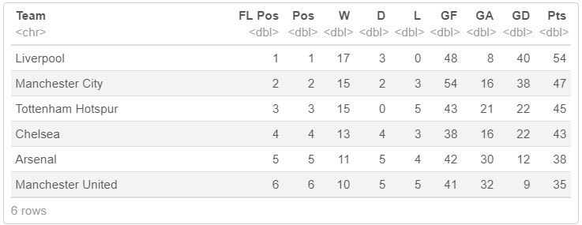
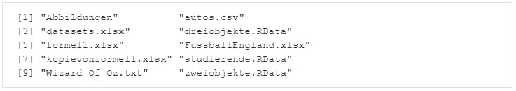
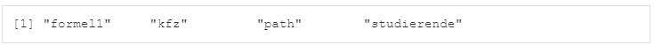

```{r setup, include=FALSE}
library(tidyverse)
library(learnr)
library(readxl)
library(XML)
library(xml2)
library(openxlsx)
library(rvest)
path<-getwd()                   # Arbeitsverzeichnis speichern
```


## Willkommen

Dieses Tutorial ergänzt die Inhalte des Buches [Künstliche Intelligenz und Machine Learning mit R](https://www.amazon.de/Data-Science-Statistik-mit-Anwendungsl%C3%B6sungen/dp/3658348240/ref=sr_1_1?__mk_de_DE=%C3%85M%C3%85%C5%BD%C3%95%C3%91&dchild=1&keywords=Data+Science+und+Statistik+mit+R&qid=1627898747&sr=8-1).

Das Kapitel 6.1 behandelt das Thema des Imports und Exports von Daten und nachfolgend wird vorgestellt, wie dies von R unterstützt wird.

Daten werden in der Regel in R eingelesen. Dies kann aus unterschiedlichsten Quellen und in verschiedenen Formaten erfolgen.
Daten können aber auch direkt in R mit der Funktion scan() eingegeben werden, z.B. neu<-scan() erlaubt die Erfassung von Elementen, die zu einem Vektor zusammengefügt werden. Das Objekt neu wird gespeichert, sobald ein leeres Element vorliegt und die Enter-Taste gedrückt wurde. Zur Modifikation einer Variablen kann auch die Funktion fix() verwendet werden. 

Aber Daten direkt in R zu erfassen ist eher selten. Daten werden in den meisten Fällen aus Dateien, von Datenbanken oder aus dem Internet geladen und dann mit R weiterverarbeitet und analysiert. Daher wird nachfolgend zunächst der Umgang mit Dateien vorgestellt. 

## 1. Umgang mit Dateien

Dateien können immer eindeutig beschrieben werden durch die Kombination von Dateiname und Pfadname, in welchem die Datei abgespeichert ist bzw. abgespeichert werden soll. Wenn keine explizite Angabe eines Pfadnamens erfolgt, dann geht R davon aus, dass die Datei sich im sogenannten Arbeitsverzeichnis (Working Directory) befindet bzw. dort gespeichert werden soll. Das Arbeitsverzeichnis kann man sich mit der Funktion getwd() anzeigen lassen bzw. mit der Funktion setwd() neu festlegen. Das Arbeitsverzeichnis kann in RStudio auch über das Menü Session/Set Working Directory/Choose Directory bestimmt werden.

```{r 1_0, exercise=FALSE}
path<-getwd()                   # Arbeitsverzeichnis anzeigen
path
setwd(file.path(path, "/data")) # Arbeitsverzeichnis festlegen
getwd()
```

### 1.1 Dateien anzeigen

Mit der Funktion list.files() oder dir() lassen sich alle Dateien anzeigen, die sich in einem Verzeichnis befinden. Sofern kein Verzeichnis als Parameter angegeben wird, wird das Arbeitsverzeichnis verwendet. Mit dem Argument recursive=TRUE werden auch die Dateien der Unterverzeichnisse angezeigt. Neue Verzeichnisse können mit der Funktion dir.create() und neue Dateien mit der Funktion file.create() erstellt werden. 

Um abzufragen, ob eine Datei existiert, kann die Funktion file.exists() verwendet werden. Die Funktion file.info() zeigt Informationen (size = Größe, isdir = ob es sich um ein Verzeichnis handelt, mtime = letzte Änderung, atime = letzter Zugriff, exe = ausführbare Datei yes/no) zu einer Datei an. 

Um eine Datei umzubenennen, kann die Funktion file.rename() angewendet werden, zum Kopieren die Funktion file.copy() und zum Löschen die Funktion file.remove(). Um ein ganzes Verzeichnis zu löschen, dient die Funktion unlink().

```{r 1_1, exercise=FALSE}
path<-getwd()                   # Arbeitsverzeichnis anzeigen
setwd(file.path(path, "/data")) # Arbeitsverzeichnis festlegen
list.files()                    # Dateien anzeigen
list.files(recursive = TRUE)    # Dateien inkl. Unterverzeichnisse
file.exists("studierende.RData")# Datei existiert 
file.exists("unternehmen.RData")# Datei existiert nicht
```

### 1.2 Workspace anzeigen

Der Workspace beinhaltet alle im Arbeitsspeicher befindlichen Objekte, die mit der Funktion ls() angezeigt werden können. Möchte man den kompletten Workspace mit allen Objekten sichern, so ist dies mit der Funktion save.image(“Dateiname.RData“) möglich. Möchte man explizit spezifische Objekte aus dem Arbeitsspeicher sichern, so ist dies mit der Funktion save(Objektname1, Objektnamen, file=“Dateiname.RData“) möglich. Die so gespeicherten Objekte können dann mit der Funktion load(“Dateiname.RData“) wieder eingelesen werden. Beide Extensions .RData und .Rda sind gleichwertig verwendbar.

```{r 1_2, exercise=FALSE}
ls()
```

## 2. Import von Daten

Daten können u.a. importiert werden von FlatFiles, z.B. KommaSeparatedFiles (CSV), Text- und HTML-Dateien, Excel Dateien, Software anderer Statistikpakete, aus Datenbanken oder über APIs (Application Programming Interfaces). 

### 2.1 Import von Daten aus Dateien

An dieser Stelle sollen die grundlegendsten Importmöglichkeiten vorgestellt werden, um RData-Dateien und folgende R-externen Dateiformate einzulesen: TXT, CSV, XLSX, JSON, XML und HTML. 

#### 2.1.1 Import aus einer RData-Datei

Eine RData-Datei kann mit der Funktion load() eingelesen werden. Die in der RData-Datei enthaltenen Variablen sind nach der Ausführung der Funktion im Arbeitsspeicher (Workspace). 

In der RData-Datei studierende befindet sich ein Dataframe mit dem Namen studierende. Wenn man die Funktion ls() einmal vorher und einmal hinterher aufruft ist erkennbar, dass sich hinterher ein zusätzliches Objekt mit dem Namen studierende im Arbeitsspeicher befindet.

```{r 2_0, exercise=FALSE}
ls()                                                # Inhalt von Arbeitsspeicher
load("data/studierende.RData")                      # Importiere RData-Datei
head(studierende, 4)
ls()                                                # Inhalt von Arbeitsspeicher
```

#### 2.1.2 Import aus einer txt-Datei

Eine Textdatei kann mit der Funktion readLines() eingelesen werden. 

```{r 2_1, exercise=FALSE}
oz<-readLines("data/Wizard_Of_Oz.txt")              # Importiere TXT-Datei
head(oz, 50)
ls()                                                # Inhalt von Arbeitsspeicher
```

#### 2.1.3 Import aus einer csv-Datei

Eine CSV-Datei kann mit der Funktion read_csv() für kommagetrennte oder read_csv2() für semikolongetrennte .csv-Dateien eingelesen werden.

```{r 2_2, exercise=FALSE}
kfz <- read_csv2("data/autos.csv",col_names = TRUE) # Importiere CSV-Datei
head(kfz, 4)
```

Die Funktionen read_delim() mit Punkt als Dezimaltrennzeichen und read_delim2() mit Komma als Dezimaltrennzeichen unterstützt das Lesen von Dateien, deren Variablen durch ein Sonderzeichen getrennt sind, wenn die Spalten nicht wie in einer .txt-Datei mit Tabulator getrennt sind, sondern z.B. mit einem Komma oder Semikolon. Der Parameter delim=“,“ bzw. delim=“;“ oder vergleichbar wird dabei genutzt, um das Trennzeichen zu spezifizieren. Der Paramater header=TRUE bzw. FALSE gibt an, ob die erste Zeile die Spaltennamen enthält und der Parameter col_types definiert das Zieldatenformat der Spalten.

In der nachfolgenden Funktion werden die Datentypen der Spalten über den Parameter col_types angegeben. Dies hat den Vorteil, dass die Daten bereits im gewünschten Format eingelesen werden.

```{r 2_3, exercise=FALSE}
kfz <- read_delim("data/autos.csv",col_names =TRUE,delim=";", 
                  col_types=cols(Marke=col_factor(),Zulassung=col_integer(),  
                                 PS=col_integer(),Kilometerstand=col_character(),
                                 Preis=col_character()))
head(kfz, 4)
```


#### 2.1.4 Import aus einer xlsx-Datei

Excel-Dateien können mit der Funktion read_excel() oder readxl_example() aus dem Paket readxl eingelesen werden. Die Syntax der Funktion ist read_excel(PFAD, sheet = NULL, range= NULL, col_names = TRUE) mit folgenden Argumenten:

-   PFAD: Verzeichnispfad, in dem die Datei zu finden ist und Dateiname.

-   sheet: Name des Arbeitsblatts, das importiert werden sollen. Wenn nicht angegeben, wird das erste Arbeitsblatt importiert.

-   range: Range mit Zeilen und Spaltenangabe, die importiert werden soll. Wenn nicht angegeben, werden alle Zellen importiert.

-   col_names: TRUE, wenn Spaltennamen aus der ersten Zeile importiert werden sollen (Standard). FALSE, wenn die Spaltennamen nicht in der ersten Zeile stehen.

-   n_max: Anzahl an Zeilen, die gelesen werden sollen. Wenn nicht an-gegeben, werden alle Zeilen gelesen.

Nach Ausführung der Funktion file<-readxl_example() kann die Funktion excel_sheets(file) verwendet werden, um die Namen der Sheets der gelesenen Datei anzuzeigen.

```{r 2_4, exercise=FALSE}
formel1 <- read_excel("data/formel1.xlsx")          # Importiere XLS-Datei
head(formel1, 4)
file <- readxl_example("datasets.xlsx")             # Dateiname
excel_sheets(file)                                  # Arbeitsblätter
sheet.1 <- read_excel(file)                         # Import erstes Arbeitsblatt 
head(sheet.1, 4)
sheet.car.1 <- read_excel(file,sheet="mtcars")      # Import Arbeitsblatt
head(sheet.car.1, 4)
sheet.car.2 <- read_excel(file,sheet="mtcars",col_names= FALSE)# Ohne Spaltenname
head(sheet.car.2, 4)
sheet.car.3 <- read_excel(file,sheet="mtcars",range="C1:F6")   # Range "C1:F6"
head(sheet.car.3, 4)
```

#### 2.1.5 Import aus JSON- und XML-Dateien

Auch das Einlesen von Dateien im JSON-Format oder XML-Format wird häufig benötigt. Um Dateien im JSON-Format zu lesen, kann die Funktion fromJSON() aus dem Paket rjson genutzt werden. Ebenso können Dateien im XML-Format mit Hilfe der Funktion xmlTreeParse() aus dem Paket XML eingelesen werden. 

#### 2.1.6 Import aus Statistikpaketen

Es existieren viele weitere Funktionen zum Einlesen von Daten, die hier nicht alle vorgestellt werden können. 

Es kann jedoch auch hilfreich sein die Funktionen zu kennen, mit deren Hilfe Daten aus anderen Statistikpaketen gelesen werden können. Um Daten aus dem Statistikpaket SPSS einzulesen, kann die Funktion read.spss() aus dem Paket foreign genutzt werden. In dem gleichen Paket ist auch die Funktion read.dta(), um Dateien des Statistikpakets Stata einzulesen. Im Paket sas7bdat existiert die Funktion read.sas7bdat(), um Dateien des Statistikpakets SAS einzulesen.

### 2.2 Import von Daten aus Datenbanken

Sollen Daten aus Datenbanken importiert werden, so gibt es das Paket RMySQL, um Daten mit den Funktionen dbConnect(), dbSend-Query() und dbWriteTable() aus einer MySQL-Datenbank einzulesen oder für die Nichtrelationale Datenbank MongoDB das Paket RMongo mit den Funktionen mongoDbConnect() und dbGetQuery(). Um Daten aus einer Oracle-Datenbank zu laden, kann das Paket ROracle verwendet werden.

### 2.3 Import von Daten aus dem Internet

Sollen Daten via WebScraping aus dem Web geladen werden, so ist das Paket xml2 in Verbindung mit dem Paket rvest eine gute Lösung. Die Funktion read_html() aus dem Paket xml2 liest die Daten von einer URL. Die Funktion html_table() aus dem Paket rvest extrahiert eine Tabelle aus der Webseite.

```{r 2_5, exercise=FALSE}
url <- "https://www.bundesliga.com/de/bundesliga/tabelle" # URL
content<-xml2::read_html(url)                             # Lese Webseite
list<-rvest::html_table(content,header=TRUE)[[1]]         # Tabelle Bundesliga
tabelle<-as.data.frame(list)                              # Konvertierung in Dataframe
tabelle<-tabelle[,c(-1,-3,-4,-6)]                         # Leere Spalten entfernen
colnames(tabelle)<-c("Pos","Verein","Spiele","Punkte",    # Spaltenbezeichnungen
                     "S","U","N","Tore","Diff")
tabelle                                                   # Ausgabe
```

### 2.4 Import von Daten aus einem R-Paket

Daten können auch in Paketen von R enthalten sein. Das Importieren von Daten aus Paketen erfolgt über den Befehl data(dataset, package = "package").

```{r 2_6, exercise=FALSE}
data(Titanic, package = "datasets")                       # Import aus Paket
titanic.statistics<-Titanic                               # Kopie
titanic.statistics                                        # Ausgabe
```

### 2.5 Übung

Lesen Sie die Excel-Datei "FussbalEngland.xlsx" aus dem Unterverzeichnis "data" des aktuellen Verzeichnisses, das in der Variablen path gespeichert ist, in den Dataframe soccer.england ein. Die Datei enthält alle Tabellen der englischen Fussballligen zum Stichtag des 31.12.2018. Im nächsten Schritt wählen Sie aus dem Dataframe soccer.england nur die Mannschaften aus, die in der Premier League spielen (schauen Sie sich dazu den Dataframe soccer.england zuvor an) und speichern diese in dem Dataframe soccer.premier.
In dem Dataframe soccer.premier sind die Spalten 1, 2 und 4 nicht wichtig. Löschen Sie diese Spalten und lassen sich anschließend die 6 ersten Mannschaften im Dataframe anzeigen.

Das Ergebnis sollte wie folgt angezeigt werden: 


```{r 2_7, exercise=TRUE}
path<-file.path(path, "data/FussballEngland.xlsx")
```

```{r 2_7-hint-1}
soccer.england <- read_excel(path)          # Importiere XLS-Datei
```
```{r 2_7-hint-2}
data(Titanic, package = "datasets")
titanic.statistics<-Titanic
rm(Titanic)
soccer.premier <- soccer.england[soccer.england$League=="Premier League",]
```
```{r 2_7-hint-3}
soccer.premier <- soccer.premier[c(-1,-2,-4)]
head(soccer.premier, 6)
```

## 3. Export von Daten

Möchte man den kompletten Workspace mit allen Objekten sichern, so ist dies mit der Funktion save.image(“Dateiname.RData“) möglich. Möchte man explizit spezifische Objekte sichern, so ist dies mit der Funktion save(Objektname1, Objektnamen, file=“Dateiname.RData“) möglich. Die so gespeicherten Objekte können dann mit der Funktion load(“Dateiname.RData“) wieder eingelesen werden.

Um Daten in ein Statistikpaket zu exportieren, können die Funktionen write_sav() für SPSS, die Funktion write_sas() für SAS und write_dta() für Stata verwendet werden. 

Auch das Speichern in der Cloud, z.B. auf Google Drive oder Dropbox wird durch R unterstützt. Mit der Funktion drive_upload() im Paket googledrive (zum Laden die Funktion drive_download()) und mit den Funktionen drop_auth(), drop_create() und drop_upload() im Paket rdrop2 (zum Laden die Funktion drop_read_csv()) ist der Datenaustausch mit diesen beiden Plattformen möglich.

Auch das Schreiben eines Dataframes in XLS-Dateien ist mit der Funktion write.xlsx() aus dem Paket openxlsx möglich, z.B. write.xlsx(formel1,"formel1-kopie.xlsx").

```{r 3_1-setup, exercise=FALSE, echo=FALSE, include=FALSE}
path<-getwd()
load("data/studierende.RData")
formel1 <- read_excel("data/formel1.xlsx")
kfz <- read_delim("data/autos.csv",col_names =TRUE,delim=";", 
                  col_types=cols(Marke=col_factor(),Zulassung=col_integer(),  
                                 PS=col_integer(),Kilometerstand=col_character(),
                                 Preis=col_character()))
datei<-"data/zweiobjekte.RData" 
if (file.exists(datei)) {
  #Delete file if it exists
  file.remove(datei)
}
datei<-"data/autos.csv" 
if (file.exists(datei)) {
  #Delete file if it exists
  file.remove(datei)
}
datei<-"data/kopievonformel1.xlsx" 
if (file.exists(datei)) {
  #Delete file if it exists
  file.remove(datei)
}
```

```{r 3_1, exercise=FALSE, exercise.setup="3_1-setup"}
ls()                                              # Anzeige Objekte
setwd(file.path(path, "/data"))                   # Arbeitsverzeichnis festlegen
list.files()                                      # Anzeige Dateien
save(formel1,studierende,file="zweiobjekte.RData")# Exportiere RData-Datei
write_csv(kfz, "autos.csv")                       # Exportiere CSV-Datei
write.xlsx(formel1,"kopievonformel1.xlsx")        # Exportiere XLSX-Datei
list.files()                                      # Anzeige Dateien 
```

### 3.1 Übung

Speichern Sie die drei Objekte kfz, formel1 und studierende in die R-Data-Datei mit dem Namen "dreiobjekte.RData" und lassen Sie sich anschließend alle Dateien im Verzeichnis /data anzeigen.

Das Ergebnis sollte wie folgt angezeigt werden: 


```{r 3_2-setup, exercise=FALSE, echo=FALSE, include=FALSE}
setwd(file.path(path, "/data"))                   # Arbeitsverzeichnis festlegen
```

```{r 3_2, exercise=TRUE, exercise.setup="3_2-setup"}

```

```{r 3_2-hint-1}
save(kfz,formel1,studierende,file="dreiobjekte.RData")# Export RData-Datei
```
```{r 3_2-hint-2}
list.files()                                          # Anzeige Dateien
```

Wenn Sie jetzt alle Objekte mit der Funktion rm(list=ls()) aus dem Arbeitsspeicher löschen ist der Arbeitsspeicher leer.

```{r 3_3, exercise=FALSE}
ls()
rm(list = ls ())
ls()
```

Laden Sie jetzt die von Ihnen exportierte R-Data-Datei mit dem Namen "dreiobjekte.RData" und lassen Sie sich anschließend alle Objekte im Arbeitsspeicher anzeigen.

Das Ergebnis sollte wie folgt angezeigt werden: 


```{r 3_4-setup, exercise=FALSE, echo=FALSE, include=FALSE}
setwd(file.path(path, "/data"))                   # Arbeitsverzeichnis festlegen
```

```{r 3_4, exercise=TRUE, exercise.setup="3_4-setup"}

```

```{r 3_4-hint-1}
load("dreiobjekte.RData")
```
```{r 3_4-hint-2}
ls()
```


## 4. Quiz

```{r 4_1, echo = FALSE}
quiz(
  question("Welche der folgenden Aussagen sind korrekt?", allow_retry = TRUE, random_answer_order = TRUE,
    answer('Das Arbeitsverzeichnis (Working Directory) kann mit der Funktion setwd() bestimmt werden.', correct = TRUE),
    answer('Die Funktion file.remove() entfernt alle Attribute einer Datei.', message = 'Nein, die Funktion file.remove() löscht Dateien.'),
    answer('Die Funktion list.files() zeigt die Dateien in dem aktuellen Arbeitsverzeichnis an.', correct = TRUE),
    type = "multiple"
  ),
  question("Welche der folgenden Aussagen sind korrekt?", allow_retry = TRUE, random_answer_order = TRUE,
    answer('Die Funktion file.exists() gibt den Wert FALSE zurück, wenn eine Datei existiert.', message = 'Nein, Sie gibt den Wert TRUE zurück, wenn eine Datei existiert.'),
    answer('Mit der Funktion ls() werden alle Dateien im Arbeitsverzeichnis angezeigt.', message = 'Nein, die Funktion ls() zeigt alle Objekte an, die sich im Arbeitsspeicher befinden.'),
    answer('Der Workspace beinhaltet alle im Arbeitsspeicher befindlichen Objekte.', correct = TRUE),
    type = "multiple"
  ),
  question("Welche der folgenden Aussagen sind korrekt?", allow_retry = TRUE, random_answer_order = TRUE,
    answer('Die Funktion readLines() liest Zeilen aus einer Excel-Datei ein.', message = 'Nein, Die Funktion readLines() dient zum Einlesen von Textdateien.'),
    answer('Die Funktionen read_csv(), read_csv2() und read_delim() dienen dem Einlesen von CSV-Dateien und unterscheiden sich nur durch das verwendete Trennzeichen.', correct = TRUE),
    answer('Eine Datei mit der Endung ".RData" ist eine Datei, in der Objekte aus dem Arbeitsspeicher gespeichert sind. Eine solche Datei kann mit der Funktion save() gespeichert/exportiert und mit der Funktion load() können die Objekte importiert werden.', correct = TRUE),
    type = "multiple"
  ),
  question("Welche der folgenden Aussagen sind korrekt?", allow_retry = TRUE, random_answer_order = TRUE,
    answer('XML-Dateien können in R nicht eingelesen werden.', message = 'Nein, u.a. erlaubt die Funktion xmlTreeParse() aus dem Paket XML das Einlesen von XML-Dateien.'),
    answer('Das Speichern in der Cloud, z.B. auf Google Drive oder Dropbox ist aus R heraus möglich.', correct = TRUE),
    answer('Daten aus einem Paket können mit der Funktion data(dataset, package = “package”) importiert werden.', correct = TRUE),
    type = "multiple"
  )
)
```

## Ende 

Gratulation!

Sie haben dieses Tutorial erfolgreich ausgeführt und gelernt wie Daten mit R importiert und exportiert werden können.