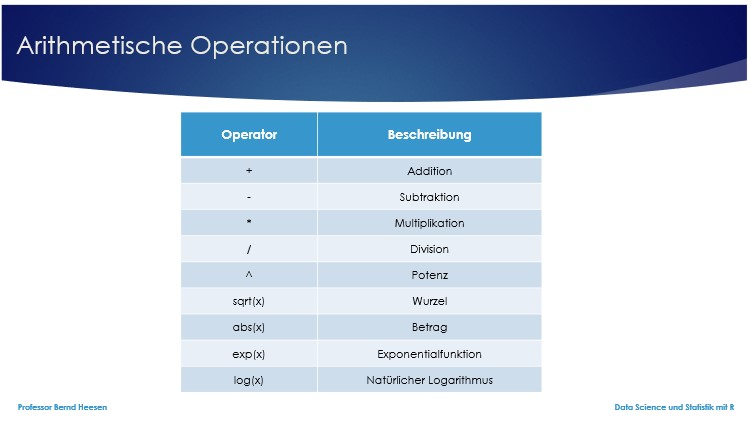
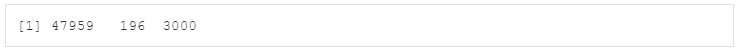
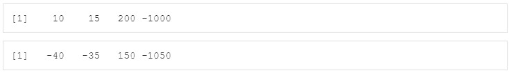
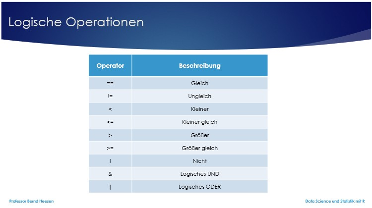
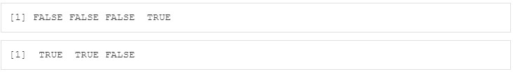
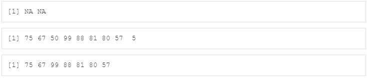
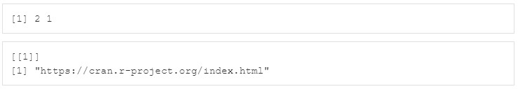
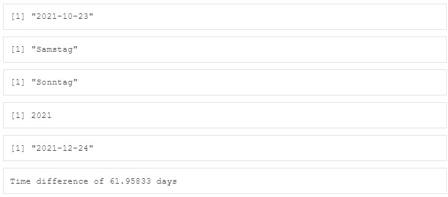
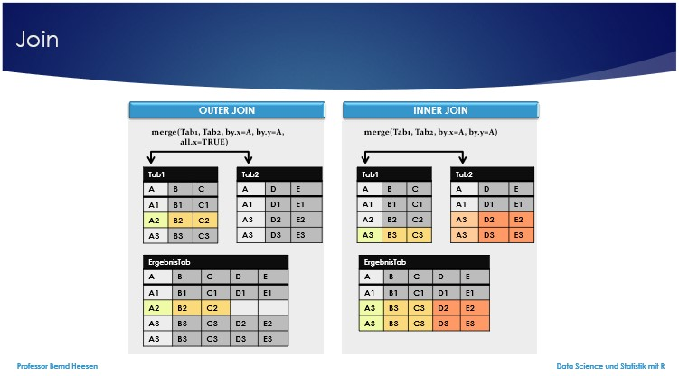
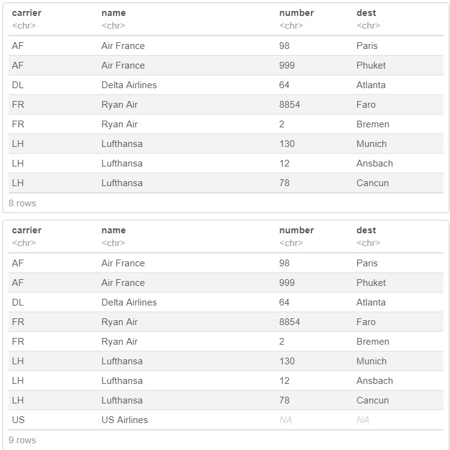

```{r setup, include=FALSE}
library(machinelearning)
library(tidyverse)
library(learnr)
```


## Willkommen

Dieses Tutorial ergänzt die Inhalte des Buches [Künstliche Intelligenz und Machine Learning mit R](https://www.amazon.de/Data-Science-Statistik-mit-Anwendungsl%C3%B6sungen/dp/3658348240/ref=sr_1_1?__mk_de_DE=%C3%85M%C3%85%C5%BD%C3%95%C3%91&dchild=1&keywords=Data+Science+und+Statistik+mit+R&qid=1627898747&sr=8-1).

Das Kapitel 5.3 im Buch beschreibt, wie Operationen in R unterstützt werden. Nachfolgend wird vorgestellt, wie R arithmetische, logische, selektive Operationen als auch Text- und Datumsoperationen unterstützt.

## 1. Arithmetische Operationen

R kann für arithmetische Operationen auch als Taschenrechner verwendet werden. Wenn das Ergebnis gespeichert werden soll, dann kann es einer Variablen zugewiesen werden. Eine solche Wertzuweisung erfolgt in R mit Hilfe der Operation <- (Kleiner-Zeichen und Minus-Zeichen), also einem Pfeil, der auf eine Variable zeigt, z.B. a<-6+8. In RStudio wird der Inhalt der Variablen anschließend im Global Environment angezeigt. Folgende Operatoren können in R verwendet werden.



### 1.1 Einfache Operationen

Wenn sich durch die Berechnung eine Zahl mit vielen Nachkommastellen ergibt, erweist sich die Funktion round() oft als hilfreich, um die Zahl auf eine vorgegebene Anzahl an Nachkommastellen zu runden, z.B. round(b,2) rundet die Zahl b auf zwei Nachkommastellen.


```{r 1_1, exercise=FALSE}
6+8                                   # Addition
a <- 6+8                              # Ergebnis in Variable speichern
a                                     # Ausgabe
6-4                                   # Subtraktion
5*3                                   # Multiplikation
b <- 30/167                           # Division
b                                     # Ausgabe
round(b,2)                            # Ausgabe gerundet auf 2 Nachkommastellen
10^3                                  # Potenz
sqrt(16)                              # Wurzel
abs(-87)                              # Betrag
exp(3)                                # Exponentialfunktion e hoch 3
2.718281828459^3                      # e hoch 3
c <- exp(3)                           # Exponentialfunktion e hoch 3
log(c)                                # Logarithmus
```

### 1.2 Operationen mit Vektoren, Dataframes, Tibbles etc.

Operationen lassen sich auch auf einen Vektor anwenden. Wenn ein Vektor c mit der Anweisung c <- c(10,15,40,200,5000) erstellt wurde und nachfolgend die Operation c+8 ausgeführt wird, so addiert R auf jedes Element des Vektors c die Zahl 8. Das Ergebnis bleibt ein Vektor mit der gleichen Länge wie der Ursprungsvektor.

Wenn R zwei Vektoren mit der gleichen Länge bei arithmetischen Operationen verwendet, werden die jeweiligen Operationen (`+`, `-`, `*`, etc.) Element für Element abgearbeitet. Haben die Vektoren unterschiedliche Längen, wird der kürzere Vektor so lange wiederverwendet, bis alle Berechnungen geleistet wurden. Falls beim Wiederverwenden der kürzere Vektor nicht vollständig auf die Länge des anderen Vektors vervielfacht werden kann, gibt R eine Warnung aus.

Arithmetische Operationen lassen sich u.a. auch gut auf Matrizen, Arrays, Dataframes und Tibbles anwenden. Um die Spalten mit den Namen x und y zu addieren, kann z.B. für einen Dataframe mit dem Namen a die Anweisung a$x + a$y" oder die Funktion with(a, x+y) verwendet werden.

```{r 1_2, exercise=FALSE}
d <- c(10,15,40,200,5000,-1000)       # Vektor numerisch Länge 6
d                                     # Ausgabe
e <- d+8                              # Operation auf Vektor
e                                     # Ausgabe
f <- d*e                              # Op Vektoren gleiche Länge
f                                     # Ausgabe
e                                     # Ausgabe
g <- c(3, -10)                        # vektor numerisch Länge 2
g                                     # Ausgabe
h <- e-g                              # Op Vektoren ungleiche Länge vielfaches
h                                     # Ausgabe
e                                     # Ausgabe
i <- c(3, -10, -20, 40)               # vektor numerisch Länge 4
i                                     # Ausgabe
j <- e-i                              # Op Vektoren ungleiche Länge vielfaches
j                                     # Ausgabe
df <- data.frame(x= c(53,2,100), y=c(299,20,30)) # Dataframe
df                                    # Ausgabe
df$x + df$y                           # Addition auf Spalten eines Dataframes
with(df,x-y)                          # Subtraktion auf Spalten eines Dataframes
```

### 1.3 Übung

```{r 1_3, exercise=FALSE}
df <- data.frame(x= c(241,7,100), y=c(199,28,30)) # Dataframe
df
```

```{r 1_4-setup, exercise=FALSE, echo=FALSE, include=FALSE}
df <- data.frame(x= c(241,7,100), y=c(199,28,30)) # Dataframe
```

Berechnen Sie das Produkt der Elemente der Zeilen x und y aus dem Dataframe df.

Die Anzeige sollte hinterher wie folgt aussehen: 


```{r 1_4, exercise=TRUE, exercise.setup="1_4-setup"}

```

```{r 1_4-hint}
df$x * df$y                           # Produkt auf Spalten eines Dataframes ODER
with(df,x*y)                          # Produkt auf Spalten eines Dataframes
```

Legen Sie einen Vektor mit dem Namen z an, der aus folgenden Zahlen besteht: 10, 15, 200,-1000. Subtrahieren Sie von jedem der Elemente im Vektor die Zahl 50 und speichern Sie das Ergebnis in dem Vektor mit dem Namen zminus50 ab. Lassen Sie sich dann den Vektor zminus50 anzeigen.

Die Anzeige sollte hinterher wie folgt aussehen: 

```{r 1_5, exercise=TRUE}

```

```{r 1_5-hint-1}
z <- c(10,15,200,-1000)               # Vektor numerisch Länge 4
z                                     # Ausgabe
```
```{r 1_5-hint-2}
zminus50 <- z-50                      # Operation auf Vektor
zminus50                              # Ausgabe
```

## 2. Logische Operationen

Auch logische Operationen lassen sich auf verschiedene Objekte anwenden.


Neben einer einfachen logischen Operation lässt sich auch ein logisches ODER (Symbol für Disjunktion in R: |), logisches UND (Symbol für Konjunktion in R: &) und die logische NEGATION (Symbol für Negation in R: !) in Bedingungen einsetzen.

### 2.1 Einfache logische Operationen

```{r 2_1, exercise=FALSE}
a <- 48                               # numerische Variable
a                                     # Ausgabe
a == 48                               # Operator == mit Ergebnis TRUE
a == 84                               # Operator == mit Ergebnis FALSE
a != 84                               # Operator != mit Ergebnis TRUE
a < 84                                # Operator < mit Ergebnis TRUE
a <= 84                               # Operator <= mit Ergebnis TRUE
a > 84                                # Operator > mit Ergebnis FALSE
a >= 84                               # Operator >= mit Ergebnis FALSE
class(a)                              # Datentyp
is.numeric(a)                         # Datentyp is.numeric TRUE
! is.numeric(a)                       # Datentyp ! is.numeric FALSE
is.numeric(a) & a > 84                # Datentyp is.numeric AND a>84 FALSE
is.numeric(a) | a > 84                # Datentyp is.numeric OR a>84 TRUE
```

### 2.2 Logische Operationen auf Vektoren

```{r 2_2-setup, exercise=FALSE, echo=FALSE, include=FALSE}
i <- c(3, -10, -20, 40)               # vektor numerisch Länge 4
df <- data.frame(x= c(53,2,100), y=c(299,20,30)) # Dataframe
```

Wenn R eine logische Operation auf einem Vektor ausführt, so wird diese für jedes Element des Vektors einzeln ausgeführt und ein Ergebnis produziert, das so viele logische Werte erzeugt, wie Elemente in dem Vektor existieren. Die einzelnen Werte stellen bei TRUE dar, dass ein Element die Bedingung erfüllt und bei FALSE, dass die Bedingung für dieses Element nicht erfüllt ist.

```{r 2_2, exercise=FALSE, exercise.setup="2_2-setup"}
i                                     # Ausgabe
truefalse1 <- i > 0                   # Operator > auf Vektor
truefalse1                            # Ausgabe
df                                    # Ausgabe
truefalse2 <- df > 50                 # Operator > auf Dataframe
truefalse2                            # Ausgabe
```

### 2.3 Übung

```{r 2_3-setup, exercise=FALSE, echo=FALSE, include=FALSE}
i <- c(3, -10, -20, 40)                          # vektor numerisch Länge 4
df <- data.frame(x= c(53,2,100), y=c(299,20,30)) # Dataframe
```

Der Vektor i wurde durch die Anweisung c(3, -10, -20, 40) und der Dataframe df mit der Anweisung data.frame(x= c(53,2,100), y=c(299,20,30)) angelegt. Erstellen Sie eine logische Operation auf den Vektor i, welche prüft, ob für die Elemente gilt, dass der Inhalt des Elements multipliziert mit 5 ein Ergebnis produziert, welches größer als 20 ist. Erstellen Sie darüber hinaus eine logische Operation die prüft, ob y-x aus dem Dataframe df eine positive Zahl ergibt.

Die Anzeige sollte hinterher wie folgt aussehen: 

```{r 2_3, exercise=TRUE, exercise.setup="2_3-setup"}

```

```{r 2_3-hint-1}
i*5>20
```
```{r 2_3-hint-2}
with(df,y-x>0)   # ODER
df$y-df$x>0
```

## 3. Selektive Operationen

Mit Hilfe selektiver Operationen ist es möglich Elemente aus Vektoren, Dataframes und anderen Datenstrukturen auszuwählen.

### 3.1 Einfache Selektive Operationen

Der Vektor mit dem Alter der Teammitglieder, der mit der Anweisung alter <- sample(c(floor(runif(16, min=0, max=100)), rep(NA, 4))) angelegt werden kann, enthält offensichtlich 20 numerische Elemente mit positiven Zahlen zwischen 0 und 100 Jahren oder der Angabe NA für einen fehlenden Wert, wenn die befragte Person ihr Alter nicht angegeben hat. Die Funktion rep() erzeugt wiederholt ein Element (1. Parameter) n Mal (2. Parameter). Ebenso kann ein logischer Vektor truefalse mit 20 Elementen durch die Anweisung truefalse <- rep(c(TRUE, FALSE),10) erzeugt werden, der abwechselnd ein TRUE und FALSE enthält.

Die Funktion alter[truefalse] zeigt dann nur die Elemente an, bei denen im Vektor truefalse der Wert TRUE steht. So kann mit Hilfe von TRUE und FALSE eine Selektion erfolgen.

```{r 3_1, exercise=FALSE}
alter <- sample(c(floor(runif(16,min=0,max=100)),rep(NA,4))) # Vektor numerisch
alter                                         # Ausgabe
truefalse <- rep(c(TRUE, FALSE),10)           # Vektor logisch Länge 20
truefalse                                     # Ausgabe
alter[truefalse]                              # Ausgabe wo TRUE
```

### 3.2 Selektive Operationen inkl. der Funktion is.na()

Die Funktion is.na() gibt für den in Klammern stehenden Parameter (Vektor) TRUE zurück, wenn das Element NA (NA = not available = fehlender Wert) ist und FALSE, wenn das Element NICHT NA ist. Die Funktion liefert als Ergebnis einen Vektor in der gleichen Länge wie der Parametervektor und zeigt für jedes Element die Position (Index) mit TRUE an, wo in einem Vektor NA steht. Sie dient dazu NA-Werte und deren Position zu identifizieren. Um z.B. alle Werte des Vektors alter anzuzeigen, die nicht NA sind, kann man die Funktion alter[!is.na(alter)] verwenden. Zur Erinnerung: Das ! bedeutet die Verneinung einer logischen Bedingung.
Wenn man aus diesem Vektor nur die Elemente angezeigt bekommen möchte, die ein Alter zwischen 5 und 15 Jahren haben, kann man in eckigen Klammern hinter dem Vektornamen die logische Bedingung angeben, z.B. alter[!is.na(alter) & alter>= 5 & alter<= 15].

Um zukünftige Analysen nur auf die Elemente zu beschränken, die nicht NA sind, kann man mit der Funktion alter2 <- alter[!is.na(alter)] einen neuen Vektor alter2 erstellen. Dann lässt sich anschließend die Anzeige der Personen mit Alter zwischen 5 und 15 Jahren mit der Funktion alter2[alter2>=5 & alter2<=15] erreichen. Die Erwachsenen aus dieser Gruppe lassen sich mit der Anweisung alter2[alter2 > 17] anzeigen.

```{r 3_2, exercise=FALSE}
alter <- sample(c(floor(runif(16,min=0,max=100)),rep(NA,4))) # Vektor numerisch
alter                                         # Ausgabe
is.na(alter)                                  # Ausgabe logisch Länge 20 
alter[is.na(alter)]                           # Ausgabe wo TRUE
alter[!is.na(alter)]                          # Ausgabe wo FALSE
alter2 <- alter[!is.na(alter)]                # Vektor wo FALSE
alter2                                        # Anzeige
alter[!is.na(alter) & alter>=5 & alter<=15]   # Ausgabe wo FALSE & >=5 & <=15
alter2[alter2>=5 & alter2<=15]                # Ausgabe wo FALSE & >=5 & <=15
alter2[alter2 > 17]                           # Ausgabe wo FALSE & >17
```

### 3.3 Übung

```{r 3_3-setup, exercise=FALSE, echo=FALSE, include=FALSE}
alter <- c(75, 67, NA, 50, NA, 99, 88, 81, 80, 57, 5) 
```

Der Vektor alter wurde durch die Anweisung alter <- c(75, 67, NA, 50, NA, 99, 88, 81, 80, 57, 5) angelegt. Erstellen Sie eine selektive Operation auf den Vektor alter, welche nur die Werte anzeigt, die NA sind. Erstellen Sie eine zweite Operation, welche nur die Werte anzeigt, die nicht NA sind. Erstellen Sie eine dritte Operation, die unter den vorhandenen Werten nur die Werte anzeigt, deren Wert größer als 50 ist.

Die Anzeige sollte hinterher wie folgt aussehen: 

```{r 3_3, exercise=TRUE, exercise.setup="3_3-setup"}

```

```{r 3_3-hint-1}
alter[is.na(alter)]
```
```{r 3_3-hint-2}
alter[!is.na(alter)]
```
```{r 3_3-hint-3}
alter[alter>50 & !is.na(alter)]
```

## 4. Textoperationen

Mit Variablen vom Typ character lassen sich viele Funktionen ausführen, u.a. erlaubt die Funktion paste() mehrere einzelne Wörter zu verbinden. Mit der Anweisung satz <- paste("Ich", "teste", "die", "paste()-Funktion") wird eine neue Variable mit dem Namen satz angelegt.

### 4.1 Funktion paste(), str_detect(), str_locate(), str_extract(), str_replace() und str_count()

Sie können mit der Funktion paste() auch Kombinationen von Zeichenketten erzeugen, wenn das Ergebnis aus mehrere Elementen verschiedenen Typs besteht, z.B. namen <- paste("Name",3:7,collapse=", ",sep="-"). Der Parameter collapse gibt an, wie die neu erzeugten Zeichenketten voneinander getrennt werden sollen und der Parameter sep gibt an, wenn anstatt eines Leerzeichens ein anderes Zeichen zur Trennung verwendet werden soll, um den ersten Parameter (hier: Name) und den zweiten Parameter (hier: 3 bis 7) zu verbinden. 

```{r 4_1, exercise=FALSE}
satz <- paste("Ich","teste","die","paste()-Funktion.") # Vektor character(Länge 1)
satz                                                   # Ausgabe
str(satz)                                              # Ausgabe mit Typ und Länge
namen <- paste("Name",3:7,collapse=", ",sep="-")       # Vektor character(Länge 1)
namen                                                  # Ausgabe
str(namen)                                             # Ausgabe mit Typ und Länge
```

Weitere Funktionen für die Textanalyse sind die Funktionen str_detect() zur Erkennung von Zeichenketten in einer Textvariablen, str_locate() zur Erkennung der Position, an welcher sich eine Zeichenkette in einer Textvariablen befindet, die Funktion str_extract() und str_extract_all(), um Zeichenketten eines spezifischen Formats aus einer Textvariablen zu extrahieren. Die Funktion str_replace_all() ersetzt eine Zeichenfolge in einer Textvariablen durch eine andere Zeichenkette.

Eine weitere wertvolle Funktion ist die Funktion str_count(), welche die Anzahl der Worte zählt, wenn der Parameter boundary("word") verwendet wird. Im Folgenden wird dies am Beispiel der Analyse eines Tweets vorgestellt.

```{r 4_2, exercise=FALSE}
tweet<-"Trotz #Corona-Beschränkungen sind für den morgigen #1Mai zahlreiche rechte \n                und/oder verachwörungsideologische Demos in #Sachsen geplant. Ein Übersichtsthread\n                mit den Top10 von @johannesgrunert: https://t.co/POtZkJRpJQ"
str_detect(tweet, "[:digit:]")                # Frage, ob Ziffer enthalten ist
str_locate(tweet, "[:digit:]")                # Frage, an welcher Position Ziffer
str_extract(tweet, "[:digit:]")               # Ziffer extrahieren
str_extract_all(tweet, "[:digit:]")           # Ziffern extrahieren
str_extract_all(tweet, "[:digit:]{2}")        # Ziffern extrahieren mit Länge 2
hashtag<-str_extract_all(tweet, "#[:alnum:]+")# Hashtags # mit nachfolgenden alpha
hashtags<-unlist(hashtag)                     # Hashtags in einfachen Vektor
hashtags<-as_tibble(table(hashtags))          # Hashtags in Tibble
hashtags
str_extract_all(tweet, "@[:alnum:]+")         # User @ mit nachfolgenden alpha
str_extract_all(tweet, "https?://[:graph:]+") # URLs extrahieren
str_count(tweet, boundary("word"))            # Anzahl Tokens (Wörter) zählen 
str_extract_all(tweet, "[:alpha:]+")          # Alle Tokens mit wenigstens einem Buchstaben
str_replace_all(tweet, "[^[:alpha:]+]", "")   # Alle Leerzeichen entfernen
```

### 4.2 Übung

```{r 4_3-setup, exercise=FALSE, echo=FALSE, include=FALSE}
text<-"R ist einfach eine beliebte Programmiersprache und daher lerne ich diese Programmiersprache auch besonders gerne. Mehr Details unter https://cran.r-project.org/index.html"
```

Der Vektor text enthält folgenden Inhalt: "R ist einfach eine beliebte Programmiersprache und daher lerne ich diese Programmiersprache auch besonders gerne. Mehr Details unter https://cran.r-project.org/index.html". 

Zählen Sie, wie häufig das Wort "Programmiersprache" und das Wort "ist" im Vektor vorkommt. Verwenden Sie anschließend auch eine Funktion, um alle URLs in dem Vektor anzuzeigen.

Die Anzeige sollte hinterher wie folgt aussehen: 

```{r 4_3, exercise=TRUE, exercise.setup="4_3-setup"}

```

```{r 4_3-hint-1}
str_count(text, c("Programmiersprache","ist"))  # Anzahl des Vorkommens zählen 
```
```{r 4_3-hint-2}
str_extract_all(text, "https?://[:graph:]+")    # URLs extrahieren
```

## 5. Datumsoperationen

Das Datumsformat unterscheidet sich je Region und auch die Zeitzone variiert regional. Mit der Funktion Sys.getlocale(“LC_ALL“) kann man sich die Systemeinstellungen anzeigen lassen und mit Sys.setlocale(“LC_TIME“) die Region festlegen. Die Zeitzone lässt sich mit der Funktion Sys.timezone() abfragen. 

```{r 5_1, exercise=FALSE}
Sys.getlocale("LC_ALL")                       # Systemeinstellungen ALL anzeigen
Sys.setlocale("LC_TIME", "C")                 # Windows Betriebssystem, Zeit=US
Sys.setlocale("LC_TIME", "German")            # Windows Betriebssystem, Zeit=D
Sys.getlocale("LC_TIME")                      # Systemeinstellungen TIME anzeigen
Sys.timezone()                                # Aktuelle Zeitzone
```

### 5.1 Einfache Datumsoperationen

Es gibt spezielle Funktionen, die auf Datumsvariablen anwendbar sind. Der Datentyp der Datumsvariablen ist Date und der von Zeitvariablen ist POSIXct und POSIXlt. Alle Zeitinformationen werden als die Zeit in Tagen, Stunden oder Sekunden gespeichert, die seit dem 1.1.1970 vergangen ist. Für Zeiten vor diesem Datum gibt eine negative Zahl die Tage bzw. Sekunden bis zum 1.1.1970 an. 

Die Funktion Sys.Date() kann verwendet werden, um das aktuelle Datum anzuzeigen und die Funktion Sys.time(), um die aktuelle Zeit und das aktuelle Datum anzuzeigen. Mit der Anweisung unclass(Sys.Date()) bzw. unclass(Sys.time()) wird Ihnen die interne Darstellung des aktuellen Datums bzw. der aktuellen Zeit angezeigt und dies ist die Zahl der Tage bzw. Sekunden, die seit dem 1.1.1970 vergangen sind.

```{r 5_2, exercise=FALSE}
heute <- Sys.Date()                           # Aktuelles Datum
heute                                         # Anzeige
str(heute)                                    # Anzeige Typ
zeit <- Sys.time()                            # Aktuelle Zeit
zeit                                          # Anzeige
str(zeit)                                     # Anzeige Typ
unclass.heute <- unclass(heute)               # Tage seit dem 1.1.1970
unclass.heute                                 # Anzeige
str(unclass.heute)                            # Anzeige Typ
unclass.zeit <- unclass(zeit)                 # Sekunden seit dem 1.1.1970
unclass.zeit                                  # Anzeige
str(unclass.zeit)                             # Anzeige Typ
```

### 5.2 Datumsoperationen für Datentyp Date

Möchte man sich den Wochentag eines Datums anzeigen lassen, so geht dies mit der Funktion weekdays(). Die Anzeige des Monats kann mit der Funktion months() erreicht werden. Eine umfassendere Möglichkeit ist jedoch die Konvertierung von Datum und Uhrzeit in das Format POSIXlt mit der Funktion as.POSIXlt(). Wenn man das Ergebnis anschließend mit der Funktion unclass() konvertiert, so kann man auf die Variablen wday, mday, mon, year, zone, hour, min und sec zugreifen.

```{r 5_3, exercise=FALSE}
heute <- Sys.Date()                           # Aktuelles Datum
heute.konv <- as.POSIXlt(heute)               # Konvertiert in Typ POSIXlt
str(heute.konv)                               # Anzeige Typ
unclass.heute.konv <- unclass(heute.konv)     # Konvertiert mit unclass()                     
unclass.heute.konv                            # Anzeige
unclass.heute.konv$wday                       # Wochentag
unclass.heute.konv$mday                       # Tag im Monat
1+unclass.heute.konv$mon                      # Monat (mon vorbei + 1)
1900 + unclass.heute.konv$year                # Jahr  (year + 1900)
weekdays(heute)                               # Wochentag
months(heute)                                 # Monat
```

### 5.3 Datumsoperationen für Datentyp POSIXct

Datumsoperationen für Datum und Zeit.

```{r 5_4, exercise=FALSE}
zeit <- Sys.time()                            # Aktuelle Zeit
zeit.konv <- as.POSIXlt(zeit)                 # Konvertiert in Typ POSIXlt 
str(zeit.konv)                                # Anzeige Typ
unclass.zeit.konv <- unclass(zeit.konv)       # Konvertiert mit unclass()                     
unclass.zeit.konv                             # Anzeige
unclass.zeit.konv$wday                        # Wochentag
unclass.zeit.konv$mday                        # Tag im Monat
1+unclass.zeit.konv$mon                       # Monat (mon vorbei + 1)
1900 + unclass.zeit.konv$year                 # Jahr  (year + 1900)
unclass.zeit.konv$zone                        # Zeitzone CET=Central European Time
unclass.zeit.konv$hour                        # Stunde
unclass.zeit.konv$min                         # Minute
unclass.zeit.konv$sec                         # Sekunde
weekdays(zeit)                                # Wochentag
months(zeit)                                  # Monat
```

### 5.4 Nützliche Konvertierungen

Manchmal gilt es auch einen Text in eine Variable vom Typ POSIXlt zu konvertieren. Die Funktion strptime() unterstützt dies, z.B. strptime("März 09, 1964 14:23","%B %d, %Y %H:%M").

Die geschickteste Art, die Details zu Datum und Uhrzeit zu erhalten, ist jedoch, nachdem man eine Variable mit der Funktion as.POSIXct() in das POSIXct-Format konvertiert hat und anschließend die Funktion format() verwendet, um sich Tag, Monat, Jahr, Stunde, Minute und Sekunde anzeigen zu lassen, z.B. mit der Anweisung format(Variable, format="%d.%m.%Y, %H:%M:%S").

```{r 5_5, exercise=FALSE}
a <- strptime("März 09, 1964 14:23","%B %d, %Y %H:%M") # Konvertiert Text in Zeit
a                                             # Anzeige CET=Central European Time
str(a)                                        # Anzeige Typ
b <- as.POSIXct("2020-03-09 11:12:54")        # Konvertiert Text in Zeit
b                                             # Anzeige CET=Central European Time
str(b)                                        # Anzeige Typ
format(b, format="%d")                        # Tag
format(b, format="%m")                        # Monat
format(b, format="%Y")                        # Jahr
format(b, format="%H")                        # Stunde
format(b, format="%M")                        # Minute
format(b, format="%S")                        # Sekunde
format(b, format="%d.%m.%Y, %H:%M:%S")        # Tag, Monat, Jahr, Stunde, Min, Sek
c <- as.POSIXct("11.04.2019, 14:52:31", format="%d.%m.%Y, %H:%M:%S") #Konv T->Zeit
format(c, format="%d")                        # Tag
format(c, format="%m")                        # Monat
format(c, format="%Y")                        # Jahr
format(c, format="%H")                        # Stunde
format(c, format="%M")                        # Minute
format(c, format="%S")                        # Sekunde
format(c, format="%d.%m.%Y, %H:%M:%S")        # Tag, Monat, Jahr, Stunde, Min, Sek
```

### 5.5 Vergleiche, Addition, Subtraktion und die Berechnung von Differenzen

Es gibt auch nützliche Berechnungsfunktionen (+, -) und Vergleiche, die mit Datums- und Zeitvariablen arbeiten. Die Funktion difftime(Zeit-1, Zeit-2, units = 'secs') gestattet die Differenz der Zeitvariablen Zeit-1 und Zeit-2 zu ermitteln. Über den Parameter units kann angegeben werden, in welcher Einheit die Differenz berechnet werden soll (Wochen=weeks, Tage=days, Stunden=hours, Minuten=mins, Sekunden=secs).

Das Paket lubridate erlaubt viele weitere essenzielle Operationen mit Datums- und Zeitvariablen. 

```{r 5_6-setup, exercise=FALSE, echo=FALSE, include=FALSE}
heute <- Sys.Date()                           # Aktuelles Datum
```

```{r 5_6, exercise=FALSE, exercise.setup="5_6-setup"}
heute                                         # Ausgabe
weekdays(heute)                               # Wochentag
übermorgen <- heute+2                         # Datumsberechnung mit +
übermorgen                                    # Ausgabe
weekdays(übermorgen)                          # Wochentag
vorgestern <- heute-2                         # Datumsberechnung mit - 
vorgestern                                    # Ausgabe
weekdays(vorgestern)                          # Wochentag
übermorgen - vorgestern                       # Berechnung Zeitdifferenz in Tagen
d <- as.POSIXct("11.04.2021, 14:52:31", format="%d.%m.%Y, %H:%M:%S") #Konv T->Zeit
d                                             # Ausgabe
e <- as.POSIXct("11.04.2021, 15:54:31", format="%d.%m.%Y, %H:%M:%S") #Konv T->Zeit
e                                             # Ausgabe
difftime(e,d,units="weeks")                   # Zeitdifferenz in Wochen
difftime(e,d,units="days")                    # Zeitdifferenz in Tagen
difftime(e,d,units="hours")                   # Zeitdifferenz in Stunden
difftime(e,d,units="mins")                    # Zeitdifferenz in Minuten
difftime(e,d,units="secs")                    # Zeitdifferenz in Sekunden
```

### 5.6 Übung

```{r 5_7-setup, exercise=FALSE, echo=FALSE, include=FALSE}
heute <- Sys.Date()                           # Aktuelles Datum
```

Geben Sie die Variable heute und den Wochentag von heute aus. Geben Sie anschließend auch den Wochentag von morgen aus, wenn in der Variablen heute das aktuelle Datum steht.
Berechnen Sie die in einem weiteren Schritt die Anzahl der Tage bis zum kommenden Heiligen Abend, dem 24. Dezember diesen Jahres.

Die Anzeige sollte hinterher ähnlich wie folgt aussehen, wobei der Wochentag und die Anzahl der Tage bis Heiligabend davon abhängt, an welchem Tag Sie diese Übung ausführen: 

```{r 5_7, exercise=TRUE, exercise.setup="5_7-setup"}

```

```{r 5_7-hint-1}
heute
weekdays(heute)                                # Wochentag heute
weekdays(heute+1)                              # Wochentag morgen
```
```{r 5_7-hint-2}
heute.konv<-as.POSIXlt(heute)                  # Datumsformat konvertieren
heute.unclass<-unclass(heute.konv)             # Unclass
heute.jahr<-heute.unclass$year+1900            # Jahr aktuell
heute.jahr
heiligabend<-paste(heute.jahr,"-12-24",sep="") # Datum von Heilig Abend
heiligabend
difftime(heiligabend,heute,units="days")       # Differenz in Tagen
```

## 6. Tabellenjoins

Oft besteht das Interesse Daten für eine Analyse miteinander zu verbinden, wenn nicht alle relevanten Informationen in einer Tabelle vorliegen bzw. sogar bewusst entsprechend dem Entity-Relationship-Modell für eine effektivere, redundanzfreie Datenträgernutzung normalisiert in unterschiedlichen Datenbanktabellen abgelegt sind. 

Für diesen Zweck kann man Tabellen x und y mit der Funktion merge() zusammenführen. Die Parameter by.x und by.y geben die Spaltennamen an, über welche der Join erfolgen soll. Das Ergebnis ist eine Tabelle, welche die Inhalte der Tabelle x und die Inhalte der Tabelle y zusammenführt, wenn für den Schlüssel, der mit by.x angegeben wurde, ein identischer Eintrag mit dem Schlüssel by.y in der Tabelle y existiert. Wenn der Parameter all.x=TRUE verwendet wird und kein Eintrag für den Schlüssel by.x in by.y existiert, dann werden die sonst mit den Werten der Tabelle y befüllten Spalten mit NA gefüllt (Outer Join, Partial Match). Wird der Parameter all.x=TRUE nicht verwendet und es existiert kein Eintrag für den Schlüssel by.x in by.y, so wird der Datensatz mit by.x nicht in die Ergebnistabelle aufgenommen (Inner Join, Full Match).



### 6.1 Join von Tabellen

Nachfolgend werden die Tabellen (Dataframes) regisseur und film gejoint.

```{r 6_1, exercise=FALSE}
regisseur <- data.frame(                      # Regisseure
    name = c("Spielberg","Scorsese","Hitchcock","Schlöndorff","Polanski"),
    nationalität = c("USA","USA","GB","Deutschland","Polen"),
    stringsAsFactors=FALSE)
film <- data.frame(                           # Filme
    nachname = c("Spielberg","Scorsese","Hitchcock","Hitchcock",
           	"Spielberg","Schlöndorff","Polanski"),
    titel = c("Der Weiße Hai","The Irishman","Psycho","Die Vögel",
    		    "Catch Me If You Can","Die Blechtrommel","Chinatown"),
    stringsAsFactors=FALSE)
m1 <- merge(regisseur,film,                   # Inner Join
            by.x="name",by.y="nachname")
m1                                            # ->Join Regisseur mit Film
dim(m1)
regisseur.neu <-  c("deJenlis","Frankreich")  # Neuer Regisseur
regisseur <- rbind(regisseur,regisseur.neu)
m2 <- merge(regisseur,film,                   # Inner Join
            by.x="name",by.y="nachname")
m2                                            # ->Keine Zeile für neuen Regisseur
dim(m2)
m3 <- merge(regisseur,film,                   # Outer Join
            by.x="name",by.y="nachname",
            all.x = TRUE)
m3                                            # ->Extra Zeile Regisseur ohne Film
dim(m3)                                            
regisseur.neu <-  c("Polanski","Frankreich")  # Neuer Regisseur - Name doppelt
regisseur <- rbind(regisseur,regisseur.neu)
m4 <- merge(regisseur,film,                   # Inner Join
            by.x="name",by.y="nachname")
m4                                            # ->Zwei Zeilen Polanski-Film
dim(m4)
m5 <- merge(regisseur,film,                   # Outer Join
            by.x="name",by.y="nachname",
            all.x = TRUE)
m5                                            # ->Extra Zeile Regisseur ohne Film
dim(m5)
```

### 6.2 Übung

```{r 6_2-setup, exercise=FALSE, echo=FALSE, include=FALSE}
airlines <- data.frame(                      # Fluggesellschaften
    carrier = c("LH","DL","US","AF","FR"),
    name = c("Lufthansa","Delta Airlines","US Airlines","Air France","Ryan Air"),
    stringsAsFactors=FALSE)
flights <- data.frame(                       # Flüge
    carrier = c("LH","AF","LH","FR","DL","LH","AF","FR"),
    number  = c("130","98","12","8854","64","78","999","2"),
    dest    = c("Munich","Paris","Ansbach","Faro","Atlanta","Cancun","Phuket","Bremen"),
    stringsAsFactors=FALSE)
```

Lassen Sie sich zunächst die Inhalte der Dataframes airlines und flights anzeigen.

```{r 6_2, exercise=TRUE, exercise.setup="6_2-setup"}
airlines
flights
```

```{r 6_3-setup, exercise=FALSE, echo=FALSE, include=FALSE}
airlines <- data.frame(                      # Fluggesellschaften
    carrier = c("LH","DL","US","AF","FR"),
    name = c("Lufthansa","Delta Airlines","US Airlines","Air France","Ryan Air"),
    stringsAsFactors=FALSE)
flights <- data.frame(                       # Flüge
    carrier = c("LH","AF","LH","FR","DL","LH","AF","FR"),
    number  = c("130","98","12","8854","64","78","999","2"),
    dest    = c("Munich","Paris","Ansbach","Faro","Atlanta","Cancun","Phuket","Bremen"),
    stringsAsFactors=FALSE)
```

Führen Sie zuerst einen Inner Join und anschließend einen Outer Join über die beiden Tabellen (Dataframes) airlines und flights aus, wobei diese über die Schlüsselfelder carrier verknüpft werden und speichern das Ergebnis in dem Dataframe flug ab. Geben Sie jeweils anschließend die Inhalte des Dataframe flug aus.

Die Anzeige sollte hinterher wie folgt aussehen: 

```{r 6_3, exercise=TRUE, exercise.setup="6_3-setup"}

```

```{r 6_3-hint-1}
flug <- merge(airlines,flights,                # Inner Join
            by.x="carrier",by.y="carrier")
flug
```
```{r 6_3-hint-2}
flug <- merge(airlines,flights,                # Outer Join
            by.x="carrier",by.y="carrier",
            all.x = TRUE)
flug
```

## 7. Quiz

```{r 7_1, echo = FALSE}
quiz(
  question("Welche der folgenden Aussagen sind korrekt?", allow_retry = TRUE, random_answer_order = TRUE,
    answer("Die Funktion round(b,2) rundet den Inhalt der numerischen Variable b auf zwei Nachkommastellen.", correct = TRUE),
    answer("Wenn R zwei Vektoren mit unterschiedlicher Länge bei arithmetischen Operationen verwendet, werden die jeweiligen Operationen (`+`, `-`, `*`, etc.) Element für Element abgearbeitet, wobei der kürzere Vektor so lange wiederverwendet wird, bis alle Berechnungen geleistet wurden.", correct = TRUE),
    type = "multiple"
  ),
  question("Welche der folgenden Aussagen sind korrekt?", allow_retry = TRUE, random_answer_order = TRUE,
    answer("Das Symbol für die logische NEGATION in R ist das Ausrufungszeichen '!'.", correct = TRUE),
    answer("Wenn die Anweisung a <- c('250') ausgeführt wurde, dann liefert die Anweisung is.numeric(a) & a > 84 das Ergebnis TRUE", message = "Nein, TRUE ist nicht korrekt, da a eine Character-Variable (nicht numerisch wegen der Anführungszeichen) ist und damit die Funktion is.numeric(a) ein FALSE zurückgibt."),
    answer("Die Anweisung liste <- a[!is.na(a)] selektiert nur die Werte aus dem Vektor a, welche NA sind, und speichert diese in dem Vektor liste ab.", message = "Nein, das Ausrufungszeichen vor dem is.na gibt an, dass nur die Werte, welche NICHT NA sind in dem Vektor a in dem Vektor liste gespeichert werden."),
    type = "multiple"
  ),
  question("Welche der folgenden Aussagen sind korrekt?", allow_retry = TRUE, random_answer_order = TRUE,
    answer('namen <- paste("Raum",4:6,collapse=", ",sep="-") speichert die folgenden drei Zeichenketten in dem Vektor namen ab: "Raum-4", "Raum-5", "Raum-6".', correct = TRUE),
    answer("sys.date() gibt das aktuelle Datum aus.", message = "Nein, Sys.Date() leistet dies. Groß- und Kleinschreibung wird in R unterschieden."),
    answer("Die Funktion merge() erlaubt Dataframes miteinander zu joinen, wobei die Parameter by.x und by.y die Namen der Spalten angeben, über deren Inhalte (Schlüssel) die Verknüpfung erfolgem soll", correct = TRUE),
    type = "multiple"
  )
)
```

## Ende 

Gratulation!

Sie haben dieses Tutorial erfolgreich ausgeführt und einen Einblick in wesentliche Operationen der Programmiersprache R erhalten.