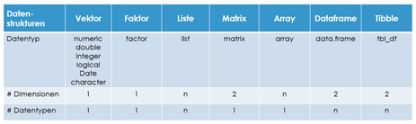

```{r setup, include=FALSE}
library(learnr)
library(tidyverse)
library(readr)
knitr::opts_chunk$set(echo = FALSE)
library(dygraphs)
#gradethis::gradethis_setup()
flights_jan <- 
  nycflights13::flights %>% 
  dplyr::filter(month == 2)
path<-getwd()
path<-file.path(path, "data/flights-jan.csv")
#dir.create("data",  showWarnings = TRUE)
write_csv(flights_jan, path)
library(learnr)
checker <- function(label,user_code,check_code,envir_result,evaluate_result,...) {
  code<-as.numeric(user_code)
  nachricht<-paste0("Code:",code,"user_code:",user_code,"Label:",label)
#  if (label == "0_1") {
    if (code == 124) {  # hier noch 12 Codes für jeden Monat einfügen und mit dem Datum abgleichen!!!
      list(message = "Gültiger Code! Ich wünsche Ihnen Viel Spaß und Erfolg bei diesem Tutorial!", correct = TRUE)
    } else {
      list(message = "Ungültiger Code!", correct = FALSE)
      q()
    }
#  } else {
#    list(message = nachricht, correct = FALSE)
#  }
}
tutorial_options(exercise.checker = checker)
```


## Welcome

This is a demo tutorial based on the package learnr https://rstudio.github.io/learnr .

### 0.1 Berechtigung

Dieses Tutorial ist copyright Bernd Heesen und beschränkt verfügbar für einen berechtigten Personenkreis.

Geben Sie nachfolgend Ihren Berechtigungscode zur Ausführung des Tutorials ein. Wenn der eingegebene Code ungültig ist, dann schließt sich  das Fenster mit dem Tutorial.
!!! Das Problem ist, dass es beim ersten Mal zwar abbricht, dann aber bei erneutem Start des Tutorials mit "Continue" sich einfach überspringen lässt (trotz im setup "allow_skip = FALSE"... und damit ungeschützt ist.

```{r 0_1, exercise=TRUE, exercise.lines=2}

```
```{r 0_1-check}
"Validierung"
```

### Outline

This tutorial can offer questions with messages based on your selection, e.g. to help you install R and tools:

* Install R on your computer
* Install the RStudio IDE
* Install the `tidyverse` R package

It uses the correct=TRUE and message="..." for both incorrect and correct answers.

```{r quiz1, echo = FALSE}
question("Check all that you have NOT done:",
  answer("installed R on my computer", message = "* Install R"),
  answer("installed the RStudio IDE", message = "* Install RStudio IDE"),
  answer("installed the tidyverse R package", message = "* Install Packages"),
  answer("None of the above. I've done them all.", correct = TRUE, message = "You can skip this tutorial!"),
  type = "multiple",
  incorrect = "This tutorial is here to help! To get set up read:"
)
```
## Video

### How to include a video


## Picture

### How to include a picture



## Code chunk

### Exercise with an empty code chunk 

exercise=TRUE are evaluated independent from prior exercises (no dependency).

Write the R code required to add two plus two:

```{r two-plus-two, exercise=TRUE}

```

### Exercise with prepopulated code and `exercise.lines = 5`

Write a function that adds any two numbers and then call it:

```{r add-function, exercise=TRUE, exercise.lines = 5}
add <- function() {
  
}
```

### Exercise with Hint & Solution

*The exercise is pre-evaluated via the `exercise.eval` option (so the user can see the default output we'd like them to customize). There is also a "hint" to the correct solution immediate below the name of the code labeled `cars-hint`. It is possible to incrementally show more hints if they are numbered cars-hint-1 and cars-hint-2...

Additional options:
exercise.cap	Caption for exercise chunk (defaults to “Code”)
exercise.lines	Lines of code for exercise editor (default to size of code chunk).
exercise.timelimit	Number of seconds to limit execution time to (defaults to 30).
exercise.startover	Whether to include a “Start Over” button for the exercise.

exercise.checker	Function used to check exercise answers (e.g., gradethis::grade_learnr()).
exercise.blanks	Regular expression to find blanks requiring replacement in the exercise code. See Checking Blanks below.
exercise.error.check.code	A string containing R code to use for checking code when an exercise evaluation error occurs (e.g., “gradethis::grade_code()”).
exercise.completion	Whether to enable code completion in the exercise editor.
exercise.diagnostics	Whether to enable code diagnostics in the exercise editor.
exercise.warn_invisible	Whether to display an invisible result warning if the last value returned is invisible.
exercise.reveal_solution	Whether or not the solution should be revealed to the user (defaults to TRUE). See Hiding Solutions below.

The exercise.setup can be used prior to an exercise to prepare the data

```{r cars-setup, exercise=TRUE, echo=FALSE}
mtcars<-dplyr::filter(mtcars, wt > 2000)
```

Modify the following code to limit the number of rows printed to 5:

```{r cars, exercise=TRUE, exercise.setup = "cars-setup", exercise.eval=TRUE, exercise.timelimit = 60}
mtcars
```
```{r cars-hint-1}
<div id="cars-hint-1">
**Hint:** You may want to use the "head" function.
</div>
head(mtcars, n = ?)
```
```{r cars-hint-2}
head(mtcars, n = 5)
```
## Data Files

```{r read-flights, exercise=TRUE}
path
flights<-read_csv(path, show_col_types = FALSE)
```

## Quiz

You can include any number of single or multiple choice questions as a quiz. Use the `question` function to define a question and the `quiz` function for grouping multiple questions together.

allow_retry = TRUE allows to retake the question if incorrect (otherwise the correct answer is displayed automatically). Allow_retry should be used as default!
try_again = "..." can add a message in case of Retry

random_answer_order = TRUE should be used as default to make tests different for all users!

* Messages
  * `correct`: Message to be displayed when a user gets a correct answer.
  * `incorrect`: Message to be displayed when a user gets an incorrect answer and is not able to try again.
  * `try_again`: Message to be displayed when a user gets an incorrect answer and has the ability to try again.
  * `message`: An additional, neutral message to be displayed along with the correct/incorrect message.
  * `post_message`: Additional message to display along with correct/incorrect feedback.  If `allow_retry` is `TRUE`, this message will only be displayed after the correct submission.  If `allow_retry` is `FALSE`, it will produce a second message alongside the `message` value.
* Question Setup
  * `allow_retry`: Boolean that determines if the user should get a second chance at submitting their answer
  * `random_answer_order`: Boolean that determines if the question answers are displayed in a random order
* Buttons
  * `submit_button`: Label of the submit button
  * `try_again_button`: Label of the submit button
* Extra
  * `options`: List of extra pieces of information to store.  For an example, `question_text` uses `options` to store the `trim` and `placeholder` values.

```{r 7_1, echo = FALSE}
quiz(
  question("Welche der folgenden Aussagen sind korrekt?", allow_retry = TRUE, random_answer_order = TRUE,
    answer("a<-12 erzeugt eine numerische Variable.", correct = TRUE),
    answer("b<-'23,67' erzeugt eine numerische Variable.", message = "Nein, die Verwendung von Hochkommata erzeugt eine character-Variable."),
    type = "multiple"
  ),
  question("Welche der folgenden Aussagen sind korrekt?", allow_retry = TRUE, random_answer_order = TRUE,
    answer("class(a) gibt den Inhalt der Klasse aus.", message = "Nein, die Funktion class() zeigt den Datentyp an."),
    answer("str(a) zeigt den Wert, die Attribute und den Datentyp von a an.", correct = TRUE),
    answer("System.date() gibt das aktuelle Datum an.", message = "Nein, die Funktion Sys.Date() gibt das aktuelle Datum an."),
    type = "multiple"
  ),
  question("Welche der folgenden Aussagen sind korrekt?", allow_retry = TRUE, random_answer_order = TRUE,
    answer("8"),
    answer("14"),
    answer("1", correct = TRUE),
    answer("23")
  )
)
```

```{r 7_3, echo = FALSE}
question_text("Ihr Berechtigungscode?", allow_retry = FALSE, trim= TRUE,
    answer(text="124", correct = TRUE)
)
```

## Graphs

It is also possible to display graphs. Here e.g. modify the dyOptions to customize the graph's appearance:

```{r dygraph-options, exercise=TRUE, exercise.eval=TRUE, fig.height=5.5}
dygraph(ldeaths) %>%
  dyOptions(fillGraph = FALSE, drawGrid = TRUE)
```

## Grading not recommended yet in 2021

* Submit `1+1` to receive a correct grade. (graded based on result)

```{r ex1, exercise = TRUE}

```

```{r ex1-solution}
1+1
```
 
```{r ex1-check}
grade_result(pass_if(~identical(.result, 2))
)
```

* Submit `1+1` to receive a correct grade (graded bases on code).

```{r ex2, exercise = TRUE}

```

```{r ex2-solution}
1+1
```
 
```{r ex2-code-check}
grade_code()
)
```

Additional options:
Custom Checking
If you need custom exercise checking logic that isn’t already provided grading packages like gradethis, then you may want to write your own exercise.checker function. This function is called on exercise submission whenever *-check or *-code-check chunks exist. When called, this function receives all the information that learnr knows about the exercise at the time of the checking, including the user_code, solution_code, check_code, exercise environments, and the last_value (if any). Checking can be performed at three different time points, so the values supplied can differ depending on the time point:

Before exercise evaluation, at this stage:
check_code contains *-code-check chunk code.
envir_result, evaluate_result, and last_value are all NULL.
During evaluation, when an error occurs:
check_code contains *-error-check chunk code.
last_value contains the error condition object.
After exercise evaluation, at this stage:
check_code contains *-check chunk code.
last_value contains the last printed value.
If, at any one of these stages, feedback should be provided, then exercise.checker should return an R list with, at the very least, a correct flag and feedback message:

Field	Description
message	Feedback message. Can be a plain character vector or can HTML produced via the htmltools package.
correct	TRUE/FALSE logical value indicating whether the submitted answer was correct.
type	Feedback type (visual presentation style). Can be “auto”, “success”, “info”, “warning”, “error”, or “custom”. Note that “custom” implies that the “message” field is custom HTML rather than a character vector.
location	Location for feedback (“append”, “prepend”, or “replace”).
Below is a rough sketch of how one might implement an exercise.checker function. Notice how the presence of envir_result may be used to determine which type of check is being done (i.e., code or result check).

See the table below for a full description of all the arguments supplied to exercise.checker.

Argument	Description
label	Label for exercise chunk.
user_code	R code submitted by the user.
solution_code	Code provided within the “-solution” chunk for the exercise.
check_code	Code provided within the “-check” chunk for the exercise.
envir_result	The R environment after the execution of the chunk.
evaluate_result	The return value from the evaluate::evaluate function.
envir_prep	A copy of the R environment before the execution of the chunk.
last_value	The last value of the evaluated chunk.
engine	The engine value of the evaluated chunk.
…	Unused (include for compatibility with parameters to be added in the future

## Ende 

Gratulation!

Sie haben dieses Tutorial erfolgreich ausgeführt und einen Einblick in die Datentypen der Programmiersprache R erhalten.