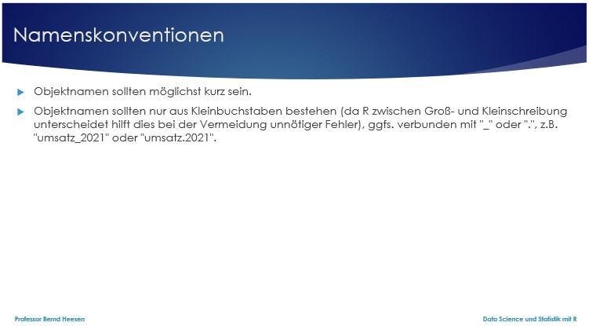
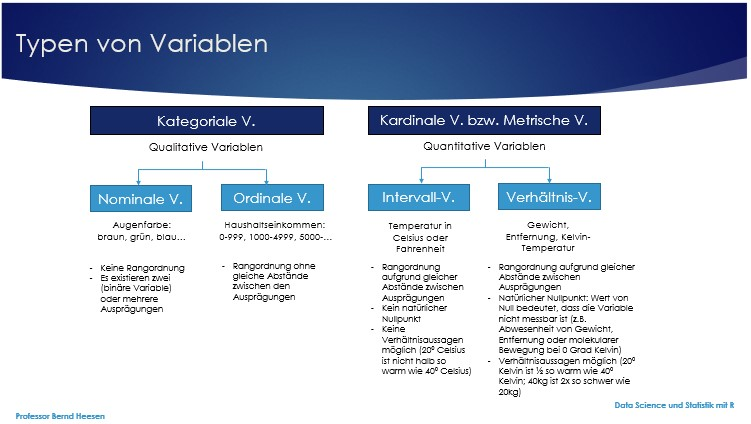
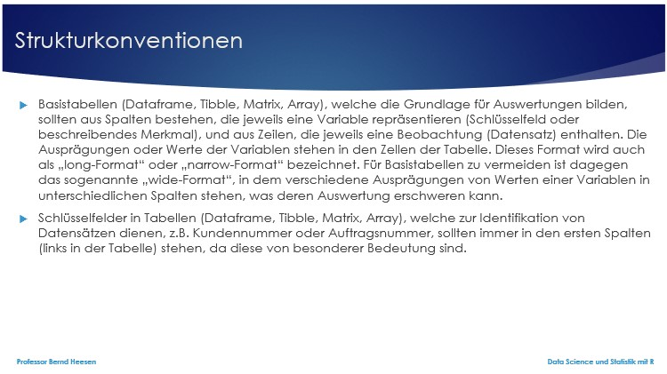
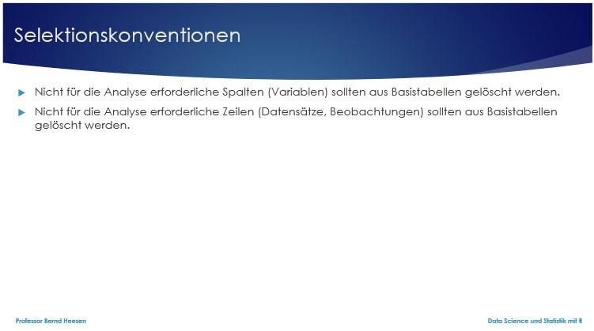
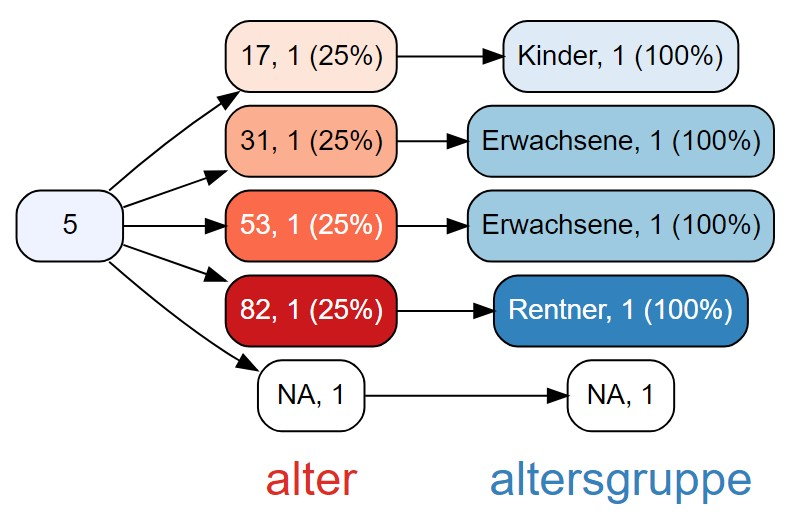
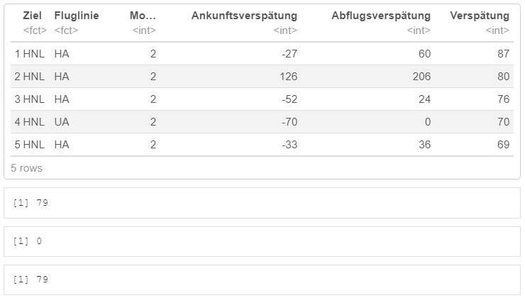
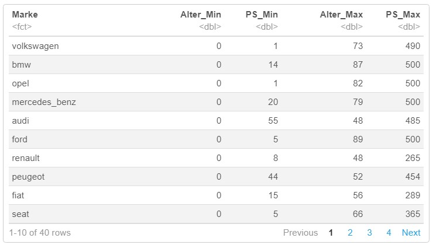

```{r setup, include=FALSE}
library(machinelearning)
library(tidyverse)
library(learnr)
library(fivethirtyeight)
library(viridis)
formel1<-select(formel1,-9)
```


## Willkommen

Dieses Tutorial ergänzt die Inhalte des Buches [Künstliche Intelligenz und Machine Learning mit R](https://www.amazon.de/Data-Science-Statistik-mit-Anwendungsl%C3%B6sungen/dp/3658348240/ref=sr_1_1?__mk_de_DE=%C3%85M%C3%85%C5%BD%C3%95%C3%91&dchild=1&keywords=Data+Science+und+Statistik+mit+R&qid=1627898747&sr=8-1).

Das Kapitel 6.2 behandelt die Transformation von Daten im Rahmen von der Vorverarbeitung und nachfolgend wird vorgestellt, wie dies von R unterstützt wird.

## 1. Überblick verschaffen

Welche Daten sind bereits vorhanden, welche Daten sollen noch importiert werden und welche dieser Daten gilt es zu transformieren?

Um einen Überblick der bereits vorhandenen Objekte im Workspace (Arbeitsspeicher) zu erlangen, ist die Funktion ls() oder objects() geeignet. Einzelne Objekte können mit der Funktion rm() gelöscht werden. Alternativ ist es in RStudio möglich im Global Environment zunächst die Grid-Anzeige und dann die gewünschten Objekte auszuwählen und über das Pinselsymbol zu löschen.

Gerade wenn Daten aus externen Quellen importiert wurden, gilt es oft die Qualität der Beschreibung oder der Inhalte zu verbessern. Dazu zählt u.a. die eindeutigere Benennung von Variablen, die Konvertierung der Datenformate für eine bessere Auswertung als auch der Umgang mit leeren oder fehlerhaften Datensätzen.

Eine der ersten Aufgaben ist es daher sich einen Überblick über die vorhandenen bzw. importierten Daten zu verschaffen.

```{r 1_1, exercise=FALSE}
#- Objekte erstellen--------------------------------------------------------------
x1 <- c("Tobi","Silke","Klaus","Tobi","Jay")    # Vektor x1 (Freunde)
x2 <- c(42, 356, 123, 200, 0)                   # Vektor X2 (Facebook Freunde)
x3 <- c(53, 17, 31, NA, 82)                     # Vektor X3 (Alter)
x4 <- c("blau","grün","grün","blau","gemischt") # Vektor X4 (Augenfarbe)
df <- data.frame(x1,x2,x3,x4)                   # Dataframe
#- Objekte anzeigen und löschen---------------------------------------------------
ls()                                            # Objekte anzeigen
rm(x2,x3)                                       # Objekte löschen
drinks<-drinks  # Kopiert Objekt aus Paket fivethirtyeight in Global Environment
ls()            # Anzeige Objekte im Global Environment
str(drinks)     # Ausgabe Typ und Anzahl
head(drinks,5)  # Ausgabe
```

### 1.1 Konventionen für die Transformation

Es stellt sich als hilfreich heraus, wenn sich Entwickler und Programmierer an Namenskonventionen halten. Nachdem Daten eingelesen wurden, die oft bereits einen Namen und eine Codierung besitzen, sollten diese Objekte den eigenen Konventionen entsprechend transformiert werden. Eigene Objekte entsprechen den Konventionen im Idealfall bereits. 



Es empfiehlt sich unterschiedliche Typen von Variablen (siehe nachfolgende Abbildung) auch unterschiedlich zu codieren. Dies erleichtert die Auswertung der Daten, reduziert den Speicherbedarf und erhöht gleichzeitig auch die Performanz der Auswertungen.




Ähnlich positiv wirken sich auch die Selektionskonventionen aus. Folgende Konventionen sind weit verbreitet und empfehlenswert:





### 1.2 Beispiel für die Anwendung der Transformationskonventionen

Am Beispiel des Tibble drinks, welches im Paket fivethirtyeight enthalten ist, kann eine Transformation der Daten vorgestellt werden. Das Tibble drinks enthält Daten zum Alkoholkonsum von mehr als 100 Ländern im Jahr 2010, wie sie von der World Health Organization berichtet wurde. Die Informationen geben den Konsum von purem Alkohol pro Person in Litern (total_litres_of_pure_alcohol) und den Konsum von Bier, Wein und Spirituosen je Person in Anzahl der Portionen an.

Nachfolgend wird vorgestellt, wie die obigen Konventionen angewendet werden können. Die hierbei verwendeten Funktionen für die Transformation werden im Laufe des Tutorials noch detailliert vorgestellt:

-   Anwendung der Selektionskonventionen: Wenn die Information von purem Alkohol pro Person in Litern für die Auswertungen nicht benötigt wird, dann kann diese Spalte gelöscht werden. Wenn für die Auswertung nur die Länder Deutschland, USA, Schweden und Italien betrachtet werden sollen, können alle anderen Datensätze für andere Länder gelöscht werden.

```{r 1_2_1, exercise=FALSE}
alkohol<- drinks %>%
  select(-5) %>%                                      # Spalten selektieren
  rename(Land=country,Bier=beer_servings,             # Spalten umbenennen
         Wein=wine_servings,
         Spirituosen=spirit_servings) %>%
  filter(Land %in% c("Germany","USA",                 # Zeilen selektieren
                     "Sweden","Italy"))
alkohol                                               # Ausgabe
```

-   Anwendung der Strukturkonventionen: Die Information zu dem Konsum der drei Arten von Getränken Bier, Wein und Spirituosen ist in drei unterschiedlichen Spalten (wide-Format) abgelegt, obwohl der Typ eines Getränks die Variable darstellt und Bier, Wein und Spirituosen nur unterschiedliche Ausprägungen bzw. Werte zu der Variablen repräsentieren. Die Funktion pivot_longer() aus dem Paket tidyr unterstützt die Transformation in das long-Format, das für eine Basistabelle gewünscht ist. Nach der Ausführung der Funktion sind die Ausprägungen der Variablen Typ in der Spalte Typ hinterlegt.

```{r 1_2_2, exercise=FALSE}
alkohol<-pivot_longer(alkohol,cols=-Land,             # Transformation in Basistab.
                      names_to="Typ",
                      values_to="Portionen")
alkohol                                               # Ausgabe
```

-   Anwendung der Codierungskonventionen: Da es sich bei der Variable Typ um eine nominale Variable handelt und diese noch als Variable vom Typ Character codiert ist, sollte eine Transformation in eine Variable vom Typ Faktor erfolgen. Dies ist mit der Funktion factor() möglich.

```{r 1_2_3, exercise=FALSE}
str(alkohol)                                          # Ausgabe Typ und Anzahl
alkohol$Typ<-factor(alkohol$Typ,levels=c("Bier","Wein","Spirituosen"))
str(alkohol)                                          # Ausgabe Typ und Anzahl
```

Nach Anwendung der Konventionen liegt die Basistabelle in korrektem Format vor und kann ohne Komplikationen für Auswertungen verwendet werden.

```{r 1_2_4, exercise=FALSE}
ggplot(alkohol,                                       # Barchart
      aes(x=Land,y=Portionen,group=Typ,fill=Typ))+
      geom_bar(stat="identity",position = "dodge")+                   
      scale_color_viridis(discrete = TRUE, guide = "none")+
      ggtitle("Alkoholkonsum")+
      labs(x="Land",y="Portionen")+
      guides(fill=guide_legend(title="Getränk"))
```

## 2. Funktionen für die Transformation

### 2.1 Umbenennung von Spalten und Zeilen

Die Umbenennung von Spalten (Variablen) eines Dataframes oder Tibbles ist mit den Funktionen colnames() und rownames() möglich (Achtung: rownames() funktioniert nicht mit Tibbles).

```{r 2_1, exercise=FALSE}
x1 <- c("Tobi","Silke","Klaus","Tobi","Jay")    # Vektor x1 (Freunde)
x2 <- c(42, 356, 123, 200, 0)                   # Vektor X2 (Facebook Freunde)
x3 <- c(53, 17, 31, NA, 82)                     # Vektor X3 (Alter)
x4 <- c("blau","grün","grün","blau","gemischt") # Vektor X4 (Augenfarbe)
df <- data.frame(x1,x2,x3,x4)                   # Dataframe
str(df)                                         # Ausgabe Typ und Anzahl
colnames(df) <- c("freund","fb","alter","farbe")# Umbenennen Variable in Dataframe
str(df)                                         # Ausgabe Typ und Anzahl
```

### 2.2 Konvertierung des Datentyps

Wenn der Datentyp konvertiert werden soll, so ist dies mit den Funktionen as.numeric(), as.logical(), as.character() und as.Date() möglich. Die Konvertierung in eine Datumsvariable ist für beliebige Datumsformate mit dem Parameter format möglich, z.B. as.Date("04.01.2021", format= "%d.%m.%Y"). 

Ordinale Variablen vom Datentyp Character können in eine Faktorvariable mit Levelbezeichnung und mit order=TRUE konvertiert werden, z.B. noten.ordinal <- factor(noten, order=TRUE, levels=c("sehr gut","gut","befriedigend","ausreichend","ungenügend")). Mit dem Parameter exclude=NULL können bei Bedarf auch Ausprägungen mit NA berücksichtigt werden. Um die Ergebnisanzeige zu verbessern, ist es manchmal auch gewünscht, dass Levels, die nicht vorkommen, eliminiert werden, was mit dem Argument drop möglich ist, z.B. noten.ordinal <- noten.ordinal[drop=T]. Im nachfolgenden Beispiel kommt die Augenfarbe braun nicht im Dataframe vor und wird daher mit drop=T als Level entfernt, um Auswertungen übersichtlicher zu gestalten.

```{r 2_2, exercise=FALSE}
str(df)                                         # Ausgabe Typ und Anzahl
df$farbe <- factor(df$farbe, levels=c("blau","grün","braun","gemischt"))
str(df)                                         # Ausgabe Typ und Anzahl
table(df$farbe)
df$farbe <- df$farbe[drop=T]                    # Löschen Levels ohne Ausprägung
str(df)                                         # Ausgabe Typ und Anzahl
table(df$farbe)
```

### 2.3 Umcodierung in Gruppen

Eine Umcodierung von Variablen in Gruppen ist oft für eine Analyse hilfreich, z.B. altersgruppe <- factor(levels=c("Kinder","Erwachsene","Rentner"), ordered = T). Anschließend werden die Zuordnungen der Datensätze des Dataframes df über logische Bedingungen erreicht, z.B. alter<18 <- "Kinder"; alter>=18 & alter<=67 <- "Erwachsene" und alter>67 <- "Rentner".Die neue Kodierung der 5 Personen im Dataframe df geschieht wie folgt:



```{r 2_3, exercise=FALSE}
altersgruppe <- factor(levels=c("Kinder","Erwachsene","Rentner"), ordered = T)
#                                               # Vektorvariable als Faktor neu
levels(altersgruppe)
altersgruppe[df$alter<18] <- "Kinder"           # Numerisch -> Ordinal
altersgruppe[df$alter>=18 & df$alter<=67] <- "Erwachsene" 
altersgruppe[df$alter>67] <- "Rentner" 
df$altersgruppe <- altersgruppe                 # Zusätzliche Variable in df 
str(df)                                         # Ausgabe Typ und Anzahl
df
table(df$alter)                                 # Werte
table(df$altersgruppe)                          # Umcodierte Werte
```

### 2.4 Umcodierung von Maßeinheiten

Eine Umcodierung von metrischen Variablen, z.B. Maßeinheiten und Währungen ist ebenfalls eine oft erforderliche Aktivität im Vorfeld von Auswertungen. Dabei kommen in der Regel einfache arithmetische Operationen zur Anwendung.

```{r 2_4, exercise=FALSE}
head(kfz, 7)
wechselkurs <- 0.89                                # Wechselkurs Dollar->Euro
kfz$PreisEuro <- str_sub(kfz$Preis, 2, 10)         # Nur Zeichen 2-10 übernehmen
kfz$PreisEuro <- sub(",","",kfz$PreisEuro)         # "," entfernen
kfz$PreisEuro <- as.numeric(kfz$PreisEuro) * wechselkurs  # Eurowert
kfz$PreisEuroPrint <- sprintf("%s %9.2f ", "Euro", kfz$PreisEuro)
head(kfz, 7)
```

### 2.5 Umgang mit fehlenden Werten (NA)

Bevor Daten analysiert werden, gilt es auch die Qualität der Daten zu überprüfen, dazu gehört es u.a. die Vollständigkeit der Daten zu betrachten. Ungültige Werte gilt es zu korrigieren. Im nachfolgenden Beispiel wird das Jahr der Zulassung eines KFZ auf NA gesetzt, sofern das Jahr vor 1900 oder nach 2021 angegeben wurde, da die Daten aus dem Jahr 2021 stammen. 

```{r 2_5, exercise=FALSE}
sum(is.na(kfz$Zulassung))                               # Anzahl NA in Zulassung
kfz$Zulassung[kfz$Zulassung<1900&!is.na(kfz$Zulassung)] # Zulassung vor 1900
kfz$Zulassung[kfz$Zulassung<1900] <- NA                 # durch NA ersetzen
sum(is.na(kfz$Zulassung))                               # Anzahl NA in Zulassung
kfz$Zulassung[kfz$Zulassung>2021&!is.na(kfz$Zulassung)] # Zulassung nach 2021
kfz$Zulassung[kfz$Zulassung>2021] <- NA                 # durch NA ersetzen
sum(is.na(kfz$Zulassung))                               # Anzahl NA in Zulassung
```

In R werden fehlende Werte mit NA (Not Available) gekennzeichnet. Mit der Funktion is.na() kann man sich anzeigen lassen, ob ein Datensatz NA enthält oder einen Wert. Für jeden Datensatz wird FALSE ausgegeben, wenn der Wert ungleich NA ist und TRUE, wenn der Wert NA ist. Die Anweisung filter(formel1, is.na(formel1$Platzierung) == TRUE) zeigt zum Beispiel alle Datensätze aus dem Dataframe formel1 an, bei denen die Angabe zur Platzierung fehlt. Es gibt verschiedene Optionen im Umgang mit fehlenden Werten:

1.    Daten unverändert belassen, die Datensätze mit fehlenden Werten jedoch bei Analysen nicht berücksichtigen: Etliche Funktionen unterstützen dies durch den Parameter na.rm = TRUE.

2.    Löschen der Datensätze mit fehlenden Werten: Möchte man alle Datensätze mit fehlenden Werte löschen, so kann dies mit der Funktion na.omit() oder der Funktion drop_na() aus dem Paket tidyr erreicht werden.

3.    Ersetzen der fehlenden Werte durch den Mittelwert, Median oder Modus: Der Vorteil dieser Variante liegt darin, dass nicht ein ganzer Datensatz für die Analyse wegfällt. Dies lässt sich mit Hilfe der logischen Prüfung is.na() in Verbindung mit einer IF-Bedingung wie ifelse() erreichen.

```{r 2_6, exercise=FALSE}
#- Mittelwert lässt sich nur mit Parameter na.rm=T berechnen---------------------
mw <- mean(kfz$Zulassung)                        # Mittelwert für Zulassung
mw                                               # Mittelwert anzeigen
mw <- mean(kfz$Zulassung,na.rm=T)                # Mittelwert für Zulassung
mittelwert<-round(mw,0)                          # Mittelwert ohne Nachkommastelle
mittelwert                                       # Mittelwert anzeigen
#- NA-Datensätze löschen, wenn sie in EINER SPEZIFISCHEN Spalte NA enthalten-----
kfz.kopie <- kfz                                 # Kopie für drop_na(,x) demo
sum(is.na(kfz.kopie$Preis))                      # Anzahl NA in Preis
kfz.kopie <- drop_na(kfz.kopie, Preis)           # Löschen Zeilen mit NA in Preis
sum(is.na(kfz.kopie$Preis))                      # Anzahl NA in Preis
#- NA-Werte durch Mittelwert ersetzen--------------------------------------------
head(filter(kfz,Marke=="volkswagen"&PS==75),7)   # 7 Datensätze anzeigen
sum(is.na(kfz.kopie$Zulassung))                  # Anzahl NA in Zulassung
kfz$Zulassung<-ifelse(is.na(kfz$Zulassung),mittelwert,kfz$Zulassung)# NA->Mittelwert
sum(is.na(kfz.kopie$Zulassung))                  # Anzahl NA in Zulassung
head(filter(kfz,Marke=="volkswagen"&PS==75),7)   # 7 Datensätze anzeigen
```

### 2.6 Selektion von Spalten

In Dataframes werden oft nicht alle Spalten bzw. Variablen für die Analyse benötigt. Um nicht mehr benötigte Spalten zu entfernen, dient die Funktion select(). Um nur die Spalten der Teams und Fahrernamen aus dem Dataframe formel1 auszuwählen, kann z.B. die Anweisung select(formel1, Team, Fahrer) angewendet werden. Die Auswahl kann aber auch über die Spaltennummern erfolgen. Um die Spalten 4 bis 7 auszuwählen, ist die Anweisung select(formel1, 4:7) zielführend. Anstatt die Spalten anzugeben, die verbleiben sollen, ist es auch möglich die Spalten anzugeben, die entfernt werden sollen, z.B. select(formel1, -Platzierung, -Punkte). Den nicht gewünschten Spalten wird dazu ein Minuszeichen vorangestellt.

```{r 2_7, exercise=FALSE}
head(formel1,3)
formel1Extrakt1 <- select(formel1,Team,Fahrer)         # Spalten selektieren 
head(formel1Extrakt1,3)
formel1Extrakt2 <- select(formel1,4:7)                 # Spalten selektieren
head(formel1Extrakt2,3)
formel1Extrakt3 <- select(formel1,-Platzierung,-Punkte)# Spalten deselektieren 
head(formel1Extrakt3,3)
```

### 2.7 Filtern von Zeilen

Wenn man beabsichtigt gewisse Zeilen aus einem Dataframe auszuwählen, kann man die Funktion filter() verwenden, z.B. filter(formel1, Team == "Ferrari") um nur die  Datensätze des Teams Ferrari auszuwählen. Es lassen sich beliebig viele Bedingungen durch Kommata getrennt angeben, z.B. gibt filter(formel1, Team == "Ferrari", Ort == "Spain") alle Zeilen zurück, die Rennen in Spanien und das Team von Ferrari betreffen. Die an die Funktion filter() übergebenen Bedingungen können beliebige logische Operatoren beinhalten.

```{r 2_8, exercise=FALSE}
formel1Extrakt4 <- filter(formel1,Team=="Ferrari")     # Zeilen selektieren
head(formel1Extrakt4,3)
str(formel1Extrakt4)
formel1Extrakt5 <- filter(formel1,Team=="Ferrari",Ort=="Spain")#Zeilen selektieren 
head(formel1Extrakt5,3)
str(formel1Extrakt5)
formel1Extrakt6 <- filter(formel1,is.na(formel1$Platzierung)==TRUE)#Zeilen sel.
head(formel1Extrakt6,3)
str(formel1Extrakt6)
```

### 2.8 Sortieren nach Variablen

Für die Vorbereitung von Analysen kann es auch hilfreich sein die Daten in einem Dataframe mit der Funktion arrange() zu sortieren. Um die Datensätze im Dataframe formel1 aufsteigend nach Platzierung (von klein bis groß) zu sortieren, kann die Anweisung arrange(formel1, Platzierung) verwendet werden. Mit der Funktion desc() kann auch absteigend sortiert werden und auch die Angabe mehrerer Spalten für eine Sortierung lässt sich kombinieren, z.B. arrange(formel1, Ort, desc(Platzierung)).

```{r 2_9, exercise=FALSE}
head(formel1,5)                                       # Anzeige
head(arrange(formel1,Startposition),5)                # Anzeige aufst. sortiert
head(arrange(formel1,desc(Startposition),desc(Ort),5))# Anzeige absteig. sortiert
```

### 2.9 Hinzufügen von Spalten

Es ist auch nicht ungewöhnlich, dass man einem Dataframe eine zusätzliche, neue Variable hinzufügen möchte. Dies erfolgt oft basierend auf dem Wert einer oder mehrerer bereits vorhandener Variablen. Die Funktion mutate() unterstützt dies. Möchte man eine Spalte zu dem Dataframe formel1 hinzufügen, die nach einer neuen Formel eine Punktzahl für die Weltrangliste berechnet und die Formel lautet 100/Platzierung, so dass der Sieger 100 WRPunkte erhält, der Zweite 50 WRPunkte, der Dritte 33 WRPunkte etc., dann hilft die Anweisung mutate(formel1, WRPunkte = 100/formel1$Platzierung). 

```{r 2_10, exercise=FALSE}
str(formel1)
head(formel1, 5)
formel1 <- mutate(formel1, WRPunkte = 100/formel1$Platzierung)# Neue Spalte
str(formel1)
head(formel1, 5)
```

### 2.10 Übung

Der Dataframe flug soll nachfolgend untersucht werden. Im ersten Schritt reduzieren Sie die Variablen im Dataframe flug auf dest, carrier, month und arr_delay und dep_delay, denn nur diese Variablen sollen nachfolgend verwendet werden. Benennen Sie die Spalten um in Ziel, Fluglinie, Monat, Ankunftsverspätung und Abflugsverspätung. 

Erstellen Sie eine neue Spalte Verspätung, welche die Differenz zwischen der Ankunftsverspätung und Abflugsverspätung ermittelt und somit anzeigt, ob eine zusätzliche Verspätung am Flughafen erfolgte.

Selektieren Sie jetzt nur die Flüge vom Februar und sortieren Sie die Flüge anschließend absteigend nach der Verspätung, die Sie gerade berechnet haben. Lassen Sie sich die Flüge mit den 5 längsten Verspätungen am Flughafen anzeigen.

Für wieviele der Flüge im Februar existiert kein Wert für die Ankunftsverspätung und Abflugsverspätung? Für wieviele Flüge konnte daher kein Wert für die Verspätung berechnet werden?

Folgendes sollte Ihnen angezeigt werden:


```{r 2_11, exercise=TRUE}

```
```{r 2_11-hint-1}
flug<-select(flug, c(dest,carrier,month,arr_delay,dep_delay))
colnames(flug) <- c("Ziel","Fluglinie","Monat","Ankunftsverspätung", "Abflugsverspätung")
```
```{r 2_11-hint-2}
flug<-mutate(flug,Verspätung=Abflugsverspätung-Ankunftsverspätung)
```
```{r 2_11-hint-3}
flug<-filter(flug,Monat==2)
head(arrange(flug,desc(Verspätung)),5)
```
```{r 2_11-hint-4}
sum(is.na(flug$Ankunftsverspätung))
sum(is.na(flug$Abflugsverspätung))
sum(is.na(flug$Verspätung))
```

## 3. Analyse der transformierten Daten

Mit der Funktion summarize() lässt sich eine Funktion auf alle Datensätze eines Dataframe anwenden, z.B. summarize(formel1, WRPunktedurchschnitt = mean(WRPunkte, na.rm = TRUE)), um die durchschnittliche Punktzahl für die Weltrangliste zu ermitteln.
Das wäre jedoch viel einfacher mit mean(formel1$WRPunkte, na.rm = TRUE) gegangen. 

Der Vorteil der Funktion summarize() liegt jedoch in der Anwendung in Verbindung mit einer Gruppierung. Eine Gruppierung nach einer Variablen eines Dataframes erfolgt mit der Funktion group_by(), z.B. group_by(formel1, Team), um die Daten nach Teams zu gruppieren. Die obige summary-Anweisung gibt jetzt die durchschnittliche Punktzahl für die Weltrangliste je Team zurück. Mit den Funktionen summarize_all(), summarize_if() und summarize_at() existieren noch Derivate der Funktion summarize(). Der Zusatz _all erlaubt die Ausführung von mehr als einer Funktion. Der Zusatz _if erlaubt eine Bedingung an die Ausführung zu knüpfen und der Zusatz _at ermöglicht die Auswahl spezifischer Spalten, auf welche die Funktion bzw. Funktionen angewendet werden sollen, z.B. summarise_at(formel1.gruppiert,.vars=vars(Punkte,WRPunkte),.funs=list (Min =min,Max=max),na.rm=TRUE). Eine weitere Funktionen, die in Verbindung mit der Funktion group_by() genutzt werden kann, ist die Funktion n(), welche die Anzahl der Datensätze je Gruppierung zählt.

```{r 3_1-setup, exercise=FALSE, echo=FALSE, include=FALSE}
formel1 <- mutate(formel1, WRPunkte = 100/formel1$Platzierung)# Neue Spalte
```

```{r 3_1, exercise=FALSE, exercise.setup="3_1-setup"}
str(formel1)
summarize(formel1,WRPunktedurchschnitt=mean(WRPunkte,na.rm=TRUE))# Mean WRPunkte
mean(formel1$WRPunkte, na.rm = TRUE)
formel1.gruppiert <-group_by(formel1, Team)              # Gruppierung
str(formel1.gruppiert)
summarize(formel1.gruppiert,                             # Mean WRPunkte je Gruppe
          WRPunktedurchschnitt=mean(WRPunkte,na.rm=TRUE))
summarize_all(formel1.gruppiert,                         # Min+Max je Gruppe
              .funs=list(Min=min,Max=max),na.rm=TRUE)
summarise_if(formel1.gruppiert,is.numeric,               # Min+Max je Gruppe
             .funs=list(Min=min,Max=max),na.rm=TRUE)     # if numeric
summarise_at(formel1.gruppiert,                          # Min+Max je Gruppe
             .vars=vars(Punkte,WRPunkte),                # für Punkte+WRPunkte
             .funs=list(Min=min,Max=max),na.rm=TRUE)
```

### 3.1 Übung

Ermitteln Sie das Älteste und das Neueste Auto und die höchste und niedrigste PS-Anzahl für jede Marke aus dem Dataframe autos. Das Ergebnis sollte wie folgt aussehen:



```{r 3_2, exercise=TRUE}

```

```{r 3_2-hint-1}
autos.gruppiert<-group_by(autos, Marke)              # Gruppierung
```
```{r 3_2-hint-2}
summarise_at(autos.gruppiert,                        # Min+Max je Gruppe
             .vars=vars(Alter,PS),                   # für Alter+PS
             .funs=list(Min=min,Max=max),na.rm=TRUE)
```

## 4. Quiz

```{r 4_1, echo = FALSE}
quiz(
  question("Welche der folgenden Aussagen sind korrekt?", allow_retry = TRUE, random_answer_order = TRUE,
    answer('Numerische Variablen sollten als Faktorvariablen codiert werden.', message = 'Nein, Nominale und Ordinale Variablen sollten als Faktorvariablen codiert werden. Für numerische Variablen eignet sich dies nicht!'),
    answer('Metrische Variablen sollten entweder als Integer oder Numeric codiert werden.', correct = TRUE),
    answer('Es ist empfehlenswert für Objektnamen nur Kleinbuchstaben zu verwenden.', correct = TRUE),
    type = "multiple"
  ),
  question("Welche der folgenden Aussagen sind korrekt?", allow_retry = TRUE, random_answer_order = TRUE,
    answer('In sogenannten Basistabellen für die Auswertung sollten Variablen in Zeilen stehen und Datensätze (Beobachtungen) in Spalten.', message = 'Nein, Variablen sollten in Spalten stehen und Datensätze (Beobachtungen) in Zeilen.'),
    answer('Nicht für die Analyse verwendete Zeilen und Spalten sollten nicht aus den Objekten im Arbeitsspeicher gelöscht werden.', message = 'Falsch, es ist sinnvoll nur erforderliche Daten im Arbeitsspeicher für die Analyse bereitzustellen, um sowohl mit dem Arbeitsspeicherplatz als auch mit der Verarbeitungsgeschwindigkeit effizient umzugehen.'),
    answer('Namens- Codierungs-, Struktur- und Selektionskonventionen erweisen sich oft als sehr hilfreich.', correct = TRUE),
    type = "multiple"
  ),
  question("Welche der folgenden Aussagen sind korrekt?", allow_retry = TRUE, random_answer_order = TRUE,
    answer('Die Funktion rename() erlaubt die Umbenennung von Spalten in einem Dataframe.', message = 'Nein, die Funktion colnames() erlaubt dies.'),
    answer('NA steht für "not available" und gibt an, dass eine Funktion gerade nicht ausgeführt werden kann.', message = 'Falsch, NA steht zwar für "not available", aber dies bedeutet, dass eine Variable keinen Wert hat, z.B. kein Preis in der Variablen Preis hinterlegt ist, weil dieser unbekannt ist.'),
    answer('Die Funktion as.numeric() unterstützt die Konvertierung des Datentyps einer Variablen in numerisches Format.', correct = TRUE),
    type = "multiple"
  ),
  question("Welche der folgenden Aussagen sind korrekt?", allow_retry = TRUE, random_answer_order = TRUE,
    answer('Die Funktion is.na() gibt FALSE zurück, wenn der Inhalt einer Variablen NA ist.', message = 'Nein, die Funktion gibt in diesem Fall TRUE zurück.'),
    answer('Die Funktion select() erlaubt die Selektion von Zeilen in einem Dataframe.', message = 'Falsch, die Funktion filter() erlaubt die Selektion von Spalten in einem Dataframe.'),
    answer('Die Funktion filter() erlaubt die Selektion von Zeilen in einem Dataframe.', correct = TRUE),
    type = "multiple"
  ),
  question("Welche der folgenden Aussagen sind korrekt?", allow_retry = TRUE, random_answer_order = TRUE,
    answer('Die Funktion mutate() dient dazu eine zusätzliche Zeile in einen Dataframe hinzuzufügen.', message = 'Nein, die Funktion mutate() dient dazu eine zusätzliche Spalte in einen Dataframe hinzuzufügen.'),
    answer('Die arrange()-Funktion erlaubt es neue Spalten zu einem Dataframe hinzuzufügen.', message = 'Falsch, sie dient der Sortierung eines Dataframes.'),
    answer('Die Funktion summarize() kann eine oder mehrere Funktionen auf eine oder mehrere Variablen eines Dataframes anwenden und diese für zuvor mit der Funktion group_by() gebildete Gruppierungen ausführen.', correct = TRUE),
    type = "multiple"
  )
)
```

## Ende 

Gratulation!

Sie haben dieses Tutorial erfolgreich ausgeführt und gelernt wie Daten mit R transformiert werden können.