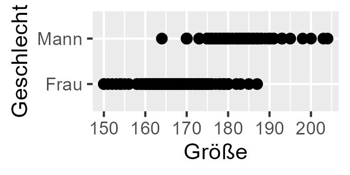
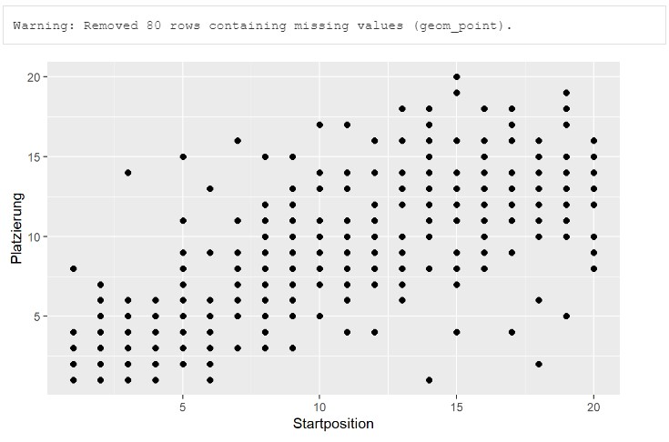
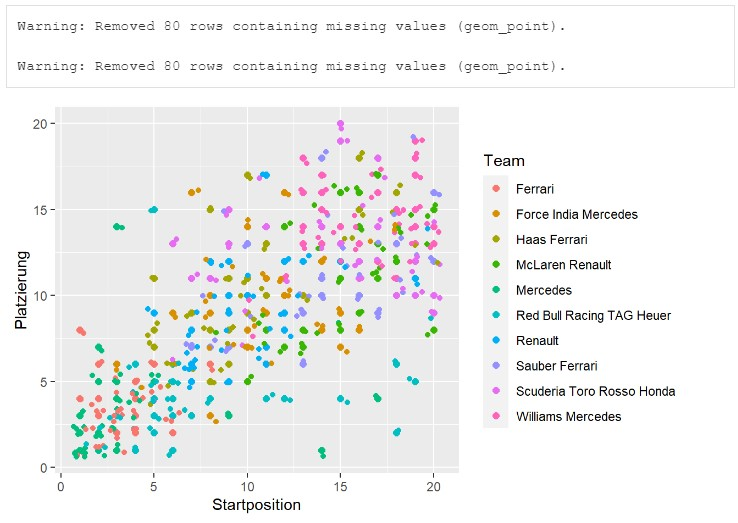
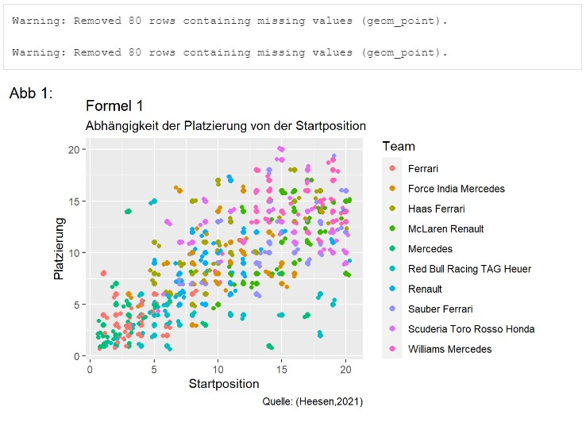
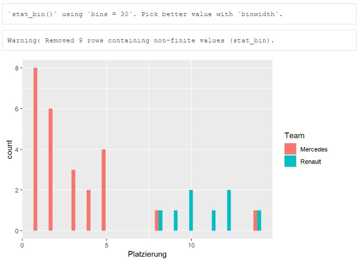
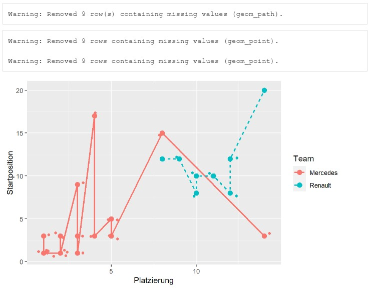

```{r setup, include=FALSE}
library(datascience)
library(machinelearning)
colnames(studierende)[5]<-"Größe"
colnames(studierende)[10]<-"Fußball"
colnames(studierende)[13]<-"Attraktivität"
library(tidyverse)
library(learnr)
library(gridExtra)
library(ggplot2)
library("RColorBrewer")
library(viridis)
```


## Willkommen

Dieses Tutorial ergänzt die Inhalte des Buches [Künstliche Intelligenz und Machine Learning mit R](https://www.amazon.de/Data-Science-Statistik-mit-Anwendungsl%C3%B6sungen/dp/3658348240/ref=sr_1_1?__mk_de_DE=%C3%85M%C3%85%C5%BD%C3%95%C3%91&dchild=1&keywords=Data+Science+und+Statistik+mit+R&qid=1627898747&sr=8-1).

Das Kapitel 6.3 wird vorgestellt, wie die Visualisierung im Rahmen der Explorativen Datenanalyse in R unterstützt wird.

## 1. Visualisierung

Visualisierung erleichtert das Verständnis von Daten erheblich. Besonders weit verbreitet und beliebt für die Visualisierung ist die Funktion ggplot() aus dem Paket ggplot2 (gg steht für grammar of graphics) unterstützt die Erstellung von Grafiken in R. 

Die Abbildungen werden, wenn nicht anders angegeben, im dafür vorgesehenen Grafikfenster ausgegeben. Alternativ können die erstellten Abbildungen aber auch mit der Funktion ggsave() als Grafikdatei gespeichert werden.

### 1.1 Die Funktion ggplot

Der Funktion ggplot() werden die für die Abbildung erforderlichen Daten als Parameter übergeben. Darüber hinaus werden die sogenannten aesthetic mappings wie die Zuordnung der x- und y-Achse oder die Farbe mit der Funktion aes() über den Parameter mapping angegeben, z.B. ggplot(studierende, mapping=aes(x=Geschlecht,y=Größe). 

Die Abbildungsform wird über die Funktion geom_*() definiert, z.B. geom_line() für eine Linie oder geom_point() für einen Scatterplot. 

Jeder Funktionsaufruf der Funktionen ggplot(), aes() und geom_* erzeugt einen eigenen sogenannten Layer, eine Abbildungsebene. Mehrere Abbildungsebenen können dann in einer Abbildung übereinander dargestellt werden. Um einem bereits existierenden Layer einen weiteren Layer hinzuzufügen, wird das + verwendet, z.B. ggplot(studierende, mapping=aes(x=Geschlecht,y=Größe) + geom_point(size=2) oder alternativ auch die Funktion aes() mit + als ggplot(studierende) + aes(x=Geschlecht,y=Größe) + geom_point(size=2). Die Funktion geom_point() stellt dabei für jeden Datensatz (Zeile im Dataframe) einen Punkt dar.

```{r 1_11, exercise=FALSE}
ggplot(studierende, mapping=aes(x=Geschlecht, y=Größe)) +  # x+y-Achsen
       geom_point(size=2)                                  # Abbildungstyp
ggplot(studierende) + 
       aes(x=Geschlecht,y=Größe) +                         # x+y-Achsen
       geom_point(size=2)                                  # Abbildungstyp
```

Der Übersichtlichkeit halber erscheint es empfehlenswert die Funktion aes() mit + in einer separaten Zeile zu kodieren.

Die Abbildungen werden, wenn nicht anders angegeben, im dafür vorgesehenen Grafikfenster ausgegeben. Alternativ können die erstellten Abbildungen aber auch mit der Funktion ggsave() als Grafikdatei gespeichert werden. Über die Parameter units (cm, in, mm) in Verbindung mit der Angabe height= und width lässt sich die Größe der erzeugten Datei spezifizieren.

```{r 1_12, exercise=FALSE}
p1<-ggplot(studierende) + 
       aes(x=Größe,y=Geschlecht) +                         # x+y-Achsen
       geom_point(size=2)                                  # Abbildungstyp
ggsave("images/meinplot-p1.jpg", plot=p1,                  # Speichern in Datei
       units="cm",height=3,width=6)
```

Die folgende Datei wurde im Verzeichnis images abgespeichert: 

### 1.2 Vermeidung von Overplotting

Die Funktion geom_point() stellt für jeden Datensatz (Zeile im Dataframe) einen Punkt dar. Da der Dataframe studierende 357 Studierende beschreibt, gibt es etliche Personen mit identischer Körpergröße. Die Darstellung der Punkte überlappt und daher ist nicht mehr erkennbar, wie viele Studierende je Größe existieren; dies wir auch als Overplotting bezeichnet. Die Funktion geom_jitter() löst das Problem des Overplottings, indem die Punkte nebeneinander dargestellt werden, so dass alle Datenpunkte erkennbar sind. Über den Parameter width kann dabei festgelegt werden, wie breit die Streuung erfolgen soll, über den Parameter size die Größe und über den Parameter alpha die Transparenz der Datenpunkte.

Die Ausgabe kann, anstatt direkt auf dem Bildschirm ausgegeben zu werden, auch in eine Variable gespeichert werden, in dem eine Wertzuweisung der Ausgabe von ggplot() an die Variable erfolgt, z.B. p1<-ggplot(). Die Variable p1 kann dann durch weitere Angaben oder Layers mit der Operation + ergänzt bzw. modifiziert werden.

Sollen mehrere Abbildungen nebeneinander oder untereinander dargestellt werden, so eignet sich die Funktion grid.arrange(...,ncol=x,nrow=y), bei der x die Anzahl der Spalten und y die Anzahl der Zeilen angibt, in welchen die Abbildungen ... ausgegeben werden sollen.

```{r 1_2, exercise=FALSE}
p0<-ggplot(studierende) +                          # plot in p1 speichern
           aes(x=Geschlecht, y=Größe,              # x+y-Achsen
               color=Geschlecht)                   # Farbe
p1<-p0 + geom_point()
p2<-p0 + geom_point(size=4)                        # Punkte-Plot
p3<-p0 + geom_jitter()                             # Jittering 
p4<-p0 + geom_jitter(width=0.3,alpha=0.1,size=4)   # Jit. mit Parametern 
grid.arrange(p1,p2,p3,p4,ncol=2,nrow=2)            # Ausgabe 2x2
```

### 1.3 Violinendarstellung

Um die Verteilung eine Variablen anders darzustellen, kann u.a. auch die Funktion geom_violin() verwendet werden. 

```{r 1_3, exercise=FALSE}
p1<-ggplot(studierende) +                          # Daten=studierende
           aes(x=Geschlecht, y=Größe,              # x+y-Achsen
               color=Geschlecht,                   # Farbe Kontur
               fill=Geschlecht) +                  # Farbe Füllung
           geom_violin()                           # Violin-Plot
p2<-ggplot(studierende) +                          # Daten=studierende
           aes(x=Geschlecht, y=Größe,              # x+y-Achsen
                                                   # Konturfarbe standard schwarz
               fill=Geschlecht) +                  # Farbe Füllung
           geom_violin()                           # Violin-Plot
p3<-p2 + geom_jitter(width=0.3)                    # zusätzliche Ebene
grid.arrange(p1,p2,p3,nrow=2,ncol=2)               # Ausgabe
```

### 1.4 Hintergrund

Für die Darstellung des Hintergrundes können verschiedene Gestaltungsoptionen über die Funktionen theme_*() ausgewählt werden, z.B. theme_classic() für einen weißen Hintergrund ohne Raster, theme_grey(), theme_dark() und theme_minimal() mit Raster und unterschiedlicher Hintergrundfarbe. Tatsächlich beinhaltet ein Theme aber ganz viele grundsätzliche Einstellungen, welche Abbildungen beeinflussen, wie die Farben, die Textausrichtung, die Schriftart, die Ränder und vieles mehr. Die jeweils aktuellen Grundeinstellungen lassen sich mit der Funktion theme_get() anzeigen bzw. in einer Variablen speichern.

```{r 1_4-setup, exercise=FALSE, echo=FALSE, include=FALSE}
p2<-ggplot(studierende) +                          # Daten=studierende
           aes(x=Geschlecht, y=Größe,              # x+y-Achsen
                                                   # Konturfarbe standard schwarz
               fill=Geschlecht) +                  # Farbe Füllung
           geom_violin()                           # Violin-Plot
```

```{r 1_4, exercise=FALSE, exercise.setup="1_4-setup"}
p4<-p2 + theme_dark()                              # Themes
p5<-p2 + theme_minimal()
p6<-p2 + theme_classic()
p7<-p2 + theme_grey()
grid.arrange(p4,p5,p6,p7,nrow=2,ncol=2)            # Ausgabe
```

### 1.5 Schriftart

Bezüglich der Schriftarten kann man im Standard wählen zwischen sans, serif und mono, indem die Funktion theme() mit dem Parameter text angewendet wird, z.B. theme(text=element_text(size=20,family="serif",face="bold")). Dies kann für jede Abbildung individuell ergänzt werden. 

```{r 1_5-setup, exercise=FALSE, echo=FALSE, include=FALSE}
p2<-ggplot(studierende) +                          # Daten=studierende
           aes(x=Geschlecht, y=Größe,              # x+y-Achsen
               fill=Geschlecht) +                  # Farbe Füllung
           geom_violin()                           # Violin-Plot
```

```{r 1_5, exercise=FALSE, exercise.setup="1_5-setup"}
p8<-p2 + theme(text=element_text(family="serif")) 
p9<-p2 + theme(text=element_text(size=14,family="sans",face="bold")) 
p10<-p2                                            # Normalschrift
grid.arrange(p8,p9,p10,nrow=2,ncol=2)              # Ausgabe
```

Wenn jedoch eine Standardschrift für die gesamte R-Session definiert werden soll, so kann dies mit der Funktion theme_set() erreicht werden, um ein anderes Set zu laden oder über die Funktion theme_update(), um einzelne Attribute zu verändern. Die jeweils aktuellen Grundeinstellungen lassen sich mit der Funktion theme_get() anzeigen bzw. in einer Variablen speichern. Diese Funktionen sind in dem Paket ggplot2 enthalten. Die Veränderung der Schriftart erfolgt z.B. über die Anweisung theme_update(text=element_text(family="serif")).

```{r 1_52-setup, exercise=FALSE, echo=FALSE, include=FALSE}
p2<-ggplot(studierende) +                          # Daten=studierende
           aes(x=Geschlecht, y=Größe,              # x+y-Achsen
               fill=Geschlecht) +                  # Farbe Füllung
           geom_violin()                           # Violin-Plot
```

```{r 1_52, exercise=FALSE, exercise.setup="1_52-setup"}
theme.norm <- theme_get()                                   # Standard->theme.norm
theme_update(text=element_text(family="serif",size=20))     # Modifikation
ggplot(studierende,aes(x=Geschlecht, y=Größe))+ geom_point()# Modifizierte Schrift
theme_set(theme.norm)
ggplot(studierende,aes(x=Geschlecht, y=Größe))+ geom_point()# Normalschrift
```

### 1.6 Titel und Legende

Um den Titel, den Untertitel und die Achsenbeschriftungen zu definie-ren, lässt sich die Funktion labs() mit den Parametern title, sub-title, x, y, caption und tag verwenden. Die Caption wird unterhalb der Abbildung rechts angezeigt und eignet sich für Quellenangaben. Der Tag bietet sich u.a. für die Angabe einer Abbildungsnummer an. Möchte man eine der zuvor gemachten Beschriftungen entfernen, so gelingt dies durch die Zuordnung des Wertes NULL zu dem jeweiligen Parameter, z.B. subtitle=NULL, um den Untertitel auszublenden. Um die Überschrift, die Elemente der Legende und deren Farben zu verän-dern, kann die Funktion scale_fill_manual() verwendet werden. Deren Parameter name erlaubt die Legendenüberschrift zu bestimmen, labels für die Elemente und values für die Farben.

```{r 1_6-setup, exercise=FALSE, echo=FALSE, include=FALSE}
studierende$Alter<-2020-studierende$Geburtsjahr   # Alter berechnen
studierende$Altersgruppe <-                       # Altersgruppe ermitteln 
  case_when(studierende$Alter < 20 ~ "<20",
    between(studierende$Alter,20,25) ~ "20-25",
            studierende$Alter > 25 ~ ">25")
studierende$Altersgruppe <- factor(studierende$Altersgruppe, 
                                   levels=c("<20","20-25",">25"), ordered = T)
```

```{r 1_6, exercise=FALSE, exercise.setup="1_6-setup"}
ggplot(studierende)+                          
  aes(x=Altersgruppe,fill=Altersgruppe)+       # Färbung je Kategorie
  geom_bar()+                                  # Bar-Chart
  labs(title="Erstsemester Mgmt&Leadership",   # Beschriftungen
       subtitle="Anzahl je Altersgruppe",
       x="Altersgruppe", y="Anzahl",
       caption="Quelle: (Heesen,2020)",tag="Abb:1")
p2<-ggplot(studierende)+                          
  aes(x=Altersgruppe,fill=Altersgruppe)+       # Färbung je Kategorie
  geom_bar()+                                  # Bar-Chart
  labs(title="Erstsemester Mgmt&Leadership",   # Beschriftungen
       subtitle="Anzahl je Altersgruppe",
       x="Altersgruppe", y="Anzahl",
       caption="Quelle: (Heesen,2020)",tag="Abb:1")+
  scale_fill_manual(name="Legende:",
                    labels=c("jünger als 20","20 bis 25","älter als 25"),
                    values=c("blue","red","green"))
p2
p2 + labs(tag=NULL)                          # Tag ausblenden
```

### 1.7 Übung

```{r 1_7-setup, exercise=FALSE, echo=FALSE, include=FALSE}
sp3 <- studierende[1:15,"Note"]                        # Stichprobe 3 (sp3)
```

Der Dataframe formel1 beschreibt die Rennen der Formel-1. Lassen Sie sich im ersten Schritt einen Scatterplot ausgeben, wobei die Startposition der Rennwagen auf der x-Achse und die Platzierung auf der y-Achse abgebildet werden sollen. Speichern Sie die Ausgabe der Funktion ggplot() in der Variablen p1 und lassen Sie sich diese anschließend ausgeben.

Etliche der Datenpunkte wurden in der letzten Abbildung übereinander gedruckt. Stellen Sie daher im zweiten Schritt sicher, dass Sie ein Overplotting vermeiden, indem Sie aufbauend auf der Variablen p1 die Funktion geom_jitter() verwenden und das Ergebnis in der Variablen p2 speichern. Nutzen Sie auch den Parameter group und color, um die Teams in unterschiedlichen Farben anzeigen zu lassen. Lassen Sie sich anschließend p2 ausgeben.

Aufbauend auf der Variablen p2 ergänzen Sie bitte den Titel als "Formel 1", den Untertitel als "Abhängigkeit der Platzierung von der Startposition", die x-Achsenbeschriftung als "Startposition", die y-Achsenbeschriftung als "Platzierung", die Caption als "Quelle: (Heesen,2021)" und den Tag als "Abb 1:".

Die Anzeige sollte hinterher wie folgt aussehen: 




```{r 1_7, exercise=TRUE, exercise.setup="1_7-setup"}

```

```{r 1_7-hint-1}
p1<-ggplot(formel1) + 
       aes(x=Startposition,y=Platzierung) +   # x+y-Achsen
       geom_point(size=2)                     # Abbildungstyp
p1
```
```{r 1_7-hint-2}
p2 <- p1 + geom_jitter() +                    # Kein Overplotting
           aes(group=Team,color=Team)         # Klassifikation/Färbung
p2
```
```{r 1_7-hint-3}
p2 + labs(title="Formel 1",                   # Beschriftungen
       subtitle="Abhängigkeit der Platzierung von der Startposition",
       x="Startposition", y="Platzierung",
       caption="Quelle: (Heesen,2021)",tag="Abb 1:")
```


## 2. Abbildungstypen

Die Art der Abbildung hängt auch von dem Variablentyp und der Variablenanzahl ab. 

### 2.1 Histogramm

Für eine metrische Variable eignet sich z.B. die Funktion geom_histogram(), um die absolute Häufigkeit der Werte anzuzeigen. 

Der Parameter bins ermöglicht bei dieser Funktion die Vorgabe der Balkenanzahl. Um die relative Häufigkeit der Werte in Prozent anzuzeigen, kann die y-Achse mit y=..density.. spezifiziert werden. Um eine Unterscheidung in Abhängigkeit von einer kardinalen Variablen, z.B. Geschlecht, zu erreichen, kann diese in der Funktion aes() mit dem Parameter fill=Geschlecht definiert werden. Standardmäßig werden die beiden Geschlechter gestapelt (stacked) angezeigt. Über den Parameter position mit den Ausprägungen identity in Verbindung mit einer Transparenz über den Parameter alpha lassen sich die Geschlechter auch hintereinander anzeigen. Wenn der Parameter position mit dem Wert dodge angegeben wird, erfolgt die Anzeige der Geschlechter nebeneinander.

```{r 2_1, exercise=FALSE}
p1<-ggplot(studierende)+                           # 1 Metrische Variable
    aes(x=Größe)+                                  # Absolute Häufigkeit
    geom_histogram()                               # Histogramm
p2<-p1 + geom_histogram(bins=10)                   # Histogramm 10 Balken
p3<-ggplot(studierende)+                           # 1 Metrische Variable
    aes(x=Größe,y=..density..)+                    # Relative Häufikeit
    geom_histogram()                               # Histogramm
p4<-ggplot(studierende)+                           # Direkte Anzeige
    aes(x=Größe,fill=Geschlecht)+                  # Abs.Häufikeit je Geschlecht
    geom_histogram()                               # Histogramm als Stapel(Stack)
p5<-ggplot(studierende)+                           # Direkte Anzeige
    aes(x=Größe,fill=Geschlecht)+                  # Abs.Häufikeit je Geschlecht
    geom_histogram(position="identity",alpha=0.4)  # Histogramm hintereinander
p6<-ggplot(studierende)+                           # Direkte Anzeige
    aes(x=Größe,fill=Geschlecht)+                  # Abs.Häufikeit je Geschlecht
    geom_histogram(position="dodge")               # Histogramm nebeneinander
grid.arrange(p1,p2,p3,p4,p5,p6,nrow=3,ncol=2)      # Ausgabe
```

### 2.2 Bar-Chart

Für eine kategoriale Variable bietet sich für die Darstellung der Häufigkeiten die Funktion geom_bar() an, die ein Bar-Chart darstellt.

Wenn eine unterschiedliche Färbung der Kategorien gewünscht ist, so lässt sich dies mit dem Parameter fill in der Funktion aes() erreichen. Wie bei der Funktion geom_histogram() lässt sich auch hier wieder über den Parameter position definieren, ob die Balken übereinander, hintereinander oder nebeneinander dargestellt werden sollen.

Für die nachfolgende Visualisierung soll erneut der Dataframe studierende verwendet werden. Zunächst wird in diesem Dataframe noch eine Variable Alter auf Basis des Geburtsjahres berechnet und eine weitere Variable Altersgruppe hinzugefügt, welche die Studierenden in drei Kategorien einteilt: <20, 20-25 und älter als 25. Es handelt sich hierbei um eine ordinale Variable (Faktorvariable, ordered=T).

```{r 2_20, exercise=FALSE}
studierende$Alter<-2020-studierende$Geburtsjahr   # Alter berechnen
studierende$Altersgruppe <-                       # Altersgruppe ermitteln 
  case_when(studierende$Alter < 20 ~ "<20",
    between(studierende$Alter,20,25) ~ "20-25",
            studierende$Alter > 25 ~ ">25")
studierende$Altersgruppe <- factor(studierende$Altersgruppe, 
                                   levels=c("<20","20-25",">25"), ordered = T)
```

```{r 2_2, exercise=FALSE}
p1<-ggplot(studierende)+                          
    aes(x=Altersgruppe)+                          # 1 Kategoriale Variable
    geom_bar()                                    # Bar-Chart
p2<-ggplot(studierende)+                          
    aes(x=Altersgruppe,fill=Altersgruppe)+        # Färbung je Kategorie
    geom_bar()                                    # Bar-Chart
grid.arrange(p1,p2,ncol=2)                        # Ausgabe
#- Zwei Kategoriale Variablen-----------------------------------------------
p1<-ggplot(studierende)+                          
    aes(x=Altersgruppe,fill=Geschlecht)+          # Färbung je 2. Var.
    geom_bar()                                    # Bar-Chart übereinander
p2<-ggplot(studierende)+                          
    aes(x=Altersgruppe,fill=Geschlecht)+          # Färbung je 2. Var.
    geom_bar(position="identity",alpha=0.4)       # Bar-Chart hintereinander
p3<-ggplot(studierende)+                          
    aes(x=Altersgruppe,fill=Geschlecht)+          # Färbung je 2. Var.
    geom_bar(position="dodge")                    # Bar-Chart nebeneinander
grid.arrange(p1,p2,p3,nrow=2,ncol=2)              # Ausgabe
```

### 2.3 Dot-Plot oder Scatter-Plot

Wenn man zwei metrische Variablen und deren Beziehung zueinander darstellen möchte, so bietet sich die Funktion geom_point() an. Als Parameter sind auch hier wieder size und alpha nutzbar und zur Vermeidung von Overplotting bietet sich ggfs. die Funktion geom_jitter() an. 

```{r 2_3-setup, exercise=FALSE, echo=FALSE, include=FALSE}
studierende$Alter<-2020-studierende$Geburtsjahr   # Alter berechnen
```

```{r 2_3, exercise=FALSE, exercise.setup="2_3-setup"}
p1<-ggplot(studierende)+                          
    aes(x=Alter,y=Größe)+                          # 2 Metrische Variablen
    geom_point(alpha=0.3)                          # Scatter-Plot
p2<-ggplot(studierende)+                          
    aes(x=Alter,y=Größe)+                          # 2 Metrische Variablen
    geom_jitter(alpha=0.3,width=0.2)               # Scatter-Plot mit Jitter
grid.arrange(p1,p2,ncol=2)                         # Ausgabe
```

Um eine dritte Variable, besonders eine kategoriale Variable, in der Abbildung einzubinden, eignet sich der Parameter shape oder color in der Funktion aes().

```{r 2_31-setup, exercise=FALSE, echo=FALSE, include=FALSE}
studierende$Alter<-2020-studierende$Geburtsjahr    # Alter berechnen
```

```{r 2_31, exercise=FALSE, exercise.setup="2_31-setup"}
ggplot(studierende)+                          
  aes(x=Alter,y=Größe,
  color=Geschlecht,shape=Geschlecht)+            # 2 Metrische+1 Kateg. Var.
  geom_point(alpha=0.3,size=2)                   # Scatter-Plot
```

### 2.4 Linien-Plot

Auch die Funktion geom_line() eignet sich für zwei metrische Variablen. Die Parameter linetype (blank, solid, dashed, dotted, longdash, twodash) und size erlauben Gestaltungsoptionen. Sofern zusätzlich eine kategoriale Gruppierungsvariable verwendet werden soll, um mehrere Linien oder Punkte abzubilden, so kann dies mit dem Parameter group in der Funktion aes() erreicht werden.

```{r 2_40-setup, exercise=FALSE, echo=FALSE, include=FALSE}
studierende$Alter<-2020-studierende$Geburtsjahr   # Alter berechnen
```

```{r 2_40, exercise=FALSE, exercise.setup="2_40-setup"}
durchschnittsnoten$Note<-round(durchschnittsnoten$Note,2)
durchschnittsnoten
durchschnittsnoten.frau<-filter(durchschnittsnoten,Geschlecht=="Frau")
p1<-ggplot(durchschnittsnoten.frau)+                          
    aes(x=Alter,y=Note)                            # 2 Metrische Variablen
p2<-p1 + geom_line()                               # Linien-Chart
p3<-p1 + geom_point(size=3)                        # Punkte-Chart
p4<-p1 + geom_line(linetype="solid",size=2)        # Gestaltungsoptionen
p5<-p1 + geom_line(linetype="dashed",size=1)
p6<-p1 + geom_line(linetype="longdash",size=0.5) +
     geom_point(size=3) 
p7<-ggplot(durchschnittsnoten)+                          
    aes(x=Alter,y=Note,group=Geschlecht,           # 2 Metrische Var. +
        color=Geschlecht,linetype=Geschlecht)+     # 1 Kategoriale Var.
    geom_line(size=1)+
    geom_point(size=3)
grid.arrange(p2,p3,p4,p5,p6,p7,nrow=3,ncol=2)      # Ausgabe
```

### 2.5 Gruppierte Scatter-Plots und Bar-Charts

Nachfolgend werden Daten aus dem Dataframe kfz visualisiert. Zunächst wird das Alter berechnet. Da die Daten in dem Jahr 2019 von einer Gebrauchtwagenseite entnommen wurde, wird 2019 als Basisjahr verwendet. Eine Altersgruppe wird als ordinale Variable berechnet und es erfolgt noch eine Beschränkung auf Autos mit einer PS-Zahl zwischen 50 und 150 und einem Preis zwischen 500€ und 10.000€.

Neben zwei Verhältnisvariablen kann eine kategoriale Gruppierungsvariable verwendet werden, um Balken oder Punkte z.B. andersfarbig abzubilden. Dies kann mit dem Parameter group für Scatter-Plots oder fill für Bar-Charts in der Funktion aes() erreicht werden.

```{r 2_5-setup, exercise=FALSE, echo=FALSE, include=FALSE}
kfz$Alter<-2019-kfz$Zulassung                      # Alter berechnen
kfz$Altersgruppe <-                                # Altersgruppe ermitteln 
  case_when(kfz$Alter < 3 ~ "neuwertig",
    between(kfz$Alter,3,10) ~ "mittelalt",
    between(kfz$Alter,11,15) ~ "alt",
            kfz$Alter > 15 ~ "oldtimer")
kfz$Altersgruppe <- factor(kfz$Altersgruppe, 
    levels=c("neuwertig","mittelalt","alt","oldtimer"), ordered = T)
wechselkurs <- 0.83                                # Wechselkurs Dollar->Euro
kfz$PreisEuro <- str_sub(kfz$Preis, 2, 10)         # Nur Zeichen 2-10 übernehmen
kfz$PreisEuro <- sub(",","",kfz$PreisEuro)         # "," entfernen
kfz$PreisEuro <- as.numeric(kfz$PreisEuro,na.rm=T) * wechselkurs  # Eurowert
kfz<-filter(kfz,PreisEuro<10000 & PreisEuro>500 & PS<150 & PS>50)
kfz$PreisEuro<-round(kfz$PreisEuro/1000,0)
```

```{r 2_5, exercise=FALSE, exercise.setup="2_5-setup"}
#- 2 Metrische Variablen und 1-2 Kategoriale Variablen-------------------------
p1<-ggplot(kfz)+                          
    aes(x=PS,y=PreisEuro,group=Altersgruppe,       # 2 Metr.Var. + 1 Kateg.Var.
        color=Altersgruppe,linetype=Altersgruppe)+ 
    geom_point(size=1)+
    labs(y="Preis (Tausend €)")+          # Bezeichnung y-Achse
    scale_y_continuous(breaks=c(1:10))    # Skala für y-Achse
p2<-ggplot(kfz)+                          
    aes(x=PS,fill=Altersgruppe)+          # 2 Metr.Var. + 1 Kateg.Var.
    geom_histogram(bins=10)               # Histogramm
grid.arrange(p1,p2,nrow=2)                # Ausgabe
```

### 2.6 Facetten

Gerade wenn mehrere Gruppierungsvariablen zum Einsatz kommen, die in Abbildungen mit Hilfe von Farben und Formen dargestellt werden, kann eine Abbildung unübersichtlich werden. Hier kann die Funktion facet_wrap() oder facet_grid() hilfreich sein. Die Funktion facet_wrap() erstellt für jede Kategorie einer Gruppierungsvariablen eine eigene Abbildung und die Funktion facet_grid() leistet das gleiche für jede Kombination aller Kategorien von zwei Gruppierungsvariablen.

```{r 2_6-setup, exercise=FALSE, echo=FALSE, include=FALSE}
kfz$Alter<-2019-kfz$Zulassung                      # Alter berechnen
kfz$Altersgruppe <-                                # Altersgruppe ermitteln 
  case_when(kfz$Alter < 3 ~ "neuwertig",
    between(kfz$Alter,3,10) ~ "mittelalt",
    between(kfz$Alter,11,15) ~ "alt",
            kfz$Alter > 15 ~ "oldtimer")
kfz$Altersgruppe <- factor(kfz$Altersgruppe, 
    levels=c("neuwertig","mittelalt","alt","oldtimer"), ordered = T)
kfz<-drop_na(kfz,Altersgruppe)
```

```{r 2_6, exercise=FALSE, exercise.setup="2_6-setup"}
p1<-ggplot(kfz)+                          
    aes(x=PS,fill=Altersgruppe)+          # 2 Metr.Var. + 1 Kateg.Var.
    facet_wrap(~ Altersgruppe)            # Eigene Abb. je Altersgruppe
p1 + geom_histogram(bins=10)              # Histogramm
kfz.marke<-filter(kfz,Marke %in% c("bmw","peugeot","volkswagen"))
p1<-ggplot(kfz.marke)+                          
    aes(x=PS,fill=Altersgruppe)+          # 2 Metr.Var. + 1 Kateg.Var.
    facet_grid(~ Altersgruppe)            # Eigene Abb. je Altersgruppe
p1 + geom_histogram(bins=10)              # Histogramm
p1<-ggplot(kfz.marke)+                          
    aes(x=PS,fill=Altersgruppe)+          # 2 Metr.Var. + 1 Kateg.Var.
    facet_grid(Marke ~ Altersgruppe)      # Eigene Abb. je Altersgruppe/Marke
p1 + geom_histogram(bins=10)              # Histogramm
```

### 2.7 Übung

```{r 2_7-setup, exercise=FALSE, echo=FALSE, include=FALSE}
sp3 <- studierende[1:15,"Note"]                        # Stichprobe 3 (sp3)
```

Der Dataframe formel1 enthält die Ergebnisse der Formel-1. Lassen Sie sich die Platzierungen der Teams Mercedes und Renault nebeneinander in einem Histogramm anzeigen. Die Ergebnisse der beiden Teams können mit der Anweisung mercedesrenault<-formel1[formel1$Team==c("Mercedes","Renault"),] in dem Dataframe mercedesrenault gespeichert werden, der als Basis für das Histogramm verwendet werden kann.

Lassen Sie sich für die beiden Teams noch ein Line-Chart mit der Platzierung auf der x-Achse und Startposition auf der y-Achse ausgeben, wobei die Teams mit unterschiedlichen Farben und Linientypen dargestellt werden sollten. Verwenden Sie für die Größenangabe der Linien und Punkte die Anweisungen geom_line(size=1) und geom_point(size=3). Zusätzlich sollten Sie noch die Funktion geom_jitter() verwenden, um Overplotting zu verhindern.

Die Anzeige sollte hinterher wie folgt aussehen (Warnungen ergeben sich hier wegen fehlender Werte im Dataframe): 



```{r 2_7, exercise=TRUE, exercise.setup="2_7-setup"}
mercedesrenault<-formel1[formel1$Team==c("Mercedes","Renault"),]   #Dataframe mit 2 Teams
```

```{r 2_7-hint-1}
ggplot(mercedesrenault)+
    aes(x=Platzierung,fill=Team)+                  # Abs.Häufikeit je Geschlecht
    geom_histogram(position="dodge")               # Histogramm nebeneinander
```
```{r 2_7-hint-2}
ggplot(mercedesrenault)+                          
    aes(x=Platzierung,y=Startposition,group=Team,  # 2 Metrische Var. +
        color=Team,linetype=Team)+                 # 1 Kategoriale Var.
    geom_line(size=1)+
    geom_point(size=3)+
    geom_jitter()
```

## 3. Farben

Farben spielen eine große Rolle bei Abbildungen. Farben können mit der Funktion rgb() entsprechend dem RGBA-Modell definiert werden. Im RGBA-Modell steht RGB für Rot, Grün, Blau (Farben werden durch Mischung der drei Grundfarben gebildet) und A für den Alpha-Kanal, der die Transparenz angibt. Alternativ zu dem RGBA-Modell können Farben aber auch über die Funktion hsv() über das Hue-Saturation-Value oder hcl() durch die Hue-Chroma-Luminance definiert werden. Alle Farben werden letztlich in hexadezimaler Form gespeichert, wo z.B. rot dezimal als (255,0,0) und hexadezimal als "#FF0000" gespeichert wird, was bedeutet 100% Rot-Anteil und 0% Blau- und Grün-Anteil.

### 3.1 Farbpaletten

Beliebte Farbpaletten erleichtern die Selektion von Farben aus bereits vorhandenen Farbpaletten. Etabliert haben sich u.a. die Farbpaletten von Cynthia Brewer und Mark Harrower, die im Paket ColorBrewer enthalten sind und über die Funktion brewer.pal() in eine eigene Palette kopiert werden können, z.B. meinepalette1<-brewer.pal(10,"Set2"). Die Zahl in der Klammer gibt an, wieviele Farben verwendet werden sollen. 

In Verbindung mit der Funktion ggplot() bieten sich auch die Funktionen scale_fill_brewer() und scale_color_brewer() mit dem Parameter palette an, z.B. scale_color_brewer(palette = "Dark2"). Die Farbpaletten sind in drei Kategorien aufgeteilt. Die erste Kategorie ist für sequentielle (von hell zu dunkel), die zweite Kategorie für qualitative (sich stark unterscheidende einzelne Farben) und die dritte Kategorie ist für spektrale Darstellungen geeignet, in denen die Mitte neutral ist wie z.B. bei der Verwendung einer Likert-Skala. Im Buch in Kapitel 3.6.1. sind die Brewer-Farbpaletten dargestellt, die auch für Farbenblinde geeignet sind.

Speziell für Farbenblinde entwickelte Farbpaletten werden in dem Paket viridis zur Verfügung gestellt. Farbenblindheit zusammen mit Farbenfehlsichtigkeit (insbesondere Rot-Grün-Sehschwäche) betreffen immerhin ca. fünf Prozent der Weltbevölkerung, überwiegend Männer. Es erscheint daher geboten bei der Farbwahl Paletten zu verwenden, die auch von Farbblinden und Farbenfehlsichtigen anhand der Graustufen die Unterscheidung ermöglicht. 

In Verbindung mit der Funktion ggplot() bieten sich die Funktionen scale_fill_viridis() und scale_color_viridis() mit dem Parameter option an, z.B. scale_color_viridis(option = "D"), wobei die Optionen A für „magma“, B für „inferno“, C für „plasma“ und D für „viridis“ stehen. Erfolgt keine Angabe des Parameters option, so wird viridis als Standard gewählt.

In den bisherigen Abbildungen wurden Farben bereits verwendet, um Kategorien zu differenzieren bzw. durch die Nutzung des Parameters color und fill der Funktion aes(). Die Zuweisung der Farben erfolgt bei einer Farbe z.B. mit der Angabe color= "red". Bei einer Vielzahl an Farben eignet sich die Funktion scale_colour_manual() mit dem Parameter values, der entweder über die Funktion c() mit values= c("red","white","green") oder via Farbpaletten mit values=namederPalette spezifiziert werden kann. Mehr Möglichkeiten sind im Kapitel 3.6.1 im Buch beschrieben.

```{r 3_0, exercise=FALSE}
p0<-ggplot(alkohol,aes(x=Land,y=Portionen,group=Typ,fill=Typ))+ 
  geom_bar(stat="identity",position="dodge")+                   
  labs(subtitle="Alkoholkonsum",x="Land",y="Portionen")+
  guides(fill=guide_legend(title="Getränk"))
p1<-p0 + scale_color_viridis(discrete=TRUE)+
         labs(title="Viridis-Palette")                              # Viridis
p2<-p0 + scale_fill_brewer(palette="Dark2")+
         labs(title="Qualitative Brewer-Palette")                   # Brewer
p3<-p0 + scale_fill_brewer(palette="Blues")+
         labs(title="Sequentielle Brewer-Palette")                  # Brewer
p4<-p0 + scale_fill_brewer(palette="YlGn")+
         labs(title="Sequentielle Brewer-Palette")                  # Brewer
p5<-p0 + scale_fill_brewer(palette="RdBu")+
         labs(title="Spektrale Brewer-Palette")                     # Brewer
p6<-p0 + scale_fill_grey()+labs(title="Grau-Palette")               # Graustufen
grid.arrange(p1,p2,p3,p4,p5,p6,nrow=3,ncol=2)                       # Ausgabe
```

## 4. Quiz

```{r 4_1, echo = FALSE}
quiz(
  question("Welche der folgenden Aussagen sind korrekt?", allow_retry = TRUE, random_answer_order = TRUE,
    answer('Die sogenannten aesthetic mappings wie die Zuordnung der x- und y-Achse oder die Farbe werden mit der Funktion aes() über den Parameter mapping angegeben, z.B. ggplot(studierende, mapping=aes(x=Geschlecht,y=Größe)).', correct = TRUE),
    answer('Die Abbildungsform wird in der Funktion ggplot() über die Funktion geom_*() definiert, z.B. geom_line() für eine Linie oder geom_point() für einen Scatterplot.', correct = TRUE),
    answer('Overplotting lässt sich bei Dot-Plots nicht vermeiden.', message = 'Doch, die Funktion geom_jitter() vermeidet Overplotting.'),
    type = "multiple"
  ),
  question("Welche der folgenden Aussagen sind korrekt?", allow_retry = TRUE, random_answer_order = TRUE,
    answer('Jeder Funktionsaufruf der Funktionen ggplot(), aes() und geom_* erzeugt einen eigenen sogenannten Layer, eine Abbildungsebene. Mehrere Abbildungsebenen können dann in einer Abbildung übereinander dargestellt werden. Um einem bereits existierenden Layer einen weiteren Layer hinzuzufügen, wird das + verwendet.', correct = TRUE),
    answer('Die Funktion geom_point() stellt für jeden Datensatz (Zeile im Dataframe) einen Punkt dar.', correct = TRUE),
    answer('Die Funktionen theme_*(), z.B. theme_classic() erlauben u.a. den Hintergrund, die Schriftart, die Farben und vieles mehr festzulegen.', correct = TRUE),
    type = "multiple"
  ),
  question("Welche der folgenden Aussagen sind korrekt?", allow_retry = TRUE, random_answer_order = TRUE,
    answer('Die Funktion labs() erlaubt die Festlegung von Beschriftungen wie Titel, Untertitel etc..', correct = TRUE),
    answer('Wenn man zwei metrische Variablen und deren Beziehung zueinander darstellen möchte, so bietet sich die Funktion geom_point() an.', correct = TRUE),
    answer('Möchte man Abbildungen auch für Farbenblinde angemessen gestalten, so kann man nur mit Grautönen für die Darstellung arbeiten.', message = 'Nein, die Farbpaletten von Viridis und Brewer sind speziell so konzipiert, dass sie Farben nutzen, jedoch auch für Farbenblinde gut differenzierbar sind.'),
    type = "multiple"
  )
)
```

## Ende 

Gratulation!

Sie haben dieses Tutorial erfolgreich ausgeführt und einen Einblick in die Erstellung von Visualisierungen erhalten.